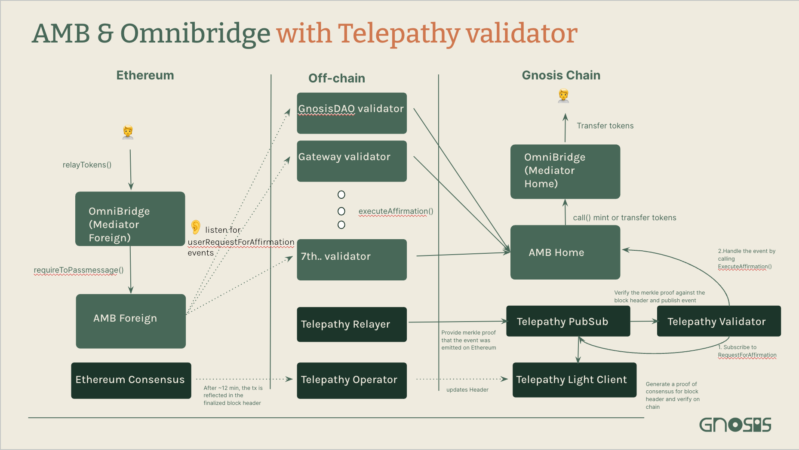

The native Arbitrary Message Bridge (AMB) allows user to send arbitrary data between Gnosis Chain and Ethereum. This allows Gnosis contracts to send data and trigger contract functions on Ethereum and other chains, and vice versa.

The AMB is a key bridge primitive that is used inside higher-order bridges like the [Omnibridge native token bridge](../About%20Token%20Bridges/omnibridge.md), and is part of the [Tokenbridge Architecture](https://tokenbridge.net/).

With [Telepathy added as the 8th validator](../managementdecisions.md#add-telepathy-validator-in-the-amb), AMB bridge is now more secure with trustless zero-knowledge light client technology. Due to the light client finality requirements (at least 23mins on Ethereum), the transactions will take approx. 30mins to be signed by the bridge. However, users can still use 3rd party bridges (Jumper.exchange, Connext, Hop) without any impact. For more details, check out [how AMB & Omnibridge works with Telepathy validator](#how-it-works-with-telepathy-validator).

## Key Information

### Overview

|                       | Detail                                                |
| --------------------- | ----------------------------------------------------- |
| Frontend URL          | N/A                                                   |
| Trust Model           | [4-of-8 Validator Multisig](#bridge-validators)       |
| Governance            | [8-of-16 Multisig](#bridge-governance)                |
| Governance Parameters | [Validators](#bridge-validators)                      |
| Bug Bounty            | [up to $2m](https://immunefi.com/bounty/gnosischain/) |
| Bug Reporting         | [Immunefi](https://immunefi.com/bounty/gnosischain/)  |

## Key Contracts

<Tabs>
<TabItem value="ethereum" label="Ethereum">

### Ethereum

| Contract                            | Address                                                                                                                                  |
| ----------------------------------- | ---------------------------------------------------------------------------------------------------------------------------------------- |
| Omnibridge Multi-Token Mediator | [0x88ad09518695c6c3712AC10a214bE5109a655671](https://etherscan.io/address/0x88ad09518695c6c3712AC10a214bE5109a655671#writeProxyContract) |
| AMB (Foreign)        | [0x4C36d2919e407f0Cc2Ee3c993ccF8ac26d9CE64e](https://etherscan.io/address/0x4C36d2919e407f0Cc2Ee3c993ccF8ac26d9CE64e#writeProxyContract) |
| AMB/OmniBridge wETH Router Helper   | [0xa6439Ca0FCbA1d0F80df0bE6A17220feD9c9038a](https://etherscan.io/address/0xa6439ca0fcba1d0f80df0be6a17220fed9c9038a)                    |

</TabItem>

<TabItem value="gnosis" label="Gnosis">

### Gnosis

| Contract                            | Address                                                                                                                                   |
| ----------------------------------- | ----------------------------------------------------------------------------------------------------------------------------------------- |
| AMB/Omnibridge Multi-Token Mediator | [0xf6A78083ca3e2a662D6dd1703c939c8aCE2e268d](https://gnosisscan.io/address/0xf6A78083ca3e2a662D6dd1703c939c8aCE2e268d#writeProxyContract) |
| AMB (Home)           | [0x75Df5AF045d91108662D8080fD1FEFAd6aA0bb59](https://gnosisscan.io/address/0x75Df5AF045d91108662D8080fD1FEFAd6aA0bb59#writeProxyContract) |
| AMB Helper Contract                 | [0x7d94ece17e81355326e3359115D4B02411825EdD](https://gnosisscan.io/address/0x7d94ece17e81355326e3359115D4B02411825EdD#readContract)       |

</TabItem>

<TabItem value="sepolia-chiado" label="Sepolia-Chiado">

### Sepolia - Chiaado

| Contract                     | Address                                                                                                                               |
|------------------------------|---------------------------------------------------------------------------------------------------------------------------------------|
| AMB (Sepolia)          | [0xf2546D6648BD2af6a008A7e7C1542BB240329E11](https://sepolia.etherscan.io/address/0xf2546D6648BD2af6a008A7e7C1542BB240329E11)         |
| Validator Contract (Sepolia) | [0xa0bd95dd2570632c8640ab5bc213f3a0ea33e26a](https://sepolia.etherscan.io/address/0xa0bd95dd2570632c8640ab5bc213f3a0ea33e26a)         |
| AMB (Chiado)                 | [0x8448E15d0e706C0298dECA99F0b4744030e59d7d](https://gnosis-chiado.blockscout.com/address/0x8448E15d0e706C0298dECA99F0b4744030e59d7d) |
| Validator Contract (Chiado)  | [0x9e8a89ebcb83065eaaf4b7ff720caa5e6b25c976](https://gnosis-chiado.blockscout.com/address/0x9e8a89ebcb83065eaaf4b7ff720caa5e6b25c976) |
| AMB Helper Contract (Chiado)  | [0x3cc500B3c01D04C265c9293cB35BA2Fd8eA6dc1b](https://gnosis-chiado.blockscout.com/address/0x3cc500B3c01D04C265c9293cB35BA2Fd8eA6dc1b?tab=read_contract) |


</TabItem>


<TabItem value="goerli" label="Goerli-Chiado">

### Goerli - Chiado

:::note
The bridge betwee Goerli and Chiado is deprecating soon.
:::

| Contract                      | Address                                                                                                                      |
| ----------------------------- | ---------------------------------------------------------------------------------------------------------------------------- |
| OmniBridge Mediator (Foreign) | [0x00147c84f13764dCDAbAF1cbAe622fa6f6839085](https://goerli.etherscan.io/address/0x00147c84f13764dCDAbAF1cbAe622fa6f6839085) |
| AMB Contract Proxy (Foreign)  | [0x87A19d769D875964E9Cd41dDBfc397B2543764E6](https://goerli.etherscan.io/address/0x87A19d769D875964E9Cd41dDBfc397B2543764E6) |
| GNO on Goerli                 | [0x7f477c3f03213970d939104cc436dc995cf615b5](https://goerli.etherscan.io/address/0x7f477c3f03213970d939104cc436dc995cf615b5) |


| Contract                    | Address                                                                                                                               |
| --------------------------- | ------------------------------------------------------------------------------------------------------------------------------------- |
| OmniBridge Mediator (Home)  | [0x09D549a48AC52F3f9945E7de6402c609c92aa2E1](https://gnosis-chiado.blockscout.com/address/0x09D549a48AC52F3f9945E7de6402c609c92aa2E1) |
| AMB Contract Proxy (Home)   | [0x99Ca51a3534785ED619f46A79C7Ad65Fa8d85e7a](https://gnosis-chiado.blockscout.com/address/0x99Ca51a3534785ED619f46A79C7Ad65Fa8d85e7a) |
| GnosisBridge(GNO) on Chiado | [0x19C653Da7c37c66208fbfbE8908A5051B57b4C70](https://gnosis-chiado.blockscout.com/address/0x19C653Da7c37c66208fbfbE8908A5051B57b4C70) |


</TabItem>


</Tabs>


### Fees & Daily Limits

As the Arbitrary Message Bridge is a message passing bridge, there are no fees or daily limits associated with it.

### Bridge Validators

- See [Bridge Validator](../management/validators#amb--omnibridge)
### Bridge Governance

- See [Bridge Governance](../management/README.md)

## How it works

### Terminology

- **Home (Native) Network**: Of the two networks being bridged between, the home or native network is the one with fast and inexpensive operations. All bridge operations to collect validator confirmations are performed on this side of the bridge. It is the Gnosis Chain in this case.
- **Foreign Network**: Can be any EVM chain, generally it refers to Ethereum.
- **Originating Contract**: An arbitrary contract where the message originates, typically this is where the user interacts and requests for a function to be invoked on another network.

### Call a cross-chain method via AMB:

```solidity
function requireToPassMessage (address _contract,
                                bytes _data,
                                uint256 _gas) external;
```

| param      | details                                                                                                   |
| ---------- | --------------------------------------------------------------------------------------------------------- |
| \_contract | address of contract on other network                                                                      |
| \_data     | encoded bytes of the method selector and the params that will be called in the contract on the other side |
| \_gas      | gas to be provided in execution of the method call on the other side                                      |


#### Foreign Network to Home Network

1. User calls `foo()` on the originating contract
2. Originating contract calls [`requireToPassMessage()`](https://etherscan.io/address/0x4C36d2919e407f0Cc2Ee3c993ccF8ac26d9CE64e#writeProxyContract#F10) on Foreign Bridge contract, and encodes `foo()`, target address, and gas limit used on the other chain for executing a message.
3. `UserRequestForAffirmation` event is emitted, and listening validators relay the message to the Home side where signatures are collected
4. [`executeAffirmation()`](https://gnosisscan.io/address/0x75Df5AF045d91108662D8080fD1FEFAd6aA0bb59#writeProxyContract#F15) is called on the Home Bridge contract by a validator once enough signatures are collected.
5. Home bridge contract decodes the message and calls `foo()` on the target contract.

#### Home Network to Foreign Network

1. User calls `foo()` on an originating contract
2. Originating contract calls [`requireToPassMessage()`](https://gnosisscan.io/address/0x75Df5AF045d91108662D8080fD1FEFAd6aA0bb59#writeProxyContract#F14) on Home Bridge contract, and encodes `foo()`, target address, and gas limit used on the other chain for executing a message.
3. Signatures are collected from validators by calling [`submitSignatures()`](https://gnosisscan.io/address/0x75Df5AF045d91108662D8080fD1FEFAd6aA0bb59#writeProxyContract#F5), and once enough are collected `CollectedSignatures()` event is emitted.
4. Message is relayed to the Foreign Bridge contract, and [`executeSignatures()`](https://etherscan.io/address/0x4C36d2919e407f0Cc2Ee3c993ccF8ac26d9CE64e#writeProxyContract#F3) is called
5. Foreign bridge contract decodes the message and calls `foo()` on target contract

### How it works with Telepathy validator



\*\* In the graph above, light green compoenents work as the same as [Call a cross-chain method via AMB](#call-a-cross-chain-method-via-amb) on the previous section.

There are 5 key components for Telepathy validator in AMB & Omnibridge:

**Off chain**

1. Telepathy Relayer: Provide merkle proof for **Telepathy PubSub**, that the `userRequestForAffirmation` event was emitted on Ethereum.
2. Telepathy Operator: For every ~12 mins (2 epoch in Ethereum), call **Telepathy Light Client** to update header.

**On Gnosis Chain**

3. Telepathy PubSub: Verify the Merkle proof against the block header and publish the event.
4. Telepathy Light Client: Generate a proof of consensus for block header and verify on-chain.
5. Telepathy Validator: Subscribe to `UserRequestForAffirmation` event, and handle the published event by calling `executeAffirmation()` on AMB.

Once the user initiate cross-chain method via AMB on Ethereum, it will take ~12 mins for the transaction to get finalized in block and for Telepathy light client to obtain the block header information. Thus, user has to wait for approx. 30 mins for the message to get bridged to Gnosis Chain.

| Role                | Address                                                                                                                |
| ------------------- | ---------------------------------------------------------------------------------------------------------------------- |
| Telepathy PubSub    | [0x30Ec3049F571cf61099535bd73EcbC8968e6311a](https://gnosisscan.io/address/0x30Ec3049F571cf61099535bd73EcbC8968e6311a) |
| Telepathy Validator | [0x456c255a8bc1f33778603a2a48eb6b0c69f4d48](https://gnosisscan.io/address/0x456c255A8BC1F33778603A2a48Eb6B0C69F4d48E) |
| Telepathy Light Client | [0x251cee0641afed44f625fafa1cd2b410f7868591](https://gnosisscan.io/address/0x251cee0641afed44f625fafa1cd2b410f7868591) |

For more details, check out [Telepathy Validator for Omnibridge](https://hackmd.io/@wdyZgTm3RrOsm-rhXDXEHA/BJ_7ExKgn) and https://docs.telepathy.xyz/.

### How to check if AMB is down (not relaying message)

In certain circumstances, i.e. hardfork, AMB will be planned for downtime (not relaying message) to ensure security of the bridge. Planned downtime will be announced in public channel like Discord and Twitter, prior to the event.  
There is also another way to check whether the AMB is down or not by reading `maxGasPerTx` value on AMB contract.

In the current configuration, `maxGasPerTx` is set to 4000000 on [Ethereum](https://etherscan.io/address/0x4C36d2919e407f0Cc2Ee3c993ccF8ac26d9CE64e#readProxyContract) and 2000000 on [Gnosis Chain](https://gnosisscan.io/address/0x75Df5AF045d91108662D8080fD1FEFAd6aA0bb59#readProxyContract).

The AMB is down when `maxGasPerTx` is set to 0, only by owner of the contract.

By setting `maxGasPerTx` to 0, the [condition in `_sendMessage()`](https://github.com/gnosischain/tokenbridge-contracts/blob/master/contracts/upgradeable_contracts/arbitrary_message/MessageDelivery.sol#L40) will not pass, meaning, the bridge is down/stopped.

### Security Considerations for Receiving a Call

| Concern       | Remediation                                                                                                                                                                                                                                                                                                                    |
| ------------- | ------------------------------------------------------------------------------------------------------------------------------------------------------------------------------------------------------------------------------------------------------------------------------------------------------------------------------ |
| Authorization | Check the address of invoking contract using `messageSender()`                                                                                                                                                                                                                                                                 |
| Authorization | Check that `msg.sender` is the address of the bridge contract                                                                                                                                                                                                                                                                  |
| Replay Attack | `transactionHash()` allows for checking of a hash of the transaction that invoked the `requireToPassMessage()` call. The invoking contract (in some cases, the mediator contract) is responsible for providing a _unique sequence_ (can be a nonce) as part of the `_data` param in the `requireToPassMessage()` function call |

### Mediator Contracts

A mediator contract is needed if there is an approval flow, such as when transferring an NFT or ERC-20 token. For a more in-depth explanation, see the [Omnibridge page](omnibridge#mediator-contracts).

### AMB Components

| Component        | Description                                                                                                                                                                                                                 |
| ---------------- | --------------------------------------------------------------------------------------------------------------------------------------------------------------------------------------------------------------------------- |
| System Contracts | AMB Implementation Contracts (Home Bridge and Foreign Bridge), Governance Multisigs, gas limit helpers, failed call management helpers (for when gas estimate was insufficient), and fee management helpers to collect fees |
| Oracles          | Containerized microservices that listen for on-chain events and send confirmations to relay messages. [More on them here](https://github.com/omni/tokenbridge/blob/master/oracle/README.md).                                |
| DevOps           | [Bridge monitoring](https://github.com/omni/tokenbridge/blob/master/monitor/README.md), [ALM](https://github.com/omni/tokenbridge/tree/master/alm), docker compose, ansible playbooks                                       |
| dApp Contracts   | extensions (pair mediator contracts on both sides of the AMB), such as the Omnibridge                                                                                                                                       |

### Use Cases of AMB

- ERC-to-ERC Bridges: `AMB-ERC-TO-ERC` mode enables the transfer of ERC tokens to the Foreign Mediator, which will interact with Foreign AMB Bridge to mint wrapped ERC-667 tokens on the Home Network. Complimentarily, the mode enables the transfer ERC20 or ERC-667 tokens to the Home Mediator, which will interact with Home AMB Bridge to unlock ERC20 tokens on the Foreign network. This is used by the [Omnibridge](omnibridge).
- ERC-to-Native Bridges: `ERC-TO-NATIVE` mode enables the user to send ERC20 tokens to the Foreign Bridge and receive native coins from the Home Bridge Complimentarily, then can send native coins to the Home Bridge to unlock ERC20 tokens from the Foreign Bridge. The home network nodes must support a consensus engine that allows using a smart contract for block reward calculation. This mode is used by the [xDai Bridge](xdai-bridge)
- Message Passing: `ARBITRARY-MESSAGE` mode enables the capability to invoke a Home/Foreign Bridge contract to send a message that will be executed on the other Network. This can be an arbitrary contract method invocation.


## Resources

- [Arbitrary Message Bridge Documentation](https://docs.tokenbridge.net/amb-bridge/about-amb-bridge)
- [Diagrams illustrating how AMB Bridge works](https://docs.tokenbridge.net/eth-xdai-amb-bridge/multi-token-extension/extension-internals)
