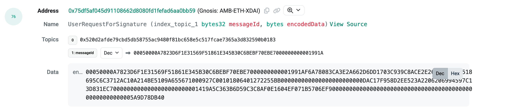
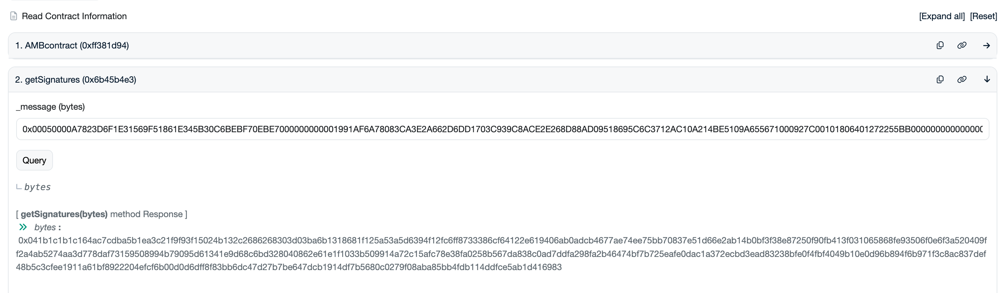

The native Arbitrary Message Bridge (AMB) allows user to send arbitrary data between Gnosis Chain and Ethereum. This allows Gnosis contracts to send data and trigger contract functions on Ethereum and other chains, and vice versa.

The AMB is a key bridge primitive that is used inside higher-order bridges like the [Omnibridge native token bridge](../About%20Token%20Bridges/omnibridge.md), and is part of the [Tokenbridge Architecture](https://github.com/tokenbridge/docs).

Due to the light client finality requirements (at least 23mins on Ethereum), the transactions will take approx. 30mins to be signed by the bridge. However, users can still use 3rd party bridges (Jumper.exchange, Connext, Hop) without any impact.

## Overview

|                       | Detail                                                |
| --------------------- | ----------------------------------------------------- |
| Frontend URL          | N/A                                                   |
| Trust Model           | [4-of-7 Validator Multisig](#bridge-validators)       |
| Governance            | [8-of-16 Multisig](#bridge-governance)                |
| Governance Parameters | [Validators](#bridge-validators)                      |
| Bug Bounty            | [up to $2m](https://immunefi.com/bounty/gnosischain/) |
| Bug Reporting         | [Immunefi](https://immunefi.com/bounty/gnosischain/)  |

### Contracts

<Tabs>
<TabItem value="ethereum" label="Ethereum">

**Ethereum**

| Contract                          | Address                                                                                                                                  |
| --------------------------------- | ---------------------------------------------------------------------------------------------------------------------------------------- |
| Omnibridge Multi-Token Mediator   | [0x88ad09518695c6c3712AC10a214bE5109a655671](https://etherscan.io/address/0x88ad09518695c6c3712AC10a214bE5109a655671#writeProxyContract) |
| AMB (Foreign)                     | [0x4C36d2919e407f0Cc2Ee3c993ccF8ac26d9CE64e](https://etherscan.io/address/0x4C36d2919e407f0Cc2Ee3c993ccF8ac26d9CE64e#writeProxyContract) |
| AMB/OmniBridge wETH Router Helper | [0xa6439Ca0FCbA1d0F80df0bE6A17220feD9c9038a](https://etherscan.io/address/0xa6439ca0fcba1d0f80df0be6a17220fed9c9038a)                    |

</TabItem>

<TabItem value="gnosis" label="Gnosis">

**Gnosis**

| Contract                            | Address                                                                                                                                   |
| ----------------------------------- | ----------------------------------------------------------------------------------------------------------------------------------------- |
| AMB/Omnibridge Multi-Token Mediator | [0xf6A78083ca3e2a662D6dd1703c939c8aCE2e268d](https://gnosisscan.io/address/0xf6A78083ca3e2a662D6dd1703c939c8aCE2e268d#writeProxyContract) |
| AMB (Home)                          | [0x75Df5AF045d91108662D8080fD1FEFAd6aA0bb59](https://gnosisscan.io/address/0x75Df5AF045d91108662D8080fD1FEFAd6aA0bb59#writeProxyContract) |
| AMB Helper Contract                 | [0x7d94ece17e81355326e3359115D4B02411825EdD](https://gnosisscan.io/address/0x7d94ece17e81355326e3359115D4B02411825EdD#readContract)       |

</TabItem>

<TabItem value="sepolia-chiado" label="Sepolia-Chiado">

**Sepolia - Chiado**

| Contract                     | Address                                                                                                                                                 |
| ---------------------------- | ------------------------------------------------------------------------------------------------------------------------------------------------------- |
| AMB (Sepolia)                | [0xf2546D6648BD2af6a008A7e7C1542BB240329E11](https://sepolia.etherscan.io/address/0xf2546D6648BD2af6a008A7e7C1542BB240329E11)                           |
| Validator Contract (Sepolia) | [0xa0bd95dd2570632c8640ab5bc213f3a0ea33e26a](https://sepolia.etherscan.io/address/0xa0bd95dd2570632c8640ab5bc213f3a0ea33e26a)                           |
| AMB (Chiado)                 | [0x8448E15d0e706C0298dECA99F0b4744030e59d7d](https://gnosis-chiado.blockscout.com/address/0x8448E15d0e706C0298dECA99F0b4744030e59d7d)                   |
| Validator Contract (Chiado)  | [0x9e8a89ebcb83065eaaf4b7ff720caa5e6b25c976](https://gnosis-chiado.blockscout.com/address/0x9e8a89ebcb83065eaaf4b7ff720caa5e6b25c976)                   |
| AMB Helper Contract (Chiado) | [0x3cc500B3c01D04C265c9293cB35BA2Fd8eA6dc1b](https://gnosis-chiado.blockscout.com/address/0x3cc500B3c01D04C265c9293cB35BA2Fd8eA6dc1b?tab=read_contract) |

</TabItem>

</Tabs>

### Bridge Validators

- See [Bridge Validator](../management/validators#amb--omnibridge)

### Bridge Governance

- See [Bridge Governance](../management/README.md)

## How it works

### Terminology

- **Home (Native) Network**: Gnosis Chain.
- **Foreign Network**: Ethereum.
- **Originating Contract**: An arbitrary contract where the message originates, typically this is where the user interacts and requests for a function to be invoked on another network. For example, Omnibridge is the originating contract that use AMB contract as data messaging layer.

### Call a cross-chain method via AMB:

```solidity
function requireToPassMessage (address _contract,
                                bytes _data,
                                uint256 _gas) external;
```

| param      | details                                                                                                   |
| ---------- | --------------------------------------------------------------------------------------------------------- |
| \_contract | address of contract on other network                                                                      |
| \_data     | encoded bytes of the method selector and the params that will be called in the contract on the other side |
| \_gas      | gas to be provided in execution of the method call on the other side                                      |


#### Ethereum to Gnosis Chain

1. User calls `foo()` on the originating contract
2. Originating contract calls [`requireToPassMessage()`](https://etherscan.io/address/0x4C36d2919e407f0Cc2Ee3c993ccF8ac26d9CE64e#writeProxyContract#F10) on [Foreign AMB contract](https://etherscan.io/address/0x4C36d2919e407f0Cc2Ee3c993ccF8ac26d9CE64e#writeProxyContract), and encodes `foo()`, target address, and gas limit used on the other chain for executing a message.
3. `UserRequestForAffirmation(bytes32 indexed messageId, bytes encodedData)` event is emitted from [Foreign AMB contract](https://etherscan.io/address/0x4C36d2919e407f0Cc2Ee3c993ccF8ac26d9CE64e#writeProxyContract), and listening bridge validators relay the message to the Home side where signatures are collected by calling Home AMB `executeAffirmation(bytes message)`, where `message` parameter is the `encodedData` from `UserRequestForAffirmation` event. Hashi acts as an additional bridge valdiator who validates transactions but no actually calling `executeAffirmation` on Home AMB. For more details about how Hashi works in this case, check out [here](./hashi-integration.md)
4. Once enough signatures has been collected by bridge valdiators, the transaction will emit `CollectedSignatures (address authorityResponsibleForRelay, bytes32 messageHash, uint256 NumberOfCollectedSignatures)` and calls `foo()` on the target contract.

#### Gnosis Chain to Ethereum

1. User calls `foo()` on an originating contract
2. Originating contract calls [`requireToPassMessage()`](https://gnosisscan.io/address/0x75Df5AF045d91108662D8080fD1FEFAd6aA0bb59#writeProxyContract#F14) on Home Bridge contract, and encodes `foo()`, target address, and gas limit used on the other chain for executing a message.
3. Signatures are collected from validators by calling [`submitSignatures()`](https://gnosisscan.io/address/0x75Df5AF045d91108662D8080fD1FEFAd6aA0bb59#writeProxyContract#F5), and once enough are collected `CollectedSignatures()` event is emitted. Hashi acts as an additional bridge valdiator who validates transactions but no actually calling `executeAffirmation` on Home AMB. For more details about how Hashi works in this case, check out [here](./hashi-integration.md)
4. Anyone can execute the call by calling [`executeSignatures(bytes message, bytes signatures)`](https://etherscan.io/address/0x4C36d2919e407f0Cc2Ee3c993ccF8ac26d9CE64e#writeProxyContract#F3) on Foreign AMB. To fetch the calldata for `executeSignatures` function, please follow the [guideline below](#how-to-call-executesignatures-on-foreign-amb-ethereum).
5. Foreign AMB contract decodes the message and calls `foo()` on target contract


### How to call executeSignatures on Foreign AMB (Ethereum)

When the transaction is initiated from Home Network (Gnosis Chain), one has to claim the transaction on Ethereum explicitly. Here is how you can fetch the calldata required to call Foreign AMB to claim the transaction.

1. Find the originating transaction on Gnosis Chain that interact with the Home AMB, and look for `UserRequestForSignature(bytes32 indexed messageId, bytes encodedData)`. [Example](https://gnosisscan.io/tx/0x946d5a926b4e6c55b51eae53b6fea118d7d4fd5ebfa44d6256ef4ce7b4d927be#eventlog)
   
2. Go to [AMB Helper contract](https://gnosisscan.io/address/0x7d94ece17e81355326e3359115D4B02411825EdD#readContract) on Gnosis Chain, paste the `encodedData` from `UserReqeustForSignature` into `getSignatures(bytes _message)` (the message starts with 0x0005). Fetch the return value from `getSignatures`.
   
3. On Foreign AMB, call `executeSigantures(bytes _data, bytes _signatures)`, where `_data` is the `encodedData` from `UserRequestForSignature` and `_signatures` is from the return value of `getSignatures` method. Please make sure that the caller account has enough ETH for the gas fee.


### How to check if AMB is down (not relaying message)

In certain circumstances, i.e. hardfork, AMB will be planned for downtime (not relaying message) to ensure security of the bridge. Planned downtime will be announced in public channel like Discord and Twitter, prior to the event.  
There is also another way to check whether the AMB is down or not by reading `maxGasPerTx` value on AMB contract.

In the current configuration, `maxGasPerTx` is set to 4000000 on [Ethereum](https://etherscan.io/address/0x4C36d2919e407f0Cc2Ee3c993ccF8ac26d9CE64e#readProxyContract) and 2000000 on [Gnosis Chain](https://gnosisscan.io/address/0x75Df5AF045d91108662D8080fD1FEFAd6aA0bb59#readProxyContract).

The AMB is down when `maxGasPerTx` is set to 0, only by owner of the contract.

By setting `maxGasPerTx` to 0, the [condition in `_sendMessage()`](https://github.com/gnosischain/tokenbridge-contracts/blob/master/contracts/upgradeable_contracts/arbitrary_message/MessageDelivery.sol#L40) will not pass, meaning, the bridge is down/stopped.

### Security Considerations for Receiving a Call

| Concern       | Remediation                                                                                                                                                                                                                                                                                                                    |
| ------------- | ------------------------------------------------------------------------------------------------------------------------------------------------------------------------------------------------------------------------------------------------------------------------------------------------------------------------------ |
| Authorization | Check the address of invoking contract using `messageSender()`                                                                                                                                                                                                                                                                 |
| Authorization | Check that `msg.sender` is the address of the bridge contract                                                                                                                                                                                                                                                                  |
| Replay Attack | `transactionHash()` allows for checking of a hash of the transaction that invoked the `requireToPassMessage()` call. The invoking contract (in some cases, the mediator contract) is responsible for providing a _unique sequence_ (can be a nonce) as part of the `_data` param in the `requireToPassMessage()` function call |

### AMB Components

| Component        | Description                                                                                                                                                                                                                 |
| ---------------- | --------------------------------------------------------------------------------------------------------------------------------------------------------------------------------------------------------------------------- |
| System Contracts | AMB Implementation Contracts (Home Bridge and Foreign Bridge), Governance Multisigs, gas limit helpers, failed call management helpers (for when gas estimate was insufficient), and fee management helpers to collect fees |
| Bridge validator | Containerized microservices that listen for on-chain events and send confirmations to relay messages. [More on them here](https://github.com/gnosischain/tokenbridge/blob/master/oracle/README.md.md).                      |
| DevOps           | [Bridge validator](https://github.com/gnosischain/tokenbridge/blob/master/oracle/README.md),[Bridge UI](https://github.com/gnosischain/bridge-monitor), docker compose, ansible playbooks                                   |
| dApp Contracts   | extensions (pair mediator contracts on both sides of the AMB), such as the Omnibridge                                                                                                                                       |

### Use Cases of AMB

- ERC-to-ERC Bridges: `AMB-ERC-TO-ERC` mode enables the transfer of ERC tokens to the Foreign Mediator, which will interact with Foreign AMB Bridge to mint wrapped ERC-667 tokens on the Home Network. Complimentarily, the mode enables the transfer ERC20 or ERC-667 tokens to the Home Mediator, which will interact with Home AMB Bridge to unlock ERC20 tokens on the Foreign network. This is used by the [Omnibridge](omnibridge).
- ERC-to-Native Bridges: `ERC-TO-NATIVE` mode enables the user to send ERC20 tokens to the Foreign Bridge and receive native coins from the Home Bridge Complimentarily, then can send native coins to the Home Bridge to unlock ERC20 tokens from the Foreign Bridge. The home network nodes must support a consensus engine that allows using a smart contract for block reward calculation. This mode is used by the [xDai Bridge](xdai-bridge)
- Message Passing: `ARBITRARY-MESSAGE` mode enables the capability to invoke a Home/Foreign Bridge contract to send a message that will be executed on the other Network. This can be an arbitrary contract method invocation.

## Resources

- [Token bridge Documentation](https://github.com/tokenbridge/docs)
