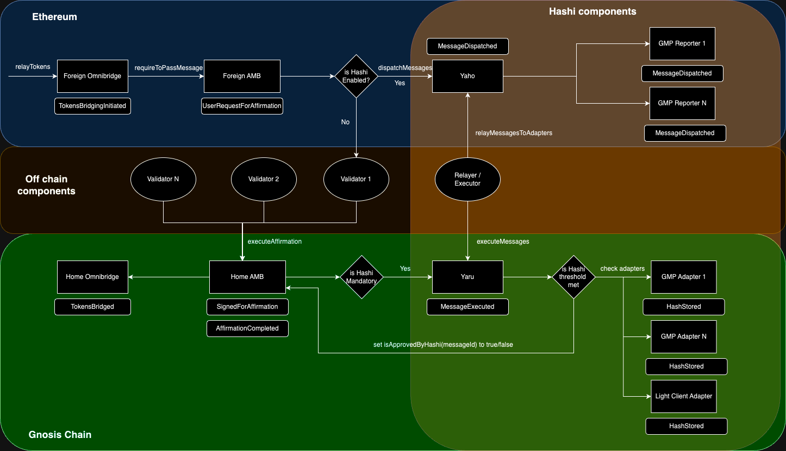

# Hashi integration

The proposal of Hashi integration on Gnosis Chain's bridges (AMB & Omnibridge, xDAI bridge) is [approved by Gnosis DAO members](https://forum.gnosis.io/t/gip-93-should-gnosisdao-support-the-integration-of-hashi-within-gnosis-chains-canonical-bridges/8245/5) on April 2nd, 2024. The integration introduces advanced security measures, mitigates systemic risks, and ensures the Gnosis Chain ecosystem remains resilient against the evolving landscape of security threats. With the efforts from Cross-Chain Alliance and Gnosis team, the integration is going toward production.

## What’s new?

1. Hashi Manager contract: New contract. Set reporters, adapters, and threshold parameters used by the bridge contract.
2. New variables/function:
   1. HASHI_ENABLED: New variable. When set to true, every message can be approved by Hashi, but the message need not to be approved by Hashi for it to get executed.
   2. HASHI_MANDATORY: New variable. When set to true, every message has to be approved by Hashi before execution.
   3. isApprovedByHashi(bytes32 msgId): New public function. Return whether a message w.r.t a message Id is approved by Hashi.
   4. setHashiManager(address HashiManager): New function, onlyOwner. Set Hashi Manager contract on the bridge contract.
3. Modified events:
   1. xDAI Bridge: in xDAI bridge, a `bytes32 nonce` is added into `UserRequestForAffirmation` and `UserRequestForSignature` events.
      1. `event UserRequestForAffirmation(address recipient, uint256 value)` is changed to `event UserRequestForAffirmation(address recipient, uint256 value, bytes32 nonce)`
      2. `event UserRequestForSignature(address recipient, uint256 value)` is changed to `UserRequestForSignature(address recipient, uint256 value bytes32 nonce)`

## AMB & Omnibridge

For Omnibridge / AMB:

**Ethereum → Gnosis Chain**

1. User approves token for Foreign Omnibridge
2. User calls ForeignOmnibridge.relayTokens(address token, address receiver, uint256 amount)
   1. ForeignOmnibridge calls ForeignAMB.requireToPassMessage()
   2. ForeignAMB check if HASHI_IS_ENABLED is true, and call Yaho.dispatchMessage
   3. Off chain relayer detects MessageDispatched event from Yaho and call Yaho.relayMessagesToAdapters to relay message to each reporters.
   4. Reporters relay the messageId and message hash to adapter contract on Gnosis Chain.
   5. Light Client based oracle only stores hashes on Gnosis Chain.
3. If Hashi is enabled & mandatory, off chain executor calls Gnosis Chain’s Yaru.executeMessages(), which check if the hash is agreed upon a threshold amount of adapters (set in Hashi Manager contract) adapters and set isApprovedByHashi(messageId) to true eventually.
4. Bridge validators detects UserRequestForAffirmation event and call HomeAMB.executeAffirmation. If Hashi is enabled & mandatory, this step has to wait after step 3.

**Gnosis Chain → Ethereum**

1. User approves token for Home Omnibridge
2. User calls HomeOmnibridge.relayTokens(address token, address receiver, uint256 amount)
   1. HomeOmnibridge calls HomeAMB.requireToPassMessage()
   2. HomeAMB check if HASHI_IS_ENABLED is true, and call Yaho.dispatchMessage
   3. Off chain relayer detects MessageDispatched event from Yaho and call Yaho.relayMessagesToAdapters to relay message to each reporters.
   4. Reporters relay the messageId and message hash to adapter contract on Ethereum.
3. Bridge validators detects UserRequestForSignature event and call HomeAMB.submitSignatures.
4. If Hashi is enabled & mandatory, off chain executor calls Ethereum’s Yaru.executeMessages(), which check if the hash is agreed upon adapters and set isApprovedByHashi(messageId) to true eventually.
5. User claims token by calling Ethereum’s ForeignAMB.executeSignatures().

## xDAI briddge

**Ethereum → Gnosis Chain**

1. User approves token for Foreign xDAI bridge.
2. User calls ForeignXDAIBridge.relayTokens(address receiver, uint256 amount)
   1. ForeignXDAIBridge check if HASHI_IS_ENABLED is true, and call Yaho.dispatchMessage
   2. Off chain relayer detects MessageDispatched event from Yaho and call Yaho.relayMessagesToAdapters to relay message to each reporters.
   3. Reporters relay the messageId and message hash to adapter contract on Gnosis Chain.
   4. Light Client based oracle only stores hashes on Gnosis Chain.
3. If Hashi is enabled & mandatory, off chain executor calls Gnosis Chain’s Yaru.executeMessages(), which check if the hash is agreed upon a threshold amount of adapters (set in Hashi Manager contract) and set isApprovedByHashi(messageId) to true eventually.
4. Bridge validators detects UserRequestForAffirmation event and call HomexDAIBridge.executeAffirmation. If Hashi is enabled & mandatory, this step has to wait after step 3. Block Reward contract emits AddedReceiver event, which will mint equivalent amount of xDAI to receiver in the next block.

**Gnosis Chain → Ethereum**

1. User calls HomexDAIBridge.relayTokens(address receiver, uint256 amount) or transfer xDAI to HomexDAIBridge without msg.data.
   1. HomexDAIBridge check if HASHI_IS_ENABLED is true, and call Yaho.dispatchMessage
   2. Off chain relayer detects MessageDispatched event from Yaho and call Yaho.relayMessagesToAdapters to relay message to each reporters.
   3. Reporters relay the messageId and message hash to adapter contract on Ethereum.
2. Bridge validators detects UserRequestForSignature event and call HomexDAIBridge.submitSignatures.
3. If Hashi is enabled & mandatory, off chain executor calls Ethereum’s Yaru.executeMessages(), which check if the hash is agreed upon adapters and set isApprovedByHashi(messageId) to true eventually.
4. User claims token by calling Ethereum’s ForeignxDAIBridge.executeSignatures(). DAI is transfer to the receiver eventually.

# Testnet environment

For testing purpose, we've set up testnet environemnt. Users are welcome to experiment with the testnet environments:

- Sepolia addresses
  1. ForeignAMB: [0x2F62433e00168af10c70bc39e2fDbEe5DaCA257b](https://sepolia.etherscan.io/address/0x2F62433e00168af10c70bc39e2fDbEe5DaCA257b)
  2. Hashi Manager: [0x6C5F4F8a719bF054D6b08E3cCc27a5f208Ec8766](https://sepolia.etherscan.io/address/0x6C5F4F8a719bF054D6b08E3cCc27a5f208Ec8766#writeProxyContract)
- Chiado addresses
  1. Home AMB: [0xAF18353BF369897Aab18ec225422F921be9F7eC6](https://gnosis-chiado.blockscout.com/address/0xAF18353BF369897Aab18ec225422F921be9F7eC6?tab=contract)
  2. Hashi Manager: [0xe505cD6522E9A1c2309a915f83dDCA9addaC0895](https://gnosis-chiado.blockscout.com/address/0xe505cD6522E9A1c2309a915f83dDCA9addaC0895?tab=contract_code)
  3. AMB BridgeHelper: [0x3fba3D7Ae204a684E4359A3fC211C18EA155cd78](https://gnosis-chiado.blockscout.com/address/0x3fba3D7Ae204a684E4359A3fC211C18EA155cd78)

## Omnibridge

- Sepolia address
  1. Foreign Omnibridge: [0xc4e06E44B2d1e148beFAa3cB2012A985EFe7032a](https://sepolia.etherscan.io/address/0xc4e06E44B2d1e148beFAa3cB2012A985EFe7032a) ✅
  2. WETH Router: [0x65E64139f202F89cb6b4bFc140bf01Cda1886465](https://sepolia.etherscan.io/address/0x65E64139f202F89cb6b4bFc140bf01Cda1886465#code)
- Chiado address
  1. Home Omnibridge: [0xB866dC5321Ca41a22938A7afD5Bc3c5069975874](https://gnosis-chiado.blockscout.com/address/0xB866dC5321Ca41a22938A7afD5Bc3c5069975874?tab=write_proxy)

## xDAI

- Sepolia addresses
  1. Foreign xDAI: [0x97589968FA7ef153af44C6F5d0Fb9AcaEA97AC94](https://sepolia.etherscan.io/address/0x97589968FA7ef153af44C6F5d0Fb9AcaEA97AC94)
  2. Hashi Manager: [0x90d3c0c9BCb317E80A459B0126257665186E59fa](https://sepolia.etherscan.io/address/0x90d3c0c9bcb317e80a459b0126257665186e59fa#code)
- Chiado addresses
  1. Home xDAI: [0x867696eA1cfA243aB909797022D0A0C99BdACcF1](https://gnosis-chiado.blockscout.com/address/0x867696eA1cfA243aB909797022D0A0C99BdACcF1?tab=contract)
  2. Hashi Manager: [0x5b745C021ef62f90862a812EB6763f5758e51eE2](https://gnosis-chiado.blockscout.com/address/0x5b745C021ef62f90862a812EB6763f5758e51eE2?tab=contract)
  3. xDAI Bridge Helper: [0xA7bE47d1111baFDb2f0E9ce8D6431508aC2fd98e](https://gnosis-chiado.blockscout.com/address/0xA7bE47d1111baFDb2f0E9ce8D6431508aC2fd98e#code)

## Reference

1. AMB contracts: https://github.com/crosschain-alliance/tokenbridge-contracts/tree/feat/hashi-integration-amb
2. xDAI bridge contracts: https://github.com/crosschain-alliance/tokenbridge-contracts/tree/feat/hashi-integration-xdai-bridge
3. Test: https://github.com/crosschain-alliance/tokenbridge-contracts-migration-tests
4. Audits: https://crosschain-alliance.gitbook.io/hashi/v0.2/audit-report#gnosis-bridge-hashi-integration
5. Hashi: https://crosschain-alliance.gitbook.io/hashi/v0.2/introduction
