# USDS migration on xDai Bridge

:::info
To address a potential front-running issue from the previous design\*, a new implementation has been introduced.
The key changes includes ⚠️:

1. New USDS deposit contract on Gnosis Chain
2. New `token` parameter is introduced in the `UserRequestForSignature` event on Gnosis Chain xDAI Bridge (HomeBridgeErcToNative.sol)
3. The `executeSignaturesUSDS` function from the previous design is removed from the BridgeRouter.sol and XDaiForeignBridge.sol contract.

\*refer to Omega audit XDFB1.
:::

:::danger

The bridge migration is targeting on 28 October 2025.
Target audiences:

1. 3rd party applications: please refer to [Call To Action](https://github.com/gnosischain/tokenbridge-contracts/blob/feat/xdai-usds-migration/USDSMigration.md#call-to-action-update-your-code--indexer).
2. User: No action required.
3. Bridge validator: update the validator image to latest version(WIP).

:::

## 1. General Overview

- **What changed?**  
  **Etherum -> Gnosis Chain**

  - The [xDAI bridge on Ethereum](https://etherscan.io/address/0x4aa42145Aa6Ebf72e164C9bBC74fbD3788045016) no longer accepts DAI as collateral. It now uses [USDS](https://etherscan.io/address/0xdC035D45d973E3EC169d2276DDab16f1e407384F).
  - On Gnosis Chain, users still receive xDAI as usual.
  - The Bridge Router serves as the entry point for token relay transactions, routing them to the appropriate bridge contract on Ethereum (xDAI Bridge or Omnibridge).

  **Gnosis Chain -> Ethereum**

  - To get USDS on Ethereum, one MUST switch to USDSDepositContract on Gnosis Chain when initiating the transaction.
  - To get DAI on Ethereum, one MUST remain calling the Home xDAI Bridge (HomeBridgeErcToNative) as it is.
  - Claiming token on Ethereum remains the same function executeSignatures(bytes memory message, bytes memory signatures).

- **Why it matters?**

  - Any application sending or claiming DAI must adapt to the new USDS flows.
  - To send or claim tokens on Ethereum, you interact with the **BridgeRouter** contract, which directs transactions to the right bridge logic.
  - To send xDAI on Gnosis Chain, you interact with the **Home xDAI bridge** to receive DAI on Ethereum, or with **USDS Deposit Contract** to receive USDS on Ethereum.

- **When will it happen?**
  - **The exact date for the migration is 28 October 2025**

---

## 2. Key Contracts & Addresses

| Contract            | Chain        | Address                                      |
| ------------------- | ------------ | -------------------------------------------- |
| BridgeRouter Proxy  | Ethereum     | `0x9a873656c19Efecbfb4f9FAb5B7acdeAb466a0B0` |
| XDaiForeignBridge   | Ethereum     | `0x4aa42145Aa6Ebf72e164C9bBC74fbD3788045016` |
| HomeErcToNative     | Gnosis Chain | `0x7301CFA0e1756B71869E93d4e4Dca5c7d0eb0AA6` |
| USDSDepositContract | Gnosis Chain | `0x5C183C8A49aBA6e31049997a56D75600E27FF8c9` |

---

## 3. Technical Details

:::info
Please refer to [here](https://github.com/gnosischain/tokenbridge-contracts/blob/feat/xdai-usds-migration/USDSMigration.md) for details regarding the contracts, workflow pre & post migration.
:::

**How it works after the migration**

**Relay tokens from Ethereum**


**Claim tokens on Ethreum**


**Relay xDAI from Gnosis**


**Callflow**


### 3.1 How to Relay Tokens from Ethereum

1. **Approve** the BridgeRouter to spend your token:

   ```solidity
   // if sending DAI or USDS:
   IERC20(token).approve(BridgeRouterAddress, amount);
   ```

2. **Call** `relayTokens` on BridgeRouter:

   ```solidity
   BridgeRouter.relayTokens(
     address token,            // address of DAI or USDS
     address recipient, // who receives xDAI on Gnosis Chain
     uint256 amount            // how much to send
   );
   ```

- **What happens inside?**

  - If `token` is DAI: it's converted to USDS, then locked in xDAI Foreign Bridge cotntract.
  - If `token` is USDS: it's locked in xDAI Foreign Bridge cotntract directly.
  - If `token` is any other ERC20 or ETH: it goes through Omnibridge as before.

---

### 3.2 How to Claim Tokens on Ethereum

Once your tokens have been initiated from Gnosis Chain, you can claim them back on Ethereum:

- **Claim DAI:**

  ```solidity
  BridgeRouter.executeSignatures(message, signatures);
  ```

  - return USDS or swap USDS -> DAI for recipient

- **Other tokens:**

  ```solidity
  BridgeRouter.safeExecuteSignaturesWithAutoGasLimit(message, signatures);
  ```

  - Same process as before via Omnibridge.

- To fetch the `message` and `signatures` parameters, please check the guide for xDai Bridge [here](./xdai-bridge.md#how-to-claim-dai-on-ethereum), for AMB/Omnibridge [here](./amb-bridge.md#how-to-call-executesignatures-on-foreign-amb-ethereum).

---

### 3.3 How to Relay Tokens from Gnosis Chain

1. Interact with the correct contract based on the received token on Ethereum  
   **To get DAI on Ethereum**

   ```solidity
   HomeBridgeErcToNative.relayTokens{value: msg.value}(address recipient)
   // Or transfer xDAI directly
   HomeBridgeErcToNative.call{value: msg.value}("")
   ```

   **To get USDS on Ethereum**

   ```solidity
   USDSDepositContract.relayTokens{value: msg.value}(address recipient)
   // Or transfer xDAI directly
   USDSDepositContract.call{value: msg.value}("")
   ```

## 4. Next Steps

- **Update your code**:

  - Replace direct xDAI Foreign bridge calls with **BridgeRouter** methods (`relayTokens`, `executeSignatures`).
  - Switch to USDS Deposit contract on Gnosis Chain if you want to receive USDS on Ethereum.

### 4.1 How to test with post migration environment

To simulate the actual mainnet environment, we use Tenderly Virtual TestNets for both Ethereum and Gnosis Chain. Third-party applications are encouraged to use the following RPC endpoints to simulate the post-migration environment.

Switch your RPC:

| Chain        | Description | URL                                                                              |
| ------------ | ----------- | -------------------------------------------------------------------------------- |
| Ethereum     | RPC         | https://virtual.mainnet.eu.rpc.tenderly.co/f3e5e498-bd28-4b49-a8f6-93f033e6fa6e  |
| Ethereum     | Explorer    | https://dashboard.tenderly.co/explorer/vnet/f3e5e498-bd28-4b49-a8f6-93f033e6fa6e |
| Gnosis Chain | RPC         | https://virtual.gnosis.eu.rpc.tenderly.co/4c9e4122-6c01-46bd-a44a-e08133d2d2cc   |
| Gnosis Chain | Explorer    | https://dashboard.tenderly.co/explorer/vnet/4c9e4122-6c01-46bd-a44a-e08133d2d2cc |

If you run into any issues or have any questions, please reach out to our comms channel: [Telegram](https://t.me/gnosischain), [X](https://x.com/gnosischain), [Discord](https://discord.com/invite/gnosis) for assistance.

## 5. Glossary

1. BridgeRouter: Entry point contract after the migration on Ethereum, facilitating routing and token swapping.
   1. address: [0x9a873656c19Efecbfb4f9FAb5B7acdeAb466a0B0](https://etherscan.io/address/0x9a873656c19Efecbfb4f9FAb5B7acdeAb466a0B0)
   2. contract: [BridgeRouter.sol](https://github.com/gnosischain/tokenbridge-contracts/blob/feat/xdai-usds-migration/contracts/upgradeable_contracts/erc20_to_native/BridgeRouter.sol)
2. xDAIForeignBridge / Foreign xDAI bridge: xDAI bridge on Ethereum.
   1. address: [0x4aa42145Aa6Ebf72e164C9bBC74fbD3788045016](https://etherscan.io/address/0x4aa42145Aa6Ebf72e164C9bBC74fbD3788045016#readProxyContract)
   2. contract: [XDaiForeignBridge.sol](https://github.com/gnosischain/tokenbridge-contracts/blob/feat/xdai-usds-migration/contracts/upgradeable_contracts/erc20_to_native/XDaiForeignBridge.sol)
3. HomeBridgeErcToNative / Home xDAI Bridge : xDAI bridge on Gnosis Chain.
   1. address: [0x7301CFA0e1756B71869E93d4e4Dca5c7d0eb0AA6](https://gnosis.blockscout.com/address/0x7301CFA0e1756B71869E93d4e4Dca5c7d0eb0AA6#address-tabs) (
   2. contract: [HomeBridgeErcToNative.sol](https://github.com/gnosischain/tokenbridge-contracts/blob/feat/xdai-usds-migration/contracts/upgradeable_contracts/erc20_to_native/HomeBridgeErcToNative.sol)
4. USDS deposit contract: Deposit contract on Gnosis Chain that acts as an entry point contract if user wants to receive USDS on Ethereum.
   1. address: [0x5C183C8A49aBA6e31049997a56D75600E27FF8c9](https://gnosisscan.io/address/0x5C183C8A49aBA6e31049997a56D75600E27FF8c9#code)
   2. contract: [USDSDepositContract.sol](https://github.com/gnosischain/tokenbridge-contracts/blob/feat/xdai-usds-migration/contracts/USDSDepositContract.sol)
5. Foreign Chain : Ethereum
6. Home Chain: Gnosis Chain
