# USDS migration on xDai Bridge

:::danger

The bridge migration has not yet taken place.  
Please prepare for the upcoming upgrade by switching the entry point contract from xDAI Foreign Bridge to Bridge Router contract.
:::

## 1. General Overview

- **What changed?**

  - The [xDAI bridge on Ethereum](https://etherscan.io/address/0x4aa42145Aa6Ebf72e164C9bBC74fbD3788045016) no longer accepts DAI as collateral. It now uses [USDS](https://etherscan.io/address/0xdC035D45d973E3EC169d2276DDab16f1e407384F).
  - On Gnosis Chain, users still receive xDAI as usual.

- **Why it matters?**

  - Any application sending or claiming DAI must adapt to the new USDS flows.
  - To send or claim tokens, you interact with the **BridgeRouter** contract, which directs transactions to the right bridge logic.

- **When will it happen?**
  - **The exact date for the migration is to be determined** and will be anounced in our comms channel (X, Discord, Telegram, Gnosis Docs).
  - Before the migration happen, third party applications are given **1 month**(June 8, 2025) to adapt to the changes by switching the entry point contract to Bridge Router.

---

## 2. Key Contracts & Addresses

| Contract                 | Chain    | Address                                                                                                                 |
| ------------------------ | -------- | ----------------------------------------------------------------------------------------------------------------------- |
| **BridgeRouter (Proxy)** | Ethereum | [`0x9a873656c19Efecbfb4f9FAb5B7acdeAb466a0B0`](https://etherscan.io/address/0x9a873656c19Efecbfb4f9FAb5B7acdeAb466a0B0) |
| BridgeRouter Impl.       | Ethereum | [`0x691c025Efa7ea1c87DF256F2Da9208E5345D40b1`](https://etherscan.io/address/0x691c025Efa7ea1c87DF256F2Da9208E5345D40b1) |

---

## 3. Technical Details

:::info
Please refer to [here](https://github.com/gnosischain/tokenbridge-contracts/blob/feat/xdai-usds-migration/USDSMigration.md) for details regarding the contracts, workflow pre & post migration.
:::

**How it works after the migration**

**Relay tokens**


**Claim tokens**


**Scenarios**

1. `BridgeRouter.relayTokens(address token, address recipient, uint256 amount)`  
   -> When token is DAI / USDS from Ethereum, receive xDAI on GC.  
   -> When token is other tokens from Ethereum, receive the bridged version token on GC.
2. `BridgeRouter.executeSignatures(bytes memory message, bytes memory signatures)`  
   -> claim DAI on Ethereum
3. `BridgeRouter.executeSignaturesUSDS(bytes memory message, bytes memory signatures)`  
   -> claim USDS on Ethereum
4. `BridgeRouter.safeExecuteSignaturesWithAutoGasLimit(bytes memory message, bytes memory signatures)`  
   -> claim token from Omnibridge
5. `xDAIForeignBridge.relayTokens(address recipient, uint256 amount)`  
   -> relay USDS from Ethereum, receive xDAI on GC
6. `xDAIForeignBridge.executeSignatures(bytes memory message, bytes memory signatures)`  
   -> claim DAI on Ethereum
7. `xDAIForeignBridge.executeSignaturesUSDS(bytes memory message, bytes memory signatures)`  
   -> claim USDS on Ethereum

### 3.1 How to Relay Tokens

1. **Approve** the BridgeRouter to spend your token:

   ```solidity
   // if sending DAI or USDS:
   IERC20(token).approve(BridgeRouterAddress, amount);
   ```

2. **Call** `relayTokens` on BridgeRouter:

   ```solidity
   BridgeRouter.relayTokens(
     address token,            // address of DAI or USDS
     address recipient, // who receives xDAI on Gnosis Chain
     uint256 amount            // how much to send
   );
   ```

- **What happens inside?**

  - If `token` is DAI: it's converted to USDS, then locked in xDAI Foreign Bridge cotntracts.
  - If `token` is USDS: it's locked in xDAI Foreign Bridge cotntracts directly.
  - If `token` is any other ERC20 or ETH: it goes through Omnibridge as before.

---

### 3.2 How to Claim Tokens

Once your tokens have been initiated from Gnosis Chain, you can claim them back on Ethereum:

- **Claim DAI:**

  ```solidity
  BridgeRouter.executeSignatures(message, signatures);
  ```

  - Always returns DAI.

- **Claim USDS (new):**

  ```solidity
  BridgeRouter.executeSignaturesUSDS(message, signatures);
  ```

  - Only works after the upgrade; [reverts](https://github.com/gnosischain/tokenbridge-contracts/blob/feat/xdai-usds-migration/contracts/upgradeable_contracts/erc20_to_native/BridgeRouter.sol#L105) before.

- **Other tokens:**

  ```solidity
  BridgeRouter.safeExecuteSignaturesWithAutoGasLimit(message, signatures);
  ```

  - Same process as before via Omnibridge.

- To fetch the `message` and `signatures` parameters, please check the guide for xDai Bridge [here](./xdai-bridge.md#how-to-claim-dai-on-ethereum), for AMB/Omnibridge [here](./amb-bridge.md#how-to-call-executesignatures-on-foreign-amb-ethereum).

---

## 4. Next Steps

- **Update your code**:

  - Replace direct xDAI Foreign bridge calls with **BridgeRouter** methods (`relayTokens`, `executeSignatures`, `executeSignaturesUSDS`).

- **Monitor migration**:

  - Ensure you use `executeSignaturesUSDS` only once the upgrade is live.

### 4.1 How to test with post migration environment

To simulate the actual mainnet environment, we use Tenderly Virtual TestNets for both Ethereum and Gnosis Chain. Third-party applications are encouraged to use the following RPC endpoints to simulate the post-migration environment.

Switch your RPC:

| Chain        | Description | URL                                                                                           |
| ------------ | ----------- | --------------------------------------------------------------------------------------------- |
| Ethereum     | RPC         | https://virtual.mainnet.rpc.tenderly.co/f7d3ce08-c1ea-42da-87f1-4a40f335dda9                  |
| Ethereum     | Explorer    | https://dashboard.tenderly.co/explorer/vnet/f7d3ce08-c1ea-42da-87f1-4a40f335dda9/transactions |
| Gnosis Chain | RPC         | https://virtual.gnosis.rpc.tenderly.co/c9ef8faf-bac8-40d0-8530-ded119b8012a                   |
| Gnosis Chain | Explorer    | https://dashboard.tenderly.co/explorer/vnet/c9ef8faf-bac8-40d0-8530-ded119b8012a/transactions |

If you run into any issues or have any questions, please reach out to our comms channel: [Telegram](https://t.me/gnosischain), [X](https://x.com/gnosischain), [Discord](https://discord.com/invite/gnosis) for assistance.
