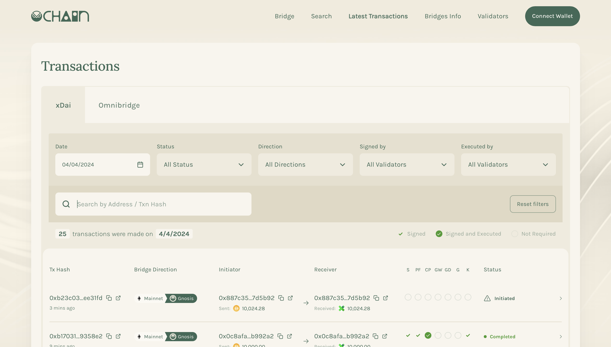
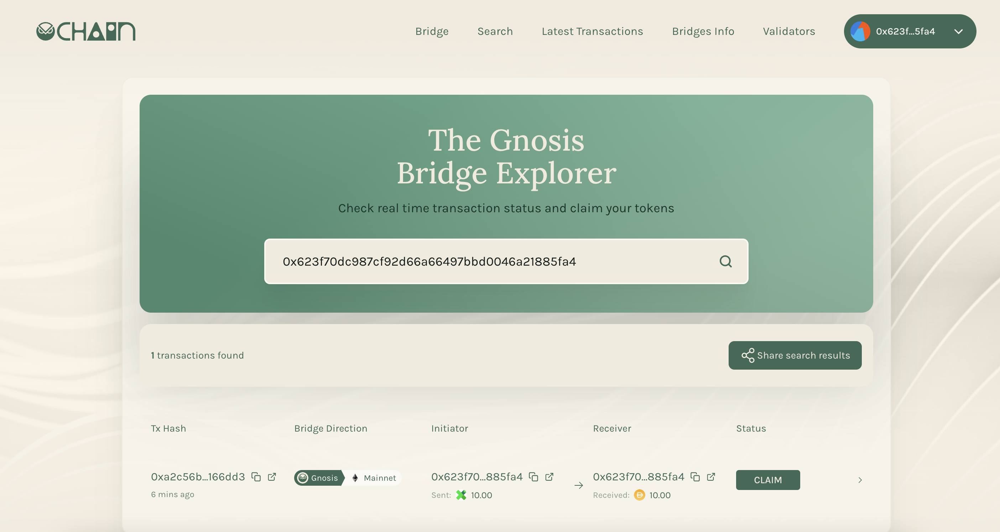
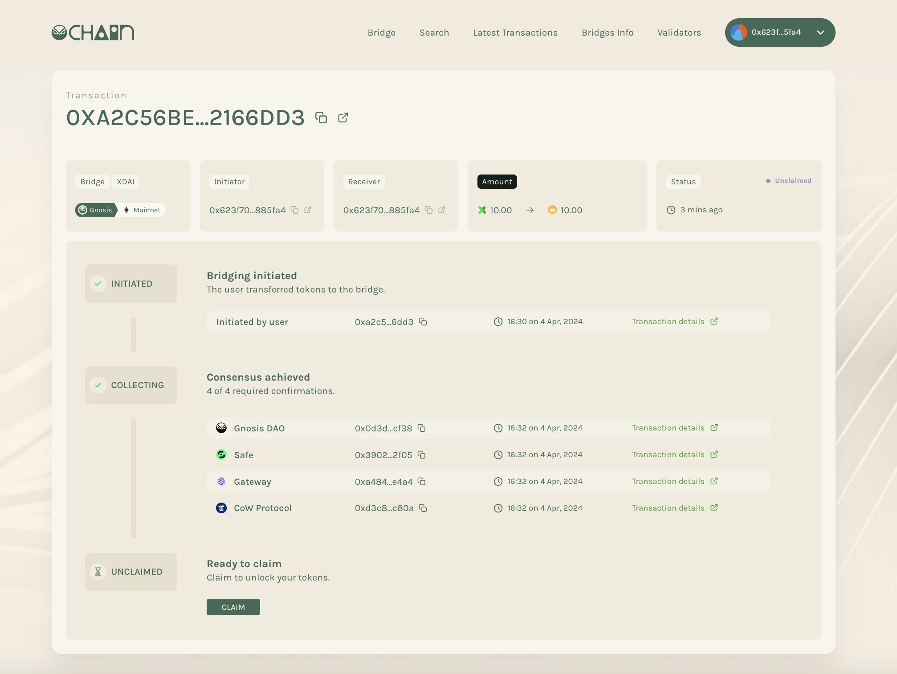
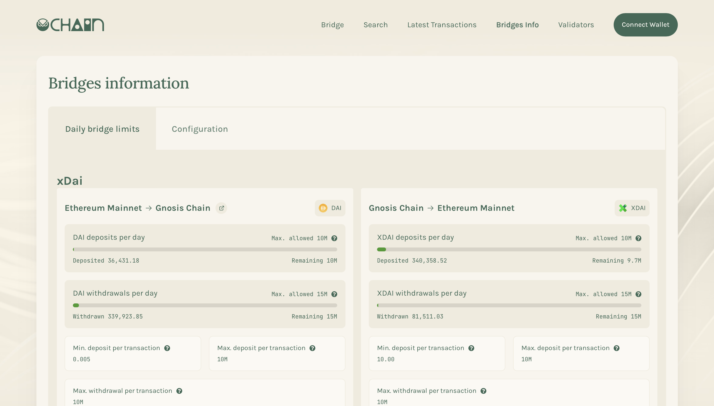
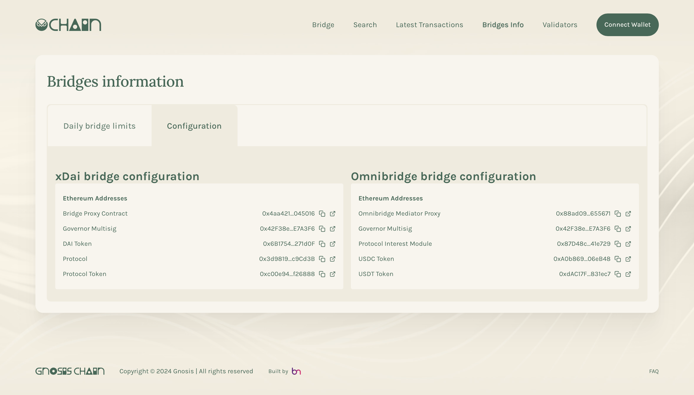
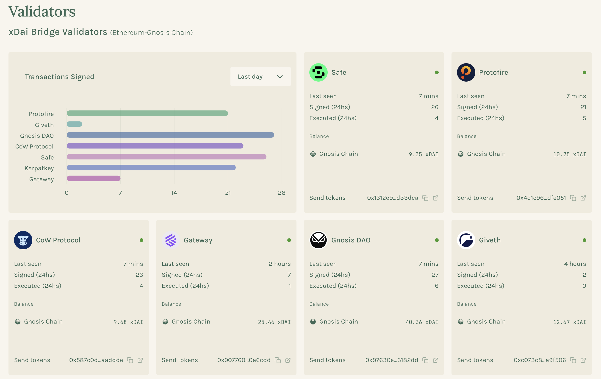

# Bridge Explorer

Bridge explorer allows user to check bridge transactions of Gnosis Bridge, bridges configurations, and validators status. Users may also claim their bridge transactions in bridge explorer.

:::info
https://bridge-explorer.gnosischain.com/bridge-explorer/latest-transactions
:::

## Transactions

### How to search for your transation?

1. Search the transaction by inserting the transaction hash or initiator/receiver address.
2. You can use different filter options to filter out the unrelevant transactions.
3. Click on the transaction item to check the details of the transaction.

### What does different filters mean?

**Status**

1. Initiated: Transaction is initiated from the source chain.
2. Collecting: Signatures from validators are being collecting for the transaction.
3. Unclaimed: Transaction has collected enough signatures, but has not yet been claimed on Ethereum.
4. Completed: Transaction has been bridged successfully.
5. Error: Transaction is not bridged successfully.

**Direction**

1. Gnosis > Mainnet: The transaction is initiated from Gnosis Chain, and bridged to Ethereum mainnet, user need to claim the transaction on Ethereum mainnet.
2. Mainnet > Gnosis: The transaction is initiated from Ethereum mainnet, and bridged to Gnosis Chain.

**Signed by**

- The transaction is signed by which validator (validator calls `submitSignatures` to sign the transaction).

**Executed by**

- The transaction is executed by which validator (validator calls `executeAffirmation` to execute the transaction).

### How to claim your transaction

1. Click **Connect** button on top right corner and connect your wallet.
2. Search for your transaction
3. Click **Claim** button to claim your transaction.

You can also claim your transaction from Transaction page.

### Daily bridge limits

This section shows insight of bridge limit and is reset every `Daily limit reset` hours.

1. **Daily Limit**
   - Ethereum -> Gnosis Chain: Maximum amount of DAI/token that users can bridge from Ethereum to Gnosis in a day
   - Gnosis Chain -> Ethereum: Maximum amount of XDAI/token that users can bridge from Gnosis to Ethereum in a day.
2. **Execution Daily Limit**
   - Ethereum -> Gnosis Chain: Maximum amount of DAI/token that bridge validators can execute and bridge from Gnosis to Ethereum in a day.
   - Gnosis Chain -> Ethereum: Maximum amount of XDAI/token that bridge validators can execute and bridge from Ethereum to Gnosis in a day.
3. **Min. per transaction**: Minimum amount of token that users can bridge in a single transaction.
4. **Max. per transaction**: Maximum amount of token that users can bridge in a single transaction.
5. **Execution max. per transaction**: Maximum amount of token that validators can execute in a single transaction.
6. **Daily limit reset**: In how many hours will the daily limit get reset to zero.
7. **Token address**: Token address of corresponding token, native token(xDAI) don't have an address.

### Configuration

This section shows the address of key contracts.

## Validators

This section shows the insight of current bridges validators, including last seen ago, total signed and executed transactions in 24 hours, balance of validators and their addresses.

If you are not coming from Ethereum, you can use one of the following bridges:
- [Jumper](https://jumper.exchange/) (by Li.Fi)
- [Bungee](https://www.bungee.exchange)
- [Hop](https://app.hop.exchange/)
- [Connext Bridge](https://bridge.connext.network/)

Gnosis' native bridges allow for sending tokens and data, and are run by a group of [trusted bridge validators](/bridges/tokenbridge/amb-bridge#bridge-validators). There is a [roadmap](/bridges/roadmap) to move towards [trustless bridges](/bridges/roadmap#trustless-bridges).

Gnosis' native bridges are first-class citizens in the chain's architecture due to the [native xDai bridge's](/bridges/tokenbridge/xdai-bridge) integral role in minting and burning the native [xDai token](/concepts/tokens/xdai) used for gas.

