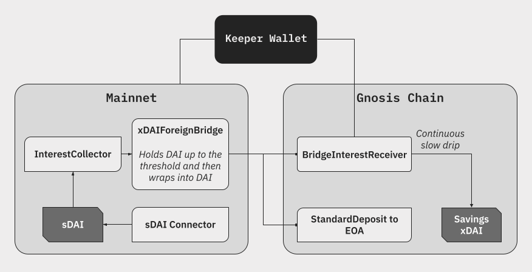

# xDai Bridge

:::info

The Legacy xDai bridge can be found at https://bridge.legacy.gnosischain.com/


:::

The [Legacy xDai bridge](https://bridge.legacy.gnosischain.com/) is a native Dai bridge from Ethereum that is used to mint and burn [xDai](/concepts/tokens/xdai), the native asset used for gas and transaction fees on Gnosis.


Once Dai is bridged into the xDai bridge, the xDai bridge contract on Gnosis notifies the [block rewards contract](#block-rewards-contract). The consensus algorithm then mints xDai to the user's corresponding address on Gnosis in the next block.

## Key Information

### Overview

|                       | Detail                                                |
| --------------------- | ----------------------------------------------------- |
| Frontend URL          | https://bridge.gnosischain.com                        |
| Trust Model           | [4-of-7 Validator Multisig](#bridge-validators)       |
| Governance            | [8-of-16 Multisig](#bridge-governance)                |
| Governance Parameters | Validator Set, Daily Limits, Fees                     |
| Bug Bounty            | [Up to $2m](https://immunefi.com/bounty/gnosischain/) |
| Bug Reporting         | [Immunefi](https://immunefi.com/bounty/gnosischain/)  |

### Key Contracts

<Tabs>
<TabItem value="ethereum" label="Ethereum">

### Ethereum

| Contract                      | Ethereum Address                                                                                                                            |
| ----------------------------- | ------------------------------------------------------------------------------------------------------------------------------------------- |
| xDAI Bridge Contract                | [eth:0x4aa42145Aa6Ebf72e164C9bBC74fbD3788045016](https://etherscan.io/address/0x4aa42145Aa6Ebf72e164C9bBC74fbD3788045016#readProxyContract) |
| Validator Management Contract | [eth:0xe1579dEbdD2DF16Ebdb9db8694391fa74EeA201E](https://etherscan.io/address/0xe1579dEbdD2DF16Ebdb9db8694391fa74EeA201E#code)              |
| Admin Multisignature Wallet   | [eth:0xff1a8EDA5eAcdB6aAf729905492bdc6376DBe2dd](https://etherscan.io/address/0xff1a8EDA5eAcdB6aAf729905492bdc6376DBe2dd)                   |

</TabItem>
<TabItem value="gnosis" label="Gnosis">

### Gnosis

| Contract                      | Gnosis Address                                                                                                                                               |
| ----------------------------- | ------------------------------------------------------------------------------------------------------------------------------------------------------------ |
| xDAI Bridge Contract                | [gno:0x7301CFA0e1756B71869E93d4e4Dca5c7d0eb0AA6](https://gnosis.blockscout.com/address/0x7301CFA0e1756B71869E93d4e4Dca5c7d0eb0AA6#address-tabs)              |
| Block Reward Contract         | [gno:0x481c034c6d9441db23Ea48De68BCAe812C5d39bA](https://gnosis.blockscout.com/address/0x481c034c6d9441db23Ea48De68BCAe812C5d39bA)                           |
| Validator Management Contract | [gno:0xB289f0e6fBDFf8EEE340498a56e1787B303F1B6D](https://gnosis.blockscout.com/address/0xB289f0e6fBDFf8EEE340498a56e1787B303F1B6D/read-proxy)                |
| Admin Multisignature Wallet   | [gno:0x0d3726e5a9f37234d6b55216fc971d30f150a60f](https://gnosis.blockscout.com/address/0x0D3726e5a9f37234D6B55216fC971D30F150a60F/transactions#address-tabs) |
| ERC20ToNative Helper Contract | [gno:0x2D51EAa266eafcb59bB36dD3c7E99C515e58113A](https://gnosis.blockscout.com/address/0x2d51eaa266eafcb59bb36dd3c7e99c515e58113a#readContract)              |

</TabItem>

<TabItem value="sepolia" label="Sepolia-Chiado">

### Sepolia - Chiado

| Contract           | Address                                                                                                                               |
| ------------------ | ------------------------------------------------------------------------------------------------------------------------------------- |
| xDAI Bridge Contract (Sepolia)    | [0x180ff98e734415ecd35fac3d32940e1b45fad0a2](https://sepolia.etherscan.io/address/0x180ff98e734415ecd35fac3d32940e1b45fad0a2) |
| Validator Contract (Sepolia) | [0x3Ea1A9f92A99bC8e820541E7bed5d1F2419fFe59](https://goerli.etherscan.io/address/0x3Ea1A9f92A99bC8e820541E7bed5d1F2419fFe59) |
| xDAI Bridge Contract (Chiado)  | [0xccA0Dc2A058884e62082312F09541cC7566406f0](https://gnosis-chiado.blockscout.com/address/0xccA0Dc2A058884e62082312F09541cC7566406f0) |
| Validator Contract (Chiado) | [0x138190e157d7604B8f89637AA10508Abd4c673B2](https://gnosis-chiado.blockscout.com/address/0x138190e157d7604B8f89637AA10508Abd4c673B2) |


</TabItem>

<TabItem value="goerli" label="Goerli-Chiado">

### Goerli - Chiado

| Contract           | Address                                                                                                                      |
| ------------------ | ---------------------------------------------------------------------------------------------------------------------------- |
| xDAI Bridge Contract (Goerli)    | [0x8659Cf2273438f9b5C1Eb367Def45007a7A16a24](https://goerli.etherscan.io/address/0x8659Cf2273438f9b5C1Eb367Def45007a7A16a24) |
| Validator Contract (Goerli) | [0x1F35121d14ABC91689a7903bf911dce83B0c6EF6](https://goerli.etherscan.io/address/0x1F35121d14ABC91689a7903bf911dce83B0c6EF6) |
| xDAI Bridge Contract (Chiado)  | [0xbb3c86f9918C3C1d83668fA84e79E876d147fFf2](https://gnosis-chiado.blockscout.com/address/0xbb3c86f9918C3C1d83668fA84e79E876d147fFf2) |
| Validator Contract (Chiado) | [0x0ee7EBC72b26e8CeAbbdF275A19dA8e4361685Ce](https://gnosis-chiado.blockscout.com/address/0x0ee7EBC72b26e8CeAbbdF275A19dA8e4361685Ce) |

</TabItem>

</Tabs>

:::info
The current deployment of xDAI bridge contract is from [tokenbridge-contracts/xdaibridge-upgrade-sdai](https://github.com/gnosischain/tokenbridge-contracts/tree/xdaibridge-upgrade-sdai), with the commit hash `bf602f35e624cc6c58c827e7c56b23c8b1afa69a`
:::

References:

- [TokenBridge Docs: About xDai Bridge](https://docs.tokenbridge.net/xdai-bridge/about)
- [TokenBridge Docs: Bridge Contract Management](https://docs.tokenbridge.net/xdai-bridge/xdai-bridge-contracts-management)

### Savings xDAI

Application: https://agave.finance/sdai/

#### Rationale

MakerDAO’s DSR current rate is 5%. Since the increase of the DSR to ~3.5%, ~7M DAI have fled out of the xDAI bridge, as can be seen on this [dashboard](https://dune.com/queries/2650075/4403805?d=11). Bridging the DSR yield into Gnosis Chain will help regain these deposits. In order to provide the needed catalyst for Gnosis Chain Defi to boom, interest rates on Gnosis Chain have to pick up or reach parity with Ethereum or other chains with higher borrowing demand.

Introducing Savings DAI (sDAI), a DSR(Dai Savings Rate) module in xDAI Bridge between Ethereum and Gnosis Chain.

By depositing most of the DAI in xDAI bridge into sDAI vault from Spark Protocol on Ethereum, which is a ERC4626 vault depositing all DAI into the Maker DSR, interest is accrued from Maker DSR and relayed to Gnosis Chain. xDAI holders on Gnosis Chain can mint sDAI with their xDAI, and enjoy the interest accumulating from Ethereum.

Check out the proposal from Karpatkey to **[Deposit DAI of the xDAI bridge in sDAI vault from Spark](https://forum.gnosis.io/t/deposit-dai-of-the-xdai-bridge-in-sdai-vault-from-spark/7236)**

#### Interest rate

Assuming the amount of “Savings DAI on GC” minted is lower than the one held by the bridge, then the yield will be higher than the Dai savings Rate. The bridge currently holds roughly 25M DAI and the DSR yield is 5%, assuming 25M get wrapped into sDAI and only 10M xDAI get deposited into the vault on GC, the yield will be 12.5% .

The expectation is that the sDAI rate will always be higher on GC than Mainnet, as only if almost 100% of all DAI bridged is staked will we achieve rate parity.

Considering the current 25M DAI sitting in the bridge, that represents ~1.25M yearly to incentivise GC.

DSR yield is risk-free if you are already holding DAI. All the risks derived from the collateral are borne by all DAI holders, regardless of them depositing in the DSR. Karpatkey team have written a research piece [here.](https://www.karpatkey.com/contents/makerdaos-game-changing-move) The only newly introduced risk is smart contract risk in how the integration is made with the sDAI vault on Ethereum and the implementation of the sDAI vault on GC.

#### Architecture



#### Ethereum

A new implementation upgrade in xDAIForeignBridge contract: [SavingsDAI Connector](https://github.com/gnosischain/tokenbridge-contracts/blob/xdaibridge-upgrade-sdai/contracts/upgradeable_contracts/erc20_to_native/SavingsDaiConnector.sol) is added as a dependency in the contract. Compare to the old implementation of the [Compound Connector](https://github.com/gnosischain/tokenbridge-contracts/blob/master/contracts/upgradeable_contracts/erc20_to_native/CompoundConnector.sol), the [payInterest](https://github.com/gnosischain/tokenbridge-contracts/blob/xdaibridge-upgrade-sdai/contracts/upgradeable_contracts/erc20_to_native/InterestConnector.sol#L138-L148) function in SavingsDai Connector is used to transfer interest received from vault to receiver address on Gnosis Chain rather than to receiver address on Ethereum.

[sDAI](https://github.com/gnosischain/tokenbridge-contracts/blob/xdaibridge-upgrade-sdai/contracts/interfaces/ISavingsDai.sol) is deployed on Ethereum. Any future DAI deposited to the Bridge will be wrapped into sDAI, with caveat that it will always keep the buffer of the minimumCashThreshold when investing.

**minimumCashThreshold:** This value determines what is the recommended amount of DAI that should be held in the bridge at all times, in order to create a buffer for withdrawals without added operations and thus lower gas costs.

#### Gnosis Chain

There are two contracts being deployed on Gnosis.

The first one is the sDAI vault, also an ERC 4626 which is the most popular standard for vaults which makes it extremely useful for Defi integrations from Lending Protocols like Agave and Spark,  to DEXes like Curve and Balancer with their boosted pools. The only modification to the standard vault (OZ implementation) is that it will allow for direct deposits and withdrawals in xDAI, rather than exclusively the ERC20 WXDAI.

The second contract is the Interest Receiver. This will be the address provided on Mainnet bridge as the interest receiver. What this contract does is quite simple, it distributes the balance it holds in xDAI and WXDAI into sDAI at a fixed block rate that gets updated every 1-2 days to adjust for interest rate changes coming from mainnet. The goal of this contract is to not make it possible to front run the bridging process of the interest, and to make sure there is a fairly frequent update of the sDAI shares value and exchange rate. This contract has the perk of being very easy to switch for a different one by simply setting a new receiver on the bridge, without impacting any of the operations. This means if we want to make modifications such as add a fee or normalize rates in the future, that will be very easy to plug-in.

#### Role and responsibilities

**xDAI/wxDAI holder**

1. Deposit xDAI/wxDAI and get sDAI shares:
   1. xDAI/wxDAI holders can deposit xDAI/wxDAI in https://agave.finance/sdai/, in return for sDAI, and their corresponding shares in the vault are recorded.
   2. Bridge Interest Receiver receives interest from mainnet and distribute to sDAI vault.
   3. sDAI holders withdraw/redeem xDAI/wxDAI (interest+original amount) according to their shares, that has gone up because of the interest received in step 2

**Keeper**

1. Call `investDAI()` `refillBridge()` `payInterest()`. On Ethereum, anyone is allowed to `investDAI()` into the sDAI vault, anyone is allowed to `refillBridge()` right back up to the threshold, and also anyone is allowed to `payInterest()`. These processes are permissionless, and it’s also costly which is why we will have a bot to automate these 3 maintenance procedures in the most efficient way possible.
2. [Keeper](https://etherscan.io/address/0xC5cD1e53839eeD4d0A38f80C610e77bD07120c90) is maintained by [Karpatkey team](https://www.karpatkey.com/). [Source Code](https://github.com/Luigy-Lemon/XDaiBridge-Keeper/tree/main)

#### Contracts

<Tabs>
<TabItem value="ethereum" label="Ethereum">

| Contract | Address                                                                                                               |
| -------- | --------------------------------------------------------------------------------------------------------------------- |
| sDAI     | [0x83F20F44975D03b1b09e64809B757c47f942BEeA](https://etherscan.io/token/0x83f20f44975d03b1b09e64809b757c47f942beea)   |
| DAI      | [0x6B175474E89094C44Da98b954EedeAC495271d0F](https://etherscan.io/token/0x6b175474e89094c44da98b954eedeac495271d0f)   |
| Keeper   | [0xC5cD1e53839eeD4d0A38f80C610e77bD07120c90](https://etherscan.io/address/0xC5cD1e53839eeD4d0A38f80C610e77bD07120c90) |

</TabItem>
<TabItem value="gnosis" label="Gnosis">

| Contract                 | Address                                                                                                                |
| ------------------------ | ---------------------------------------------------------------------------------------------------------------------- |
| sDAI                     | [0xaf204776c7245bF4147c2612BF6e5972Ee483701](https://gnosisscan.io/address/0xaf204776c7245bF4147c2612BF6e5972Ee483701) |
| wxDAI                    | [0xe91D153E0b41518A2Ce8Dd3D7944Fa863463a97d](https://gnosisscan.io/address/0xe91d153e0b41518a2ce8dd3d7944fa863463a97d) |
| SavingsXDAI Adapter      | [0xD499b51fcFc66bd31248ef4b28d656d67E591A94](https://gnosisscan.io/address/0xD499b51fcFc66bd31248ef4b28d656d67E591A94) |
| Bridge Interest Receiver | [0x670daeaF0F1a5e336090504C68179670B5059088](https://gnosisscan.io/address/0x670daeaF0F1a5e336090504C68179670B5059088) |

</TabItem>
<TabItem value="goerli" label="Goerli">

| Contract | Address                                    |
| -------- | ------------------------------------------ |
| sDAI     | 0xD8134205b0328F5676aaeFb3B2a0DC15f4029d8C |
| DAI      | 0x11fE4B6AE13d2a6055C8D9cF65c55bac32B5d844 |

</TabItem>
<TabItem value="chiado" label="Chiado">

| Contract                 | Address                                                                                                                               |
| ------------------------ | ------------------------------------------------------------------------------------------------------------------------------------- |
| sDAI                     | [0x20e5eB701E8d711D419D444814308f8c2243461F](https://gnosis-chiado.blockscout.com/address/0x20e5eB701E8d711D419D444814308f8c2243461F) |
| wxDAI                    | [0x18c8a7ec7897177E4529065a7E7B0878358B3BfF](https://gnosis-chiado.blockscout.com/address/0x18c8a7ec7897177E4529065a7E7B0878358B3BfF) |
| SavingsXDAI Adapter      | [0xc1529e13A5842D790da01F778Bf23a3677830986](https://gnosis-chiado.blockscout.com/address/0xc1529e13A5842D790da01F778Bf23a3677830986) |
| Bridge Interest Receiver | [0x65e75819E4e8250a03958Ba303E8f95F8f578168](https://gnosis-chiado.blockscout.com/address/0x65e75819E4e8250a03958Ba303E8f95F8f578168) |

</TabItem>

</Tabs>

### Fees & Daily Limits

| Type               | Ethereum -> Gnosis | Gnosis -> Ethereum |
| ------------------ | ------------------ | ------------------ |
| Approx. Gas Cost   |                    |                    |
| Bridge Fees        | 0%                 | 0%                 |
| Min Transfer       | 0.005 Dai          | 10 xDai            |
| Daily Limit        | 10,000,000 Dai     | 10,000,000 xDai    |
| Max Single Deposit | 9,999,999 Dai      | 10,000,000 xDai    |

:::note
Daily Limit is reset according to the following logic: the smart contract stores total amount of processed tokens per current day and reverts on a new transfer if it exceeds the daily limit. Id of the day is calculated using the formula `timestamp / (number of seconds in 1 day)`, where `timestamp` is the Unix timestamp.
:::

### Bridge Validators

The xDai bridge relies on trusted xDai Bridge Validators as cross-chain bridge oracle. There is a roadmap to move towards [trustless bridges](/bridges/roadmap).

<Tabs>

<TabItem value="gnosis-eth" label="Gnosis<->ETH">

Bridge transactions currently requires signatures from 4 of 7 validators.

| Organization | Gnosis Address                                                                                                                     |
| ------------ | ---------------------------------------------------------------------------------------------------------------------------------- |
| GnosisDao    | [gno:0x97630e2ae609d4104abda91f3066c556403182dd](https://gnosis.blockscout.com/address/0x97630e2ae609d4104abda91f3066c556403182dd) |
| Protofire    | [gno:0x4d1c96b9a49c4469a0b720a22b74b034eddfe051](https://gnosis.blockscout.com/address/0x4D1c96B9A49C4469A0b720a22b74b034EDdFe051) |
| CowProtocol  | [gno:0x587c0d02b40822f15f05301d87c16f6a08aaddde](https://gnosis.blockscout.com/address/0x587c0d02b40822f15f05301d87c16f6a08aaddde) |
| Giveth       | [gno:0xc073C8E5ED9Aa11CF6776C69b3e13b259Ba9F506](https://gnosis.blockscout.com/address/0xc073C8E5ED9Aa11CF6776C69b3e13b259Ba9F506) |
| GnosisSafe   | [gno:0x1312e98995bbcc30fc63db3cef807e20cdd33dca](https://gnosis.blockscout.com/address/0x1312e98995bbcc30fc63db3cef807e20cdd33dca) |
| Karpatkey    | [gno:0xfa98b60e02a61b6590f073cad56e68326652d094](https://gnosis.blockscout.com/address/0xfa98b60e02a61b6590f073cad56e68326652d094) |
| Gateway      | [gno:0x3e0A20099626F3d4d4Ea7B0cE0330e88d1Fe65D6](https://gnosis.blockscout.com/address/0x3e0A20099626F3d4d4Ea7B0cE0330e88d1Fe65D6) |

</TabItem>

<TabItem value="chiado-sepolia" label="Chiado<->Sepolia">

  0x725bc6f18f8cdd7f57a9ab9a9f2ea17a199185e5    
  0xb1562173109932146a7fbbf28d7c6652bc2daace

</TabItem>

<TabItem value="chiado-goerli" label="Chiado<->Goerli">

| Network | Address                                                                                                                                                                                                                                                              |
| ------- | -------------------------------------------------------------------------------------------------------------------------------------------------------------------------------------------------------------------------------------------------------------------- |
| Goerli  | 0xef35547c29a7547df67ff573c158bf1b74381add(Gateway) <br /> 0xda286781cbbc9819c94852885a118c93ed25e064 <br /> 0x758c277ca1b04da3ba3add5d61cd26337cfafd7e <br /> 0xdc3a6044440b75c5cefb023ae2d0e5b9069230cf (Gnosis DAO)                                               |
| Chiado  | 0xef35547c29a7547df67ff573c158bf1b74381add(Gateway)<br /> 0xda286781cbbc9819c94852885a118c93ed25e064 <br />0x758c277ca1b04da3ba3add5d61cd26337cfafd7e <br />0x9d84152df06880cdabeb30e10c2985f40d98b901<br /> 0xdc3a6044440b75c5cefb023ae2d0e5b9069230cf (Gnosis DAO) |

</TabItem>


</Tabs>

### Bridge Validator Flow


### Bridge Governance

- See [Bridge Governance](/bridges/governance)

### Bridge Revenue

The xDai bridge currently generates bridge revenue through earned yield on stablecoins deposited on the bridge, which is then used by the GnosisDAO treasury to fund Gnosis development.

### Analytics

- [Dune Analytics on xDai Bridge Transfers & Amount](https://dune.com/maxaleks/xDai-Bridge)

## How it Works

### Ethereum -> Gnosis Chain.


The [xDai token](/concepts/tokens/xdai) is minted when Dai is transferred from Ethereum to Gnosis using the xDai Bridge. During the transfer process, a block reward contract is invoked to mint xDai to a user's account. Because contract calls are made from the consensus engine to create xDai tokens, balance updates are more difficult to trace than simple value transfers. 

1. Users lock DAI on the [bridge contract](https://etherscan.io/address/0x4aa42145Aa6Ebf72e164C9bBC74fbD3788045016#code) on Ethereum by calling `relayTokens`.
2. `UserRequestForAffirmation` event is triggered
3. Validators observe the deposit and invoke `executeAffirmation` function on Gnosis bridge contract
4. When enough confirmations are collected (4/7 majority), the bridge contract on Gnosis Chain calls the block reward contract to record the receiver(s) and amount(s) of xDAI to mint.
5. The [block reward contract](https://gnosis.blockscout.com/address/0x481c034c6d9441db23Ea48De68BCAe812C5d39bA) is called by the consensus engine to update user's xDAI balance.

User may check the balance change visually using Blockscout's [coin balance history](https://gnosis.blockscout.com/address/0xE05FB316eB8C4ba7288D43c1bd87BE8a8d16761C?tab=coin_balance_history) or programmatically using [eth_getBalance](https://docs.infura.io/api/networks/ethereum/json-rpc-methods/eth_getbalance) api.

You can also view a receiver's address and amount of xDai received in the [block reward contract's](https://gnosis.blockscout.com/address/0x481c034c6d9441db23Ea48De68BCAe812C5d39bA) logs. Whenever the `executeAffirmation` method is called, it emits the following event:

```
AddedReceiver(
	uint256 amount,
	address indexed receiver,
	address indexed bridge
)
```

Example: https://gnosis.blockscout.com/tx/0x5892a695860f6087a2d93140f05e6365142ff77fd7128e39dbc03128d5797ac4?tab=logs

---

### Gnosis Chain -> Ethereum.


1. User -> Gnosis Chain bridge: initiate a withdrawal: xDAI is burned.
2. `UserRequestForSignature` event emitted (see [example transaction](https://blockscout.com/xdai/mainnet/tx/0x8e23cf0ab01476c2df5b71a72603f2c229d3d9a63ad6ca71ce164798f3733826/internal-transactions)).
3. Validators listen to the event and call `submitSignature` on Gnosis chain.
4. After consensus: `CollectedSignatures` event is emitted
5. Anyone can execute the withdrawal on Ethereum (user via UI or validator). DAI is unlocked.
6. `RelayedMessage` emitted on mainnet

:::note
This final step may be delayed if Ethereum mainnet is congested.
:::

References:

- [TokenBridge Docs: Withdrawing xDai to Dai](https://docs.tokenbridge.net/xdai-bridge/using-the-xdai-bridge/withdrawal-authorization-flow)

## Managing Bridge Contracts

### Upgrading a Contract

There are two possible scenarios for how the bridge or validators contracts can be upgraded:

- a security fix when only the contract implementation is changed
- an improvement when the contract implementation upgrade requires initialization of storage values.

#### Basic Process


1. One of the multisig wallet owners ABI encodes a method call with parameters (if any). This can be done with the [ABI Encoding Service](https://abi.hashex.org/). The encoded sequence of bytes is used to create a transaction for the multisig wallet contract. This is done with the `submitTransaction` method of the multisig wallet contract.
2. The method raises the event `Submission` containing the index of the registered transaction. The index is shared with the other owners of the wallet.
3. The rest of the owners confirm the transaction by invoking `confirmTransaction` from the multisig wallet contract.
4. As soon as enough confirmations are received, the method encoded in step 1 is invoked automatically. This is important because adequate gas limits must be set for that transaction and set of confirmations sent by the wallet owner finalizing the operation. If the method is not invoked because the gas limit is exceeded, the owners can execute the confirmed transaction manually by sending `executeTransaction`.

#### Security Upgrade

1. Deploy a new implementation of the bridge or validators contract.
2. Depending on the contract and the chain use one of the links below to get the current version of the contract implementation:
   - The bridge contract on _ETH Mainnet_: [Etherscan](https://etherscan.io/address/0x4aa42145aa6ebf72e164c9bbc74fbd3788045016#readContract),
   - The validators contract on _ETH Mainnet_: [Etherscan](https://etherscan.io/address/0xe1579dEbdD2DF16Ebdb9db8694391fa74EeA201E#readContract)
   - The bridge contract on _Gnosis_: [Blockscout](https://gnosis.blockscout.com/address/0x7301CFA0e1756B71869E93d4e4Dca5c7d0eb0AA6?tab=read_proxy)
   - The validators contract on _Gnosis_: [Blockscout](https://gnosis.blockscout.com/address/0xB289f0e6fBDFf8EEE340498a56e1787B303F1B6D?tab=read_proxy)
3. Use the `upgradeTo` method from EternalStorageProxy ABI, the address of the new implementation, and the incremented version number to encode the data for the transaction. Example of the data: `3ad06d160000000000000000000000000000000000000000000000000000000000000004000000000000000000000000f097137c7ec5e582b5704065f72ac5903d0b526d`.
4. Invoke `submitTransaction` of the multisig wallet contract (`0xff1a8EDA5eAcdB6aAf729905492bdc6376DBe2dd` on Mainnet ETH, `0x0d3726e5a9f37234d6b55216fc971d30f150a60f` on Gnosis chain). The data field must be filled with the bytes received from the previous step. The destination depends on the contract:
   - `0x4aa42145Aa6Ebf72e164C9bBC74fbD3788045016` if the security upgrade is made for the bridge contract on ETH Mainnet.
   - `0xe1579dEbdD2DF16Ebdb9db8694391fa74EeA201E` if the security upgrade is made for the validators contract on the ETH Mainnet.
   - `0x7301cfa0e1756b71869e93d4e4dca5c7d0eb0aa6` if the security upgrade is made for the bridge contract on the xDai chain.
   - `0xb289f0e6fbdff8eee340498a56e1787b303f1b6d` if the security upgrade is made for the validators contract on the xDai chain.
5. Identify the index of the transaction returned in the `Submission` event as soon as the transaction from the previous step is included into a block and share it with the other multisig wallet owners.
6. (for the rest of owners) Invoke `confirmTransaction` on the multisig wallet contract (`0xff1a8EDA5eAcdB6aAf729905492bdc6376DBe2dd` on the Mainnet ETH, `0x0d3726e5a9f37234d6b55216fc971d30f150a60f` on Gnosis chain). Set the gas limit to _three times bigger_ than the gas estimator function suggests.

#### Bridge Improvement

1. Identify the method to call as part of the new implementation initialization. In the following steps we assume that the method's name is `upgradeFrom3to4()` which takes no arguments.
2. Use the method mentioned above from the new contract implementation code or ABI to encode the data to be passed to `upgradeToAndCall()` method. Example of the data: `50d28adb`.
3. Deploy a new implementation of the bridge or validators contract.
4. Depending on the contract and the chain, use one of the links below to get the current `version` of the contract implementation:
   - The bridge contract on _the ETH Mainnet_: [Etherscan](https://etherscan.io/address/0x4aa42145aa6ebf72e164c9bbc74fbd3788045016#readContract),
   - The validators contract on _the ETH Mainnet_: [Etherscan](https://etherscan.io/address/0xe1579dEbdD2DF16Ebdb9db8694391fa74EeA201E#readContract)
   - The bridge contract on _Gnosis Chain_: [Blockscout](https://gnosis.blockscout.com/address/0x7301CFA0e1756B71869E93d4e4Dca5c7d0eb0AA6?tab=read_proxy)
   - The validators contract on _Gnosis chain_: [Blockscout](https://gnosis.blockscout.com/address/0xB289f0e6fBDFf8EEE340498a56e1787B303F1B6D?tab=read_proxy)
5. Use the `upgradeToAndCall` method from the EternalStorageProxy ABI, the address of the new implementation, and the incremented version number to encode the data for the transaction. Example of the data: `0xa9c45fcb0000000000000000000000000000000000000000000000000000000000000004000000000000000000000000692a70d2e424a56d2c6c27aa97d1a86395877b3a0000000000000000000000000000000000000000000000000000000000000060000000000000000000000000000000000000000000000000000000000000000450d28adb00000000000000000000000000000000000000000000000000000000`.
6. Invoke `submitTransaction` on the multisig wallet contract (`0xff1a8EDA5eAcdB6aAf729905492bdc6376DBe2dd` on Mainnet ETH, `0x0d3726e5a9f37234d6b55216fc971d30f150a60f` on Gnosis chain). The data field must be filled with the bytes received on the previous step. The destination depends on the contract:
   - `0x4aa42145Aa6Ebf72e164C9bBC74fbD3788045016` if the security upgrade is made for the bridge contract on ETH Mainnet.
   - `0xe1579dEbdD2DF16Ebdb9db8694391fa74EeA201E` if the security upgrade is made for the validators contract on ETH Mainnet.
   - `0x7301cfa0e1756b71869e93d4e4dca5c7d0eb0aa6` if the security upgrade is made for the bridge contract on Gnosis chain.
   - `0xb289f0e6fbdff8eee340498a56e1787b303f1b6d` if the security upgrade is made for the validators contract on Gnosis chain.
7. Identify the index of the transaction returned in the `Submission` event as soon as the transaction from the previous step is included into a block and share it with other multisig wallet owners.
8. (for the rest of owners) Invoke `confirmTransaction()` of the multisig wallet contract (`0xff1a8EDA5eAcdB6aAf729905492bdc6376DBe2dd` on Mainnet ETH, `0x0d3726e5a9f37234d6b55216fc971d30f150a60f` on Gnosis chain). Set the gas limit to _four times bigger_ than the gas estimator suggests.

References:

- [TokenBridge Docs: xDai Contracts Management](https://docs.tokenbridge.net/xdai-bridge/xdai-bridge-contracts-management)
- [TokenBridge Docs: Upgrading xDai Bridge Contracts](https://docs.tokenbridge.net/xdai-bridge/xdai-bridge-contracts-management/upgrade-contracts)
- [TokenBridge Docs: Configuring Contracts](https://docs.tokenbridge.net/xdai-bridge/xdai-bridge-contracts-management/configuration)
- [TokenBridge Docs: Admin Privilege Management](https://docs.tokenbridge.net/xdai-bridge/xdai-bridge-contracts-management/admin-privileges-management)
- [TokenBridge Docs: ERC20 Token Release](https://docs.tokenbridge.net/xdai-bridge/xdai-bridge-contracts-management/erc20-tokens-release)
- [TokenBridge Docs: xDai Bridge Management API](https://docs.tokenbridge.net/xdai-bridge/xdai-bridge-contracts-management/xdai-bridge-management-api)

## Resources

- [Tokenbridge Docs on xDai Bridge](https://docs.tokenbridge.net/xdai-bridge/about)
- [xDai Bridge docs](/bridges/tutorials/using-xdai-bridge/)
- [TokenBridge Docs: Migrating Oracle to new Server](https://docs.tokenbridge.net/xdai-bridge/xdai-bridge-oracle-maintenance/oracle-migration-to-a-new-server)
