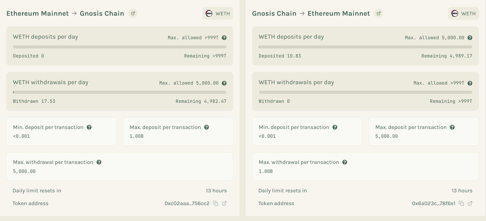

Below is a summary of each token’s transaction limits on both Ethereum and Gnosis Chain, along with quick links to inspect their on-chain contract addresses:

The below list only mentions the top 10 most actively bridged assets. For a detailed view for all assets, checkout the [Bridge Explorer's limit dashbaord](https://bridge.gnosischain.com/bridge-explorer/bridges).


| Token | ETH Max/Tx                                | ETH Daily Limit                                 | ETH Exec Daily              | Gnosis Max/Tx                          | Gnosis Daily Limit                     | Gnosis Exec Daily                             | Ethereum Address                                                                                                                   | Gnosis Address                                                                                                                   |
|-------|--------------------------------------------|--------------------------------------------------|-----------------------------|----------------------------------------|----------------------------------------|-----------------------------------------------|------------------------------------------------------------------------------------------------------------------------------------|----------------------------------------------------------------------------------------------------------------------------------|
| GNO   | 1000000000000000000000000000               | 1000000000000000000000000000000000000           | 36000000000000000000001     | 36000000000000000000000               | 36000000000000000000001               | 1000000000000000000000000000000000000        | [0x6810e776880C02933D47DB1b9fc05908e5386b96](https://etherscan.io/address/0x6810e776880C02933D47DB1b9fc05908e5386b96)            | [0x9C58BAcC331c9aa871AFD802DB6379a98e80CEdb](https://gnosisscan.io/address/0x9C58BAcC331c9aa871AFD802DB6379a98e80CEdb)             |
| WBTC  | 100000000000000000                         | 100000000000000000000000000                   | 100000000000000000000000000 | 100000000000000000                   | 100000000000000000000000000           | 100000000000000000000000000                  | [0xEF826da5AaDAE742ce32cE0C460F30Ab281e51a2](https://etherscan.io/address/0xEF826da5AaDAE742ce32cE0C460F30Ab281e51a2)            | [0xD7cd100056B477C08B419a28E976D8Ade354251a](https://gnosisscan.io/address/0xD7cd100056B477C08B419a28E976D8Ade354251a)             |
| WETH  | 1000000000000000000000000000000000000      | 1000000000000000000000000000000000001          | 1000000000000000000000000000000000001 | 1000000000000000000000000000000000000 | 1000000000000000000000000000000000001  | 1000000000000000000000000000000000001       | [0xb1A7F8b3AdA1Cbd7752c1306725b07D2F8B4e726](https://etherscan.io/address/0xb1A7F8b3AdA1Cbd7752c1306725b07D2F8B4e726)            | [0x9ba1E2F45aC86b88926a9E6F43120f42BB7eDe40](https://gnosisscan.io/address/0x9ba1E2F45aC86b88926a9E6F43120f42BB7eDe40)             |
| SAFE  | 1000000000000000000000000000000000000      | 10000000000000000000000000000000000010         | 10000000000000000000000000000000000010 | 1000000000000000000000000000000000000 | 10000000000000000000000000000000000010 | 10000000000000000000000000000000000010      | [0x5aFE3855358E112B5647B952709E6165e1c1eEEe](https://etherscan.io/address/0x5aFE3855358E112B5647B952709E6165e1c1eEEe)            | [0x4d18815D14fe5c3304e87B3FA18318baa5c23820](https://gnosisscan.io/address/0x4d18815D14fe5c3304e87B3FA18318baa5c23820)             |
| COW   | 1000000000000000000000000000               | 1000000000000000000000000000000000000          | 1000000000000000000000000000000000000  | 1000000000000000000000000000           | 1000000000000000000000000000000000000   | 1000000000000000000000000000000000000       | [0xDEf1CA1fb7FBcDC777520aa7f396b4E015F497aB](https://etherscan.io/address/0xDEf1CA1fb7FBcDC777520aa7f396b4E015F497aB)            | [0x177127622c4A00F3d409B75571e12cB3c8973d3c](https://gnosisscan.io/address/0x177127622c4A00F3d409B75571e12cB3c8973d3c)             |
| HOPR  | 1000000000000000000000000000               | 1000000000000000000000000000000000000          | 40000000000000000000000001 | 20000000000000000000000001            | 40000000000000000000000001             | 1000000000000000000000000000000000000        | [0xF5581dFeFD8Fb0e4aeC526bE659CFaB1f8c781dA](https://etherscan.io/address/0xF5581dFeFD8Fb0e4aeC526bE659CFaB1f8c781dA)            | [0xD057604A14982FE8D88c5fC25Aac3267eA142a08](https://gnosisscan.io/address/0xD057604A14982FE8D88c5fC25Aac3267eA142a08)             |
| USDT  | 1000000000000000                           | 1000000000000000000000000                       | 35000000000000               | 10000000000000                         | 35000000000000                          | 1000000000000000000000000                    | [0xdAC17F958D2ee523a2206206994597C13D831ec7](https://etherscan.io/address/0xdAC17F958D2ee523a2206206994597C13D831ec7)            | [0x4ECaBa5870353805a9F068101A40E0f32ed605C6](https://gnosisscan.io/address/0x4ECaBa5870353805a9F068101A40E0f32ed605C6)             |
| USDC  | 1000000000000000                           | 1000000000000000000000000                       | 35000000000000               | 10000000000000                         | 35000000000000                          | 1000000000000000000000000                    | [0xA0b86991c6218b36c1d19D4a2e9Eb0cE3606eB48](https://etherscan.io/address/0xA0b86991c6218b36c1d19D4a2e9Eb0cE3606eB48)            | [0xDDAfbb505ad214D7b80b1f830fcCc89B60fb7A83](https://gnosisscan.io/address/0xDDAfbb505ad214D7b80b1f830fcCc89B60fb7A83)             |
| OLAS  | 1000000000000000000000000000000000000      | 1000000000000000000000000000000000001          | 1000000000000000000000000000000000001 | 1000000000000000000000000000000000000 | 1000000000000000000000000000000000001  | 1000000000000000000000000000000000001       | [0x0001A500A6B18995B03f44bb040A5fFc28E45CB0](https://etherscan.io/address/0x0001A500A6B18995B03f44bb040A5fFc28E45CB0)            | [0xcE11e14225575945b8E6Dc0D4F2dD4C570f79d9f](https://gnosisscan.io/address/0xcE11e14225575945b8E6Dc0D4F2dD4C570f79d9f)             |

## Fees

| Token               | Ethereum -> Gnosis | Gnosis -> Ethereum |
| ------------------- | ------------------ | ------------------ |
| Default Bridge Fees | 0%                 | 0.1%               |

## Check Limits thorugh Smart Contracts



This guide explains how to programmatically retrieve daily usage and per-transaction limits for WETH bridging between Ethereum Mainnet and Gnosis Chain. All calls are against the respective bridge proxy contracts’ **read** ABI.

* **Contract (Ethereum→Gnosis)**
  `0x88ad09518695c6c3712AC10a214bE5109a655671`
* **Contract (Gnosis→Ethereum)**
  `0xf6A78083ca3e2a662D6dd1703c939c8aCE2e268d`

> **Prerequisites**
>
> * A Web3 client (e.g., [viem](https://github.com/wagmi-dev/viem), Ethers.js)
> * RPC access to Ethereum Mainnet and Gnosis Chain
> * The WETH token address on each chain
>
>   * Mainnet WETH: `0xC02aaa39b223FE8D0A0e5C4F27eAD9083C756Cc2`
>   * Gnosis WETH: (check the token registry for the canonical address)

---

## Ethereum → Gnosis

1. **Get Current Day Index**

   ```js
   const dayIndex = await contract.read.day();
   ```

   ↳ Etherscan UI: [day()](https://etherscan.io/address/0x88ad09518695c6c3712AC10a214bE5109a655671#readProxyContract#F8)

2. **Daily Deposit Usage & Limit**

   * **Total WETH Deposited Today**

     ```js
     const used = await contract.read.totalSpentPerDay([WETH_ADDRESS, dayIndex]);
     ```

     ↳ [totalSpentPerDay(address token, uint256 day)](https://etherscan.io/address/0x88ad09518695c6c3712AC10a214bE5109a655671#readProxyContract#F26)
   * **Daily Deposit Limit**

     ```js
     const limit = await contract.read.dailyLimit(WETH_ADDRESS);
     ```

     ↳ [dailyLimit(address token)](https://etherscan.io/address/0x88ad09518695c6c3712AC10a214bE5109a655671#readProxyContract#F3)

3. **Daily Withdrawal Usage & Limit**

   * **Total WETH Withdrawn Today**

     ```js
     const usedExec = await contract.read.totalExecutedPerDay([WETH_ADDRESS, dayIndex]);
     ```

     ↳ [totalExecutedPerDay(address token, uint256 day)](https://etherscan.io/address/0x88ad09518695c6c3712AC10a214bE5109a655671#readProxyContract#F25)
   * **Daily Withdrawal Limit**

     ```js
     const execLimit = await contract.read.executionDailyLimit(WETH_ADDRESS);
     ```

     ↳ [executionDailyLimit(address token)](https://etherscan.io/address/0x88ad09518695c6c3712AC10a214bE5109a655671#readProxyContract#F4)

4. **Per-Transaction Deposit Bounds**

   * **Minimum Deposit per Tx**

     ```js
     const minTx = await contract.read.minPerTx(WETH_ADDRESS);
     ```

     ↳ [minPerTx(address token)](https://etherscan.io/address/0x88ad09518695c6c3712AC10a214bE5109a655671#readProxyContract#F20)
   * **Maximum Deposit per Tx**

     ```js
     const maxTx = await contract.read.maxPerTx(WETH_ADDRESS);
     ```

     ↳ [maxPerTx(address token)](https://etherscan.io/address/0x88ad09518695c6c3712AC10a214bE5109a655671#readProxyContract#F15)

5. **Maximum Withdrawal per Tx**

   ```js
   const execMax = await contract.read.executionMaxPerTx(WETH_ADDRESS);
   ```

   ↳ [executionMaxPerTx(address token)](https://etherscan.io/address/0x88ad09518695c6c3712AC10a214bE5109a655671#readProxyContract#F5)

---

## Gnosis → Ethereum

> All methods mirror those on the Ethereum proxy, but point at the Gnosis chain contract.

1. **Get Current Day Index**

   ```js
   const dayIndex = await gnosisContract.read.day();
   ```

   ↳ [day()](https://gnosisscan.io/address/0xf6A78083ca3e2a662D6dd1703c939c8aCE2e268d#readProxyContract#F12)

2. **Daily Deposit Usage & Limit**

   * **Total WETH Deposited Today**

     ```js
     const used = await gnosisContract.read.totalSpentPerDay([WETH_ADDRESS, dayIndex]);
     ```

     ↳ [totalSpentPerDay(address token, uint256 day)](https://gnosisscan.io/address/0xf6A78083ca3e2a662D6dd1703c939c8aCE2e268d#readProxyContract#F28)
   * **Daily Deposit Limit**

     ```js
     const limit = await gnosisContract.read.dailyLimit(WETH_ADDRESS);
     ```

     ↳ [dailyLimit(address token)](https://gnosisscan.io/address/0xf6A78083ca3e2a662D6dd1703c939c8aCE2e268d#readProxyContract#F3)

3. **Daily Withdrawal Usage & Limit**

   * **Total WETH Withdrawn Today**

     ```js
     const usedExec = await gnosisContract.read.totalExecutedPerDay([WETH_ADDRESS, dayIndex]);
     ```

     ↳ [totalExecutedPerDay(address token, uint256 day)](https://gnosisscan.io/address/0xf6A78083ca3e2a662D6dd1703c939c8aCE2e268d#readProxyContract#F27)
   * **Daily Withdrawal Limit**

     ```js
     const execLimit = await gnosisContract.read.executionDailyLimit(WETH_ADDRESS);
     ```

     ↳ [executionDailyLimit(address token)](https://gnosisscan.io/address/0xf6A78083ca3e2a662D6dd1703c939c8aCE2e268d#readProxyContract#F4)

4. **Per-Transaction Deposit Bounds**

   * **Minimum Deposit per Tx**

     ```js
     const minTx = await gnosisContract.read.minPerTx(WETH_ADDRESS);
     ```

     ↳ [minPerTx(address token)](https://gnosisscan.io/address/0xf6A78083ca3e2a662D6dd1703c939c8aCE2e268d#readProxyContract#F23)
   * **Maximum Deposit per Tx**

     ```js
     const maxTx = await gnosisContract.read.maxPerTx(WETH_ADDRESS);
     ```

     ↳ [maxPerTx(address token)](https://gnosisscan.io/address/0xf6A78083ca3e2a662D6dd1703c939c8aCE2e268d#readProxyContract#F19)

5. **Maximum Withdrawal per Tx**

   ```js
   const execMax = await gnosisContract.read.executionMaxPerTx(WETH_ADDRESS);
   ```

   ↳ [executionMaxPerTx(address token)](https://gnosisscan.io/address/0xf6A78083ca3e2a662D6dd1703c939c8aCE2e268d#readProxyContract#F5)

---

## Example (using viem)

```ts
import { createPublicClient, http } from "viem";
import { mainnet, gnosis } from "viem/chains";

const ethClient = createPublicClient({ chain: mainnet, transport: http() });
const gnoClient = createPublicClient({ chain: gnosis, transport: http() });

const ETH_BRIDGE = "0x88ad09518695c6c3712AC10a214bE5109a655671";
const GNO_BRIDGE = "0xf6A78083ca3e2a662D6dd1703c939c8aCE2e268d";
const WETH = "0xC02aaa39b223FE8D0A0e5C4F27eAD9083C756Cc2";

async function fetchLimits() {
  const [dayEth] = await ethClient.read({ address: ETH_BRIDGE, abi: bridgeAbi, functionName: "day" });
  const [dayGno] = await gnoClient.read({ address: GNO_BRIDGE, abi: bridgeAbi, functionName: "day" });

 
}
```

---

**Notes:**

* All values are returned in **wei** (base units).
* Day indexing increments every 24 hours from the bridge’s genesis timestamp.
* Ensure your RPC node’s clock is in sync to avoid off-by-one-day errors.
