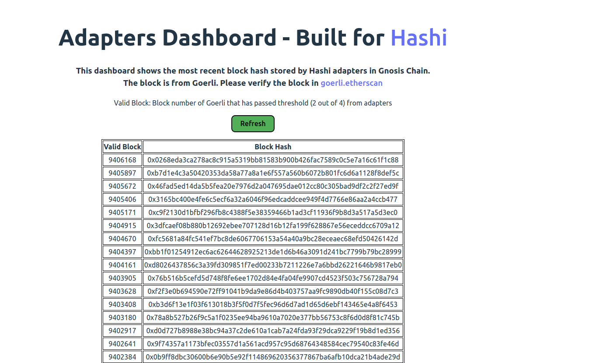

# Application

You can build your application on top of Hashi and secured by Hashi. If you have any question, please reach out to [Gnosis Chain discord](https://discord.gg/gnosischain) - #hashi channel

## Safe on Hashi

Cross-chain transaction using Safe can be a painful experience. The current approach is to set up Safe individually on each chain, and these Safes are independent of each other. There are [discussions](https://forum.safe.global/t/how-can-a-safe-hold-asset-on-multiple-chains/2242) about how to hold assets on multiple chains and this project aims to tackle the issue by leveraging the security provided by Hashi.
In this project, two kinds of approaches are demonstrated: Push and Pull flow.

### Push flow

In push flow, a cross-chain transaction is initiated by Safe from source chain (Goerli), and claimed by Safe from destination chain (Gnosis Chain).
Goerli's Safe calls [Yaho](https://github.com/gnosis/hashi/blob/main/packages/evm/contracts/Yaho.sol) contract to bundle the transaction and relay the message to bridge. Once the message is relayed to Gnosis Chain, it will be stored in Adapter(s) contract. With messageId and message, any user or Safe from Gnosis Chain can call [Yaru](https://github.com/gnosis/hashi/blob/main/packages/evm/contracts/Yaru.sol) to claim the transaction.

Check out the demo video for more details: https://youtu.be/vXuffnJCcTM

### Pull flow

In pull flow, data is being read from time to time on the source chain (Goerli).
A scenario is tested: an owner from Goerli's Safe (which is not the owner from Gnosis Chain's Safe) is able to create a transaction for GC Safe, even though it is not the owner for GC Safe. The security of pull flow rely on: block header provided by ShoyuBashi and proof provided by [eth_getProof](https://docs.alchemy.com/reference/eth-getproof) API from Goerli node. The proof is verified by an off-chain verifier at the current version.

Check out the demo video for more details: https://youtu.be/g-vRKNFmQXc

### Reference

1. [Safe on Hashi App](https://github.com/zengzengzenghuy/Safe-on-Hashi-App)

## Adapters Dashboard

The adapters dashboard shows the latest Goerli block numbers that the respective block hashes has been stored by Hashi adapters on Gnosis Chain. Once the threshold has been reached (2 out of 4 adapters has stored the same block hash), the block hash is considered valid.

https://hashiadapters-dashboard-tvw47.ondigitalocean.app/

