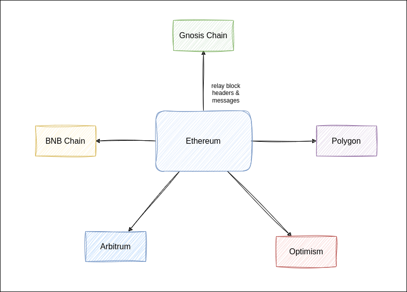

# v0.1

## Mainnet

Source Chain: Ethereum  
Destination Chain: Gnosis Chain, Polygon, BNB Chain, Optimism, Arbitrium

### Ethereum

| Contract               | Address                                                                                                                    |
| ---------------------- | -------------------------------------------------------------------------------------------------------------------------- |
| HeaderStorage          | [0x22F1fc71A505c0b2bf4D5075801cc5E0ec84B09e](https://etherscan.io/address/0x22F1fc71A505c0b2bf4D5075801cc5E0ec84B09e#code) |
| Yaho                   | [0xcF7E187Ed1090B9CE8E4a7266B5309d839E85648](https://etherscan.io/address/0xcF7E187Ed1090B9CE8E4a7266B5309d839E85648#code) |
| AMB Header Reporter    | [0x6be796cb66CdB3566b8AbebA2C516CbDF93fE831](https://etherscan.io/address/0x6be796cb66CdB3566b8AbebA2C516CbDF93fE831#code) |
| AMB Message Relay      | [0x6E9ce437c46e7fA4F0888c21AAC0d9099Ad133ea](https://etherscan.io/address/0x6E9ce437c46e7fA4F0888c21AAC0d9099Ad133ea#code) |
| Axelar Header Reporter | [0x11378C54aA4e2Daf4603f9be86ae0Cb70786682a](https://etherscan.io/address/0x11378C54aA4e2Daf4603f9be86ae0Cb70786682a#code) |

### Gnosis Chain

| Contract                      | Address                                                                                                                             |
| ----------------------------- | ----------------------------------------------------------------------------------------------------------------------------------- |
| Hashi                         | [0xa797D1dd4FF095577A70433f5d00D2345c9Ee0C5](https://gnosisscan.io/address/0xa797D1dd4FF095577A70433f5d00D2345c9Ee0C5#readContract) |
| ShoyuBashi                    | [0x06C33b0119642824Ba2D6a02fdDBa8FA6318fF32](https://gnosisscan.io/address/0x06C33b0119642824Ba2D6a02fdDBa8FA6318fF32#readContract) |
| GiriGiriBashi                 | [0x1b9CaFa940303CA46408a9b9b924F67F8DB84213](https://gnosisscan.io/address/0x1b9CaFa940303CA46408a9b9b924F67F8DB84213#readContract) |
| Yaru                          | [0x1EeAe28cF55ea2FFbaa5498C86a112831495Bf62](https://gnosisscan.io/address/0x1EeAe28cF55ea2FFbaa5498C86a112831495Bf62#readContract) |
| AMB Adapter for Header Report | [0x4efB95c26bB2ebD3281749A5eAA388bc302b4445](https://gnosisscan.io/address/0x4efB95c26bB2ebD3281749A5eAA388bc302b4445#code)         |
| AMB Adapter for Message Relay | [0x4dD1EFf3047DFD9F0a4ED9864263c818374A9b98](https://gnosisscan.io/address/0x4dD1EFf3047DFD9F0a4ED9864263c818374A9b98#readContract) |
| Telepathy Adapter             | [0xDeF29f44f8315d0079A25EF03cfB0b0D8CdA3cF8](https://gnosisscan.io/address/0xDeF29f44f8315d0079A25EF03cfB0b0D8CdA3cF8)              |

### Polygon

| Contract          | Address                                                                                                                       |
| ----------------- | ----------------------------------------------------------------------------------------------------------------------------- |
| Hashi             | [0x22F1fc71A505c0b2bf4D5075801cc5E0ec84B09e](https://polygonscan.com/address/0x22F1fc71A505c0b2bf4D5075801cc5E0ec84B09e#code) |
| ShoyuBashi        | [0xcF7E187Ed1090B9CE8E4a7266B5309d839E85648](https://polygonscan.com/address/0xcF7E187Ed1090B9CE8E4a7266B5309d839E85648)      |
| GiriGiriBashi     | [0x6be796cb66CdB3566b8AbebA2C516CbDF93fE831](https://polygonscan.com/address/0x6be796cb66CdB3566b8AbebA2C516CbDF93fE831)      |
| Yaru              | [0x856dcc80f75a9737D9D498266E1Af013668316Fb](https://polygonscan.com/address/0x856dcc80f75a9737D9D498266E1Af013668316Fb)      |
| Axelar Adapter    | [0x4694E10017Ed7E0E87bfE386e5f051a7C64286A2](https://polygonscan.com/address/0x4694E10017Ed7E0E87bfE386e5f051a7C64286A2)      |
| Telepathy Adapter | [0x04413A4795dD1f5347eAD1CD7C76Bd9E5e48b461](https://polygonscan.com/address/0x04413A4795dD1f5347eAD1CD7C76Bd9E5e48b461)      |

### Binance Smart Chain

| Contract          | Address                                                                                                              |
| ----------------- | -------------------------------------------------------------------------------------------------------------------- |
| Hashi             | [0xab6f51b61AdF8B542a569E94e1cAA233DD216862](https://bscscan.com/address/0xab6f51b61AdF8B542a569E94e1cAA233DD216862) |
| ShoyuBashi        | [0x22F1fc71A505c0b2bf4D5075801cc5E0ec84B09e](https://bscscan.com/address/0x22F1fc71A505c0b2bf4D5075801cc5E0ec84B09e) |
| GiriGiriBashi     | [0xcF7E187Ed1090B9CE8E4a7266B5309d839E85648](https://bscscan.com/address/0xcF7E187Ed1090B9CE8E4a7266B5309d839E85648) |
| Yaru              | [0x6be796cb66CdB3566b8AbebA2C516CbDF93fE831](https://bscscan.com/address/0x6be796cb66CdB3566b8AbebA2C516CbDF93fE831) |
| Axelar Adapter    | [0x856dcc80f75a9737D9D498266E1Af013668316Fb](https://bscscan.com/address/0x856dcc80f75a9737D9D498266E1Af013668316Fb) |
| Telepathy Adapter | [0x2E5685F20f42cC3b01e4A9ADE49F6848E242f022](https://bscscan.com/address/0x2E5685F20f42cC3b01e4A9ADE49F6848E242f022) |

### Optimism

| Contract          | Address                                                                                                                          |
| ----------------- | -------------------------------------------------------------------------------------------------------------------------------- |
| Hashi             | [0x22F1fc71A505c0b2bf4D5075801cc5E0ec84B09e](https://optimistic.etherscan.io/address/0x22F1fc71A505c0b2bf4D5075801cc5E0ec84B09e) |
| ShoyuBashi        | [0xcF7E187Ed1090B9CE8E4a7266B5309d839E85648](https://optimistic.etherscan.io/address/0xcF7E187Ed1090B9CE8E4a7266B5309d839E85648) |
| GiriGiriBashi     | [0x6be796cb66CdB3566b8AbebA2C516CbDF93fE831](https://optimistic.etherscan.io/address/0x6be796cb66CdB3566b8AbebA2C516CbDF93fE831) |
| Yaru              | [0x2E5685F20f42cC3b01e4A9ADE49F6848E242f022](https://optimistic.etherscan.io/address/0x2E5685F20f42cC3b01e4A9ADE49F6848E242f022) |
| Axelar Adapter    | [0x6E9ce437c46e7fA4F0888c21AAC0d9099Ad133ea](https://optimistic.etherscan.io/address/0x6E9ce437c46e7fA4F0888c21AAC0d9099Ad133ea) |
| Telepathy Adapter | [0x856dcc80f75a9737D9D498266E1Af013668316Fb](https://optimistic.etherscan.io/address/0x856dcc80f75a9737D9D498266E1Af013668316Fb) |

### Arbitrium

| Contract          | Address                                                                                                              |
| ----------------- | -------------------------------------------------------------------------------------------------------------------- |
| Hashi             | [0xab6f51b61AdF8B542a569E94e1cAA233DD216862](https://arbiscan.io/address/0xab6f51b61AdF8B542a569E94e1cAA233DD216862) |
| ShoyuBashi        | [0x22F1fc71A505c0b2bf4D5075801cc5E0ec84B09e](https://arbiscan.io/address/0x22F1fc71A505c0b2bf4D5075801cc5E0ec84B09e) |
| GiriGiriBashi     | [0xcF7E187Ed1090B9CE8E4a7266B5309d839E85648](https://arbiscan.io/address/0xcF7E187Ed1090B9CE8E4a7266B5309d839E85648) |
| Yaru              | [0x6be796cb66CdB3566b8AbebA2C516CbDF93fE831](https://arbiscan.io/address/0x6be796cb66CdB3566b8AbebA2C516CbDF93fE831) |
| Axelar Adapter    | [0x6E9ce437c46e7fA4F0888c21AAC0d9099Ad133ea](https://arbiscan.io/address/0x6E9ce437c46e7fA4F0888c21AAC0d9099Ad133ea) |
| Telepathy Adapter | [0x2E5685F20f42cC3b01e4A9ADE49F6848E242f022](https://arbiscan.io/address/0x2E5685F20f42cC3b01e4A9ADE49F6848E242f022) |

## Testnet

Source Chain: Goerli  
Destination Chain: Chiado, Gnosis Chian

For the current configuration, we validate a Goerli block hash with 4 oracles, every ~15 mins.

The 4 oracles includes Telepathy Light Client, Dendreth Light Client, Gnosis AMB, and Sygma.  
Threshold in ShoyuBashi is set to 2.

**How to use it?**  
Call getThresholdHash(domain, blockNo) in ShoyuBashi.  
By using domain=5 and blockNo a blockNumber that has been reported by the oracles, you get back the blockHash if at least 2 of the oracles have reported the same hash.

### Goerli -> Gnosis Chain

| Contract               | Deployed on  | Address                                                                                                                      |
| ---------------------- | ------------ | ---------------------------------------------------------------------------------------------------------------------------- |
| Hashi                  | Gnosis Chain | [0xf59aedc291e0aF64943541709cdd041D992b4De4](https://gnosisscan.io/address/0xf59aedc291e0aF64943541709cdd041D992b4De4)       |
| ShoyuBashi             | Gnosis Chain | [0x31a8E89D6f98454D38C03eCA3DC543F6581d607C](https://gnosisscan.io/address/0x31a8e89d6f98454d38c03eca3dc543f6581d607c)       |
| HeaderStorage          | Gnosis Chain | [0xB256d8a90852DBb222653ab89b611c2426011C0D](https://gnosisscan.io/address/0xB256d8a90852DBb222653ab89b611c2426011C0D)       |
| AMB Header Reporter    | Gnosis Chain | [0x5DE3417a21eEd340836C9c1339913b60743b3470](https://gnosisscan.io/address/0x5DE3417a21eEd340836C9c1339913b60743b3470)       |
| AMB Adapter            | Gnosis Chain | [0x32Cd442309cA6E79Db2194aac61024FBD2B14eb9](https://gnosisscan.io/address/0x32Cd442309cA6E79Db2194aac61024FBD2B14eb9)       |
| AMB                    | Gnosis Chain | [0x9f696CF3c1a0A418cBBFD6E1ab3EBe8A78971Dea](https://gnosisscan.io/address/0x9f696CF3c1a0A418cBBFD6E1ab3EBe8A78971Dea)       |
| Telepathy Adapter      | Gnosis Chain | [0x2f1E51a2763FB67fe09971Fd8d849716137A3357](https://gnosisscan.io/address/0x2f1E51a2763FB67fe09971Fd8d849716137A3357)       |
| Telepathy Light Client | Gnosis Chain | [0x34b5378DE786389a477b40dD710812c250185f83](https://gnosisscan.io/address/0x34b5378DE786389a477b40dD710812c250185f83)       |
| Sygma Adapter          | Gnosis Chain | [0x018C003C20ee3a4C602064fff54960a79c4eEfe1](https://gnosisscan.io/address/0x018C003C20ee3a4C602064fff54960a79c4eEfe1)       |
| Sygma                  | Gnosis Chain | [0xd2d95f7611c83b1f9041539557810033aC7B8742](https://gnosisscan.io/address/0xd2d95f7611c83b1f9041539557810033aC7B8742)       |
| Dendreth Adapter       | Gnosis Chain | [0x719523EaF5CFd101Ef501C64597613FBB7aEdED9](https://gnosisscan.io/address/0x719523EaF5CFd101Ef501C64597613FBB7aEdED9)       |
| Dendreh Light Client   | Gnosis Chain | [0xb676a5E81168a24496ad13dE79f2675c66684d23](https://gnosisscan.io/address/0xb676a5E81168a24496ad13dE79f2675c66684d23)       |
| HeaderStorage          | Goerli       | [0x4cd014ac64aaa899b46bf3a477b68bb67e33edc4](https://goerli.etherscan.io/address/0x4cd014ac64aaa899b46bf3a477b68bb67e33edc4) |
| AMB Header Reporter    | Goerli       | [0xedc0b1d3de4496e0d917af42f29cb71eb2982319](https://goerli.etherscan.io/address/0xedc0b1d3de4496e0d917af42f29cb71eb2982319) |
| AMB                    | Goerli       | [0x01268DB05965CeAc2a89566c42CD550ED7eE5ECD](https://goerli.etherscan.io/address/0x01268DB05965CeAc2a89566c42CD550ED7eE5ECD) |
| Sygma Header Reporter  | Goerli       | [0x2f96d347c932ac73b56e9352ecc0707e25173d88](https://goerli.etherscan.io/address/0x2f96d347c932ac73b56e9352ecc0707e25173d88) |
| Sygma                  | Goerli       | [0x5cEA5130c49dCd262B9482E0A76eCE8b23Ae45Df](https://goerli.etherscan.io/address/0x5cEA5130c49dCd262B9482E0A76eCE8b23Ae45Df) |

### Goerli -> Chiado

For the current deployment, only AMB and Telepathy oracles are supported.

| Contract               | Deployed on | Address                                                                                                                               |
| ---------------------- | ----------- | ------------------------------------------------------------------------------------------------------------------------------------- |
| Hashi                  | Chiado      | [0xA0B14A016F62d5f245048Ac67a8AF38ff81AE799](https://blockscout.com/gnosis/chiado/address/0xA0B14A016F62d5f245048Ac67a8AF38ff81AE799) |
| ShoyuBashi             | Chiado      | [0x01268DB05965CeAc2a89566c42CD550ED7eE5ECD](https://blockscout.com/gnosis/chiado/address/0x01268DB05965CeAc2a89566c42CD550ED7eE5ECD) |
| AMB Adapter            | Chiado      | [0x02EF808c1235EC235BdfEf9b5768527D86093711](https://blockscout.com/gnosis/chiado/address/0x02EF808c1235EC235BdfEf9b5768527D86093711) |
| AMB                    | Chiado      | [0x99Ca51a3534785ED619f46A79C7Ad65Fa8d85e7a](https://blockscout.com/gnosis/chiado/address/0x99Ca51a3534785ED619f46A79C7Ad65Fa8d85e7a) |
| Telepathy Adapter      | Chiado      | [0xAED11f08AB2C45C6C6DF242B8513c7919E0A0f8f](https://blockscout.com/gnosis/chiado/address/0xAED11f08AB2C45C6C6DF242B8513c7919E0A0f8f) |
| Telepathy Light Client | Chiado      | [0xb1D85B0122C9CE0a68fDC6620a7416c77f984425](https://blockscout.com/gnosis/chiado/address/0xb1D85B0122C9CE0a68fDC6620a7416c77f984425) |
| HeaderStorage          | Goerli      | [0xbdbb6bb1e9e1167f8d613f408e28d58a2e89abc1](https://goerli.etherscan.io/address/0xbdbb6bb1e9e1167f8d613f408e28d58a2e89abc1)          |
| AMB Header Reporter    | Goerli      | [0x61fac58f793b2a8a791a0583618feb89e256e839](https://goerli.etherscan.io/address/0x61fac58f793b2a8a791a0583618feb89e256e839)          |
| AMB                    | Goerli      | [0x87A19d769D875964E9Cd41dDBfc397B2543764E6](https://goerli.etherscan.io/address/0x87A19d769D875964E9Cd41dDBfc397B2543764E6)          |
