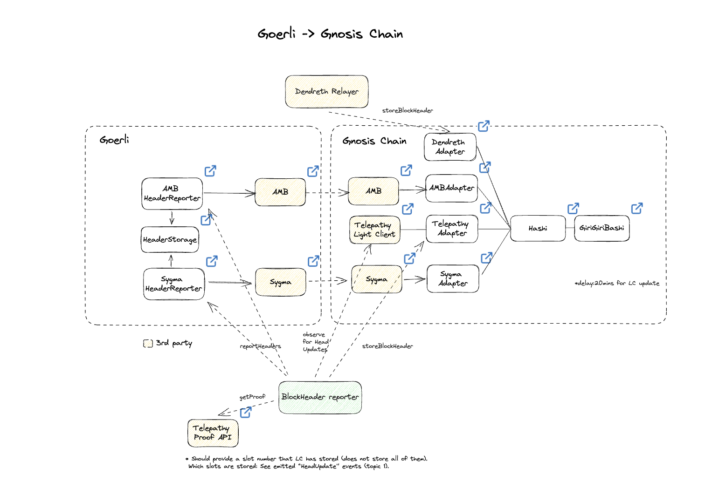

# What is Hashi

Hashi is an EVM Hash Oracle Aggregator, designed to facilitate [a principled approach to cross-chain bridge security.](https://ethresear.ch/t/hashi-a-principled-approach-to-bridges/14725)

The primary insight being that the vast majority of bridge-related security incidents could have had minimal impact if the systems relying on them had built in some redundancy. In other words, it's much more secure to require messages be validated by multiple independent mechanisms, rather than by just one.

Hashi aims to create “additive security” to cross-chain messages by aggregating block headers from different sources. A block header will be considered valid only when a number of block sources (oracles) above a certain threshold report the same result.
Hashi is the first step towards a principled approached to bridges and will play a key role in the Gnosis Chain interoperability roadmap.

## Oracles

Oracles consists of the bridge solutions available in the market, such as AMB, Telepathy, Dendreth, etc. To provide an universal interface for Hashi, an adapter contract is designed specifically for each oracle. Some of the oracles require header reporter to report block header in certain slot.

Existing oracle adapters:

- [Telepathy ZK light client](https://docs.telepathy.xyz/)
- [Dendreth ZK light client](https://github.com/metacraft-labs/DendrETH)
- [Gnosis AMB bridge](../tokenbridge/amb-bridge.md)
- [Sygma protocol](https://medium.com/buildwithsygma)
- [Wormhole](https://wormhole.com/)

In progress:

- [Celer](https://cbridge-docs.celer.network/)
- [LayerZero](https://layerzero.network/)
- [Multichain](https://multichain.xyz/)
- [Axelar](https://axelar.network/)

## Current deployments

### Goerli -> Gnosis Chain

For the current configuration, we validate a Goerli block hash with 4 oracles, every ~15 mins.

The 4 oracles includes Telepathy Light Client, Dendreth Light Client, Gnosis AMB, and Sygma.  
Threshold in ShoyuBashi is set to 2.

**How to use it?**  
Call getThresholdHash(domain, blockNo) in ShoyuBashi.  
By using domain=5 and blockNo a blockNumber that has been reported by the oracles, you get back the blockHash if at least 2 of the oracles have reported the same hash.

| Contract               | Deployed on  | Address                                                                                                                              |
| ---------------------- | ------------ | ------------------------------------------------------------------------------------------------------------------------------------ |
| Hashi                  | Gnosis Chain | [0xf59aedc291e0aF64943541709cdd041D992b4De4](https://blockscout.com/xdai/mainnet/address/0xf59aedc291e0aF64943541709cdd041D992b4De4) |
| ShoyuBashi             | Gnosis Chain | [0x31a8E89D6f98454D38C03eCA3DC543F6581d607C](https://gnosisscan.io/address/0x31a8e89d6f98454d38c03eca3dc543f6581d607c)               |
| AMB Adapter            | Gnosis Chain | [0x32Cd442309cA6E79Db2194aac61024FBD2B14eb9](https://blockscout.com/xdai/mainnet/address/0x32Cd442309cA6E79Db2194aac61024FBD2B14eb9) |
| AMB                    | Gnosis Chain | [0x9f696CF3c1a0A418cBBFD6E1ab3EBe8A78971Dea](https://gnosisscan.io/address/0x9f696CF3c1a0A418cBBFD6E1ab3EBe8A78971Dea)               |
| Telepathy Adapter      | Gnosis Chain | [0x2f1E51a2763FB67fe09971Fd8d849716137A3357](https://blockscout.com/xdai/mainnet/address/0x2f1E51a2763FB67fe09971Fd8d849716137A3357) |
| Telepathy Light Client | Gnosis Chain | [0x34b5378DE786389a477b40dD710812c250185f83](https://gnosisscan.io/address/0x34b5378DE786389a477b40dD710812c250185f83)               |
| Sygma Adapter          | Gnosis Chain | [0x9AD7a6f4FDA8247cC0bF5932B68c5b619937dB15](https://gnosisscan.io/address/0x9AD7a6f4FDA8247cC0bF5932B68c5b619937dB15)               |
| Sygma                  | Gnosis Chain | [0xd2d95f7611c83b1f9041539557810033aC7B8742](https://gnosisscan.io/address/0xd2d95f7611c83b1f9041539557810033aC7B8742)               |
| Dendreth Adapter       | Gnosis Chain | [0x719523EaF5CFd101Ef501C64597613FBB7aEdED9](https://gnosisscan.io/address/0x719523EaF5CFd101Ef501C64597613FBB7aEdED9)               |
| Dendreh Light Client   | Gnosis Chain | [0x983df74d1ef68b4ff1fff11a28c06e5c097435da](https://gnosisscan.io/address/0x983df74d1ef68b4ff1fff11a28c06e5c097435da)               |
| HeaderStorage          | Goerli       | [0x4cd014ac64aaa899b46bf3a477b68bb67e33edc4](https://goerli.etherscan.io/address/0x4cd014ac64aaa899b46bf3a477b68bb67e33edc4)         |
| AMB Header Reporter    | Goerli       | [0xedc0b1d3de4496e0d917af42f29cb71eb2982319](https://goerli.etherscan.io/address/0xedc0b1d3de4496e0d917af42f29cb71eb2982319)         |
| AMB                    | Goerli       | [0x01268DB05965CeAc2a89566c42CD550ED7eE5ECD](https://goerli.etherscan.io/address/0x01268DB05965CeAc2a89566c42CD550ED7eE5ECD)         |
| Sygma Header Reporter  | Goerli       | [0x2f96d347c932ac73b56e9352ecc0707e25173d88](https://goerli.etherscan.io/address/0x2f96d347c932ac73b56e9352ecc0707e25173d88)         |
| Sygma                  | Goerli       | [0x5cEA5130c49dCd262B9482E0A76eCE8b23Ae45Df](https://goerli.etherscan.io/address/0x5cEA5130c49dCd262B9482E0A76eCE8b23Ae45Df)         |

### Goerli -> Chiado

For the current deployment, only AMB and Telepathy oracles are supported.

| Contract               | Deployed on | Address                                                                                                                               |
| ---------------------- | ----------- | ------------------------------------------------------------------------------------------------------------------------------------- |
| Hashi                  | Chiado      | [0xA0B14A016F62d5f245048Ac67a8AF38ff81AE799](https://blockscout.com/gnosis/chiado/address/0xA0B14A016F62d5f245048Ac67a8AF38ff81AE799) |
| ShoyuBashi             | Chiado      | [0x01268DB05965CeAc2a89566c42CD550ED7eE5ECD](https://blockscout.com/gnosis/chiado/address/0x01268DB05965CeAc2a89566c42CD550ED7eE5ECD) |
| AMB Adapter            | Chiado      | [0x02EF808c1235EC235BdfEf9b5768527D86093711](https://blockscout.com/gnosis/chiado/address/0x02EF808c1235EC235BdfEf9b5768527D86093711) |
| AMB                    | Chiado      | [0x99Ca51a3534785ED619f46A79C7Ad65Fa8d85e7a](https://blockscout.com/gnosis/chiado/address/0x99Ca51a3534785ED619f46A79C7Ad65Fa8d85e7a) |
| Telepathy Adapter      | Chiado      | [0xAED11f08AB2C45C6C6DF242B8513c7919E0A0f8f](https://blockscout.com/gnosis/chiado/address/0xAED11f08AB2C45C6C6DF242B8513c7919E0A0f8f) |
| Telepathy Light Client | Chiado      | [0xb1D85B0122C9CE0a68fDC6620a7416c77f984425](https://blockscout.com/gnosis/chiado/address/0xb1D85B0122C9CE0a68fDC6620a7416c77f984425) |
| HeaderStorage          | Goerli      | [0xbdbb6bb1e9e1167f8d613f408e28d58a2e89abc1](https://goerli.etherscan.io/address/0xbdbb6bb1e9e1167f8d613f408e28d58a2e89abc1)          |
| AMB Header Reporter    | Goerli      | [0x61fac58f793b2a8a791a0583618feb89e256e839](https://goerli.etherscan.io/address/0x61fac58f793b2a8a791a0583618feb89e256e839)          |
| AMB                    | Goerli      | [0x87A19d769D875964E9Cd41dDBfc397B2543764E6](https://goerli.etherscan.io/address/0x87A19d769D875964E9Cd41dDBfc397B2543764E6)          |

## Resources

- Repository: [github.com/gnosis/hashi](https://github.com/gnosis/hashi)
- Intro discussion: [ethresear.ch/t/hashi-a-principled-approach-to-bridges](https://ethresear.ch/t/hashi-a-principled-approach-to-bridges/14725)
- Intro thread: [twitter.com/auryn_macmillan/status/1632696493525323778](https://twitter.com/auryn_macmillan/status/1632696493525323778?s=20)
- Ask questions on the [Gnosis Chain discord](https://discord.gg/gnosischain) - #hashi channel
