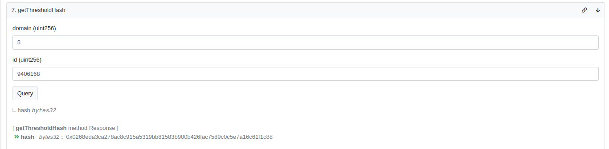
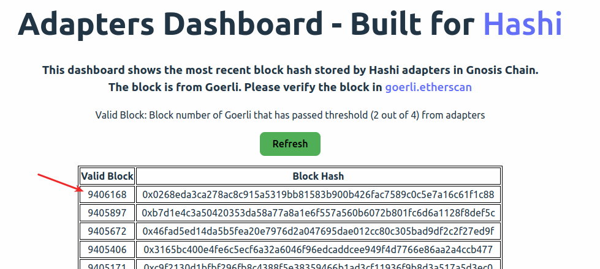

# Tutorial

## Query block hash from Hashi

To query a block hash from Hashi, navigate to [ShoyuBashi](https://gnosisscan.io/address/0x31a8e89d6f98454d38c03eca3dc543f6581d607c#readContract) contract on gnosisscan.  
Click `getThresholdHash` function.


Enter the domain (chain ID, i.e. 5 for Goerli) and id (block number from domain) for the block you want to query.  
The result will be the block hash that has passed the threshold from adapters (i.e. 2 out of 4 in Goerli  < > GC). Not every block will be stored by the adapters and reach threshold, if no threshold has been reached, the result will be bytes32(0). You can utilize [Adapters Dashboard](https://hashiadapters-dashboard-tvw47.ondigitalocean.app/) to check which block has been stored.



You may double check if the block hash is correct by searching your block hash in [Adapters Dashboard](https://hashiadapters-dashboard-tvw47.ondigitalocean.app/).



## Report block header

You may call a block header reporter to report and store the block hash, if the block you are looking for is not yet stored by the adapter.

1. Navigate to [AMB Header Reporter](https://goerli.etherscan.io/address/0xedc0b1d3de4496e0d917af42f29cb71eb2982319) or [Sygma Header Reporter](https://docs.gnosischain.com/bridges/hashi/) contract.
2. Select **Contract** and **Write Contract**.
3. Connect your wallet and switch to the correct network.
4. Click **reportHeaders** and input blockNumbers (uint256 []), [adapters address](https://docs.gnosischain.com/bridges/hashi/#current-deployments) and gas.

## Message Dispatching using Yaru and Yaho

With Yaru and Yaho, you can pass arbitrary message across the chain.

### Prerequisite

For Goerli->Gnosis Direction:

1. Deploy [Yaho](https://github.com/gnosis/hashi/blob/main/packages/evm/contracts/Yaho.sol) on Goerli, and [Yaru](https://github.com/gnosis/hashi/blob/main/packages/evm/contracts/Yaru.sol) on Gnosis Chain, with constructor `_hashi: Hashi address on Gnosis Chain, _yaho: Yaho address on Goerli, _chainId: 5`.
2. Optional: Deploy [Hashi Module](https://github.com/gnosis/hashi/blob/main/packages/evm/contracts/zodiac/HashiModule.sol) for Safe that will be called by Yaru, i.e. Safe on Gnosis Chain.
3. Deploy [AMB Message Relay](https://github.com/gnosis/hashi/blob/main/packages/evm/contracts/adapters/AMB/AMBMessageRelayer.sol) on Goerli, with constructor `_amb: AMB address on Goerli, _yaho: Yaho address on Goerli`.
4. Deploy [AMB Adapter](https://github.com/gnosis/hashi/blob/main/packages/evm/contracts/adapters/AMB/AMBAdapter.sol) on Gnosis Chain, with constructor `_amb: AMB address on Gnosis Chain, _reporter: AMB Message Relay on Goerli, _chainId: bytes32(5) `.

:::info
The contract address is available at [Message Dispatching using Yaho and Yaru](Application.md#message-dispatching-using-yaho-and-yaru).  
Check out [Safe on Hashi-Push Flow](Application.md#push-flow) for more details.
:::

### Initiate Transaction

1. Create function calldata for the contract you want to call on Gnosis Chain.

```
const calldata = contractInterface.encodeFunctionData(function_name, parameters)
```

2. Optional: Create transaction calldata for Hashi Module.

:::info
This step is only needed when [Safe](https://safe.global/) is used.
:::

```
const txData = hashi_module_interface.encodeFunctionData("executeTransaction", [
      ${contract_to_call_on_Gnosis_Chain},
      0,
      calldata,
      0,
]);
```

3. Create message with format below:
   With Safe:

```
const message =
{
    to: ${Hashi Module address},
    toChainId: 100 // Gnosis Chain,
    data: ${tx_data}
}
```

Without Safe:

```
const message =
{
    to: ${Contract address on Gnosis Chain},
    toChainId: 100 // Gnosis Chain,
    data: ${calldata}
}
```

4. Call `Yaho.dispatchMessagesToAdapters([message],[AMB_Message_Relay_Address],[AMB_Adapter_Address])` using Safe or EOA.

5. Once the transaction is created, you need to collect `messsage Id` from [`MessageDispatched` event](https://github.com/gnosis/hashi/blob/main/packages/evm/contracts/Yaho.sol#L27) emitted from Yaho.

### Claim Transaction

After the message is relayed to Gnosis Chain by AMB bridge, you can proceed to claim your transaction.
Make sure that your message is stored by checking if the AMB Adapter contract emits `HashStored` event with the correct `message Id`.

1. Call `Yaru.executeMessages([message],[messageId],[Safe_from_Goerli or EOA from Goerli that calls Yaho],[AMB_Adapter_Address on Gnosis Chain])`

## Create a new adapter

Integrating a new adapter into Hashi enhances the security of the overall architecture.

There are two contracts need to be created:

1. Header Reporter contract on source chain
2. Adapter contract on destination chain

### Header Reporter contract

Header reporter contract will be called by user or bot to pass block header of certain block(s) from source chain.

1. Create a public function called `reportHeaders`.
2. In the `reportHeaders` function, define the bridging logic and make sure three requirements are met:  
   i. Call `storeBlockHeaders()` from HeaderStorage contract  
   ii. Bridge block headers returned from the above step with encoded data that will call the function to store block headers in adapter contract on destination chain  
   iii. Emit `HeaderReported()` event.

Example

```
function reportHeaders(uint256[] memory blockNumbers) public {
    // return block header(s) of block number(s)
    bytes32[] memory blockHeaders = headerStorage.storeBlockHeaders(blockNumbers)
    // pass block header to bridge
    Bridge.passMessage(blockHeaders, storeHashesEncodedData)
    // emit event for each block header
    for (uint i = 0; i < blockNumbers.length; i++){
        emit HeaderReported(address(this),blockNumbers[i],blockHeaders[i])
    }
}
```

### Adapter contract

Create a new adapter contract for your oracle that can store block headers and fetched by Hashi.

1. Inherit `OracleAdapter.sol` and `BlockHashOracleAdapter.sol`.
2. Create a `storeHash` function that will call `_storeHash` with the following parameter:  
   `domain`(uint256): Identifier for the domain, i.e. chain id.  
   `id`(uint256): Identifier for the ID of the hash, i.e. block number.  
   `hash`(bytes3): block hash(block header).  
   Calling `_storeHash` willl emit `Hashstored(id,hash)` event.

Example

```

contract Adapter is OracleAdapter, BlockHashOracleAdapter {
    function storeHashes(uint256[] memory ids, bytes32[] memory hashes)public{
        for(uint256 i = 0; i < ids.length; i++){
            _storeHash(sourceChainID, ids[i], hashes[i])
        }
    }
}

```
