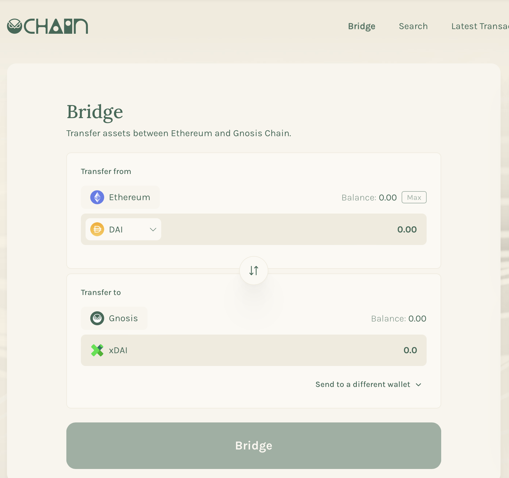
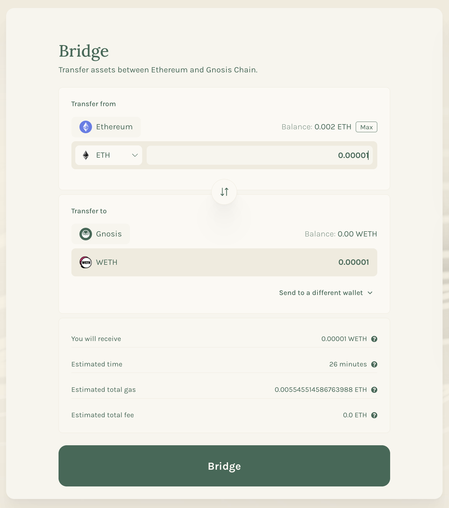
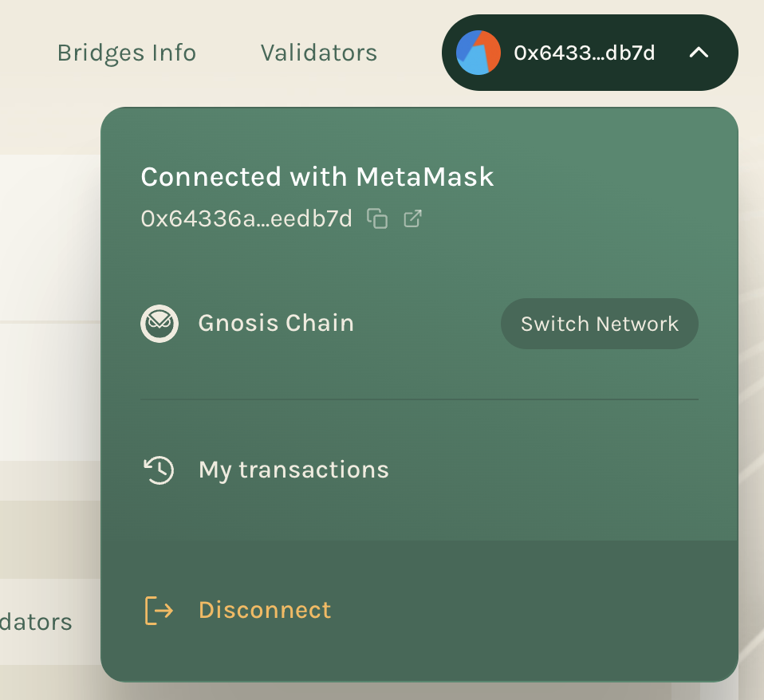

:::info
To begin using Gnosis Bridge, you need to go on this following link : https://bridge.gnosischain.com/
:::

:::note
You will need xDAI to perform any transactions on Gnosis Chain as it’s the chain’s gas token. You can get xDAI by transferring DAI from Ethereum using the Bridge Explorer
:::

### Follow the below steps to get xDAI into your Ethereum address: 
1. Go to the Gnosis Chain Bridge UI and connect your wallet to the Ethereum Mainnet.
2. Once connected, you will see your address populated in the header, and your DAI balance will be displayed on the page.
3. Enter the amount of DAI you would like to transfer to Gnosis, and click the Transfer button.
4. The web3 wallet window will open with transaction details. The default gas price is fine, if you would like a faster transaction you can increase. Click Submit or Confirm (depending on wallet) to initiate the transaction.
5. Wait for the transaction confirmation (this can take some time if the network is super congested). The transaction is considered finalized after 8 blocks. To check on a pending transaction, click on the tx in the UI.

### Follow the below steps to get ERC20 token from Ethereum address to Gnosis Chain:

1. Go to the Gnosis Bridge UI
2. Connect your wallet to the Ethereum Mainnet
3. Select the token you want to transfer and enter the amount of token you want.
4. Click Bridge and sign the transaction

Transactions from Ethereum to Gnosis Chain are expected to take ~26 mins (130 blocks) because of the verification through the ZK light client

You can view and monitor your transactions by visiting this URL: https://bridge.gnosischain.com/bridge-explorer/latest-transactions

- To see status of one specific transaction by pasting the transaction hash in the explorer : https://bridge.gnosischain.com/bridge-explorer

You can also check out all the transactions you have done by checking out the history from "My Transactions" of your connected wallet.

:::note
If you are bridging from Gnosis to Ethereum, you have to claim your funds on Ethereum after the bridge transaction has been validated. You can do this by finding your transaction on the Bridge Explorer and clicking “claim”
:::

:::note
Please note that Gnosis bridges have certain limits. You can check these limits by visiting this URL: https://bridge-explorer.gnosischain.com/bridge-explorer/bridges/
If you are bridging funds that exceed the daily limit, your transaction will be delayed till after the bridge limits reset (every 24h).
:::

:::info
If you are not coming from other chains, you can choose from a list of third-party bridges here:
[Third-party bridges](/docs/bridges/thirdpartybridges.md)
:::

### Need more help?

Join the Gnosis Chain Discord and if you need to troubleshoot a specific bridge issue, feel free to open a support ticket and tell us more about it.
