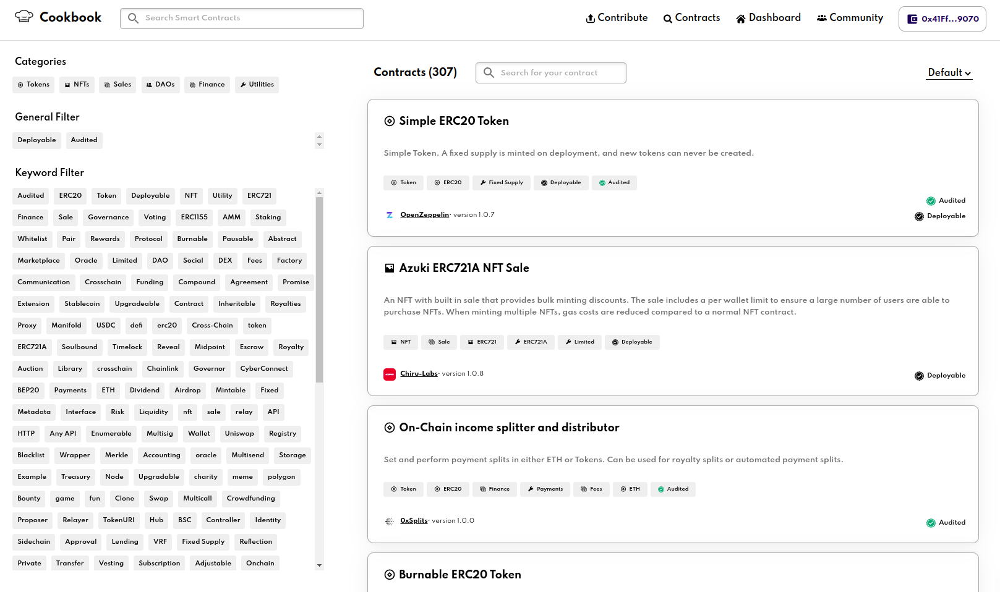
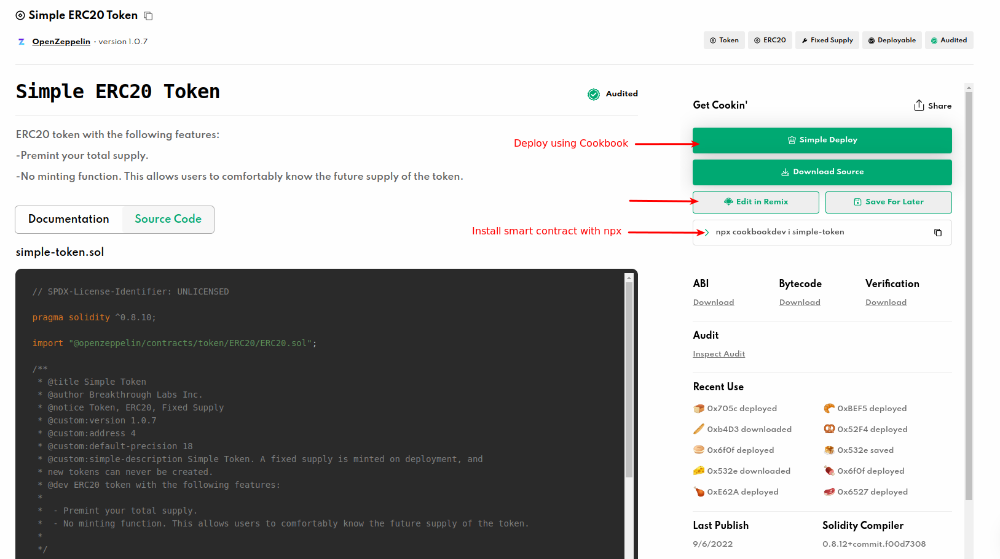
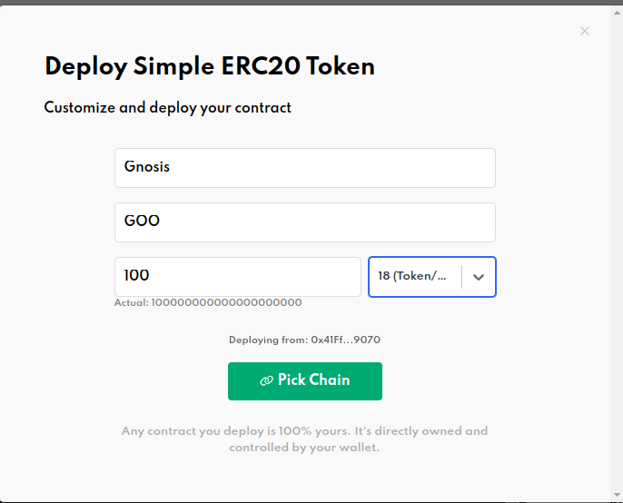
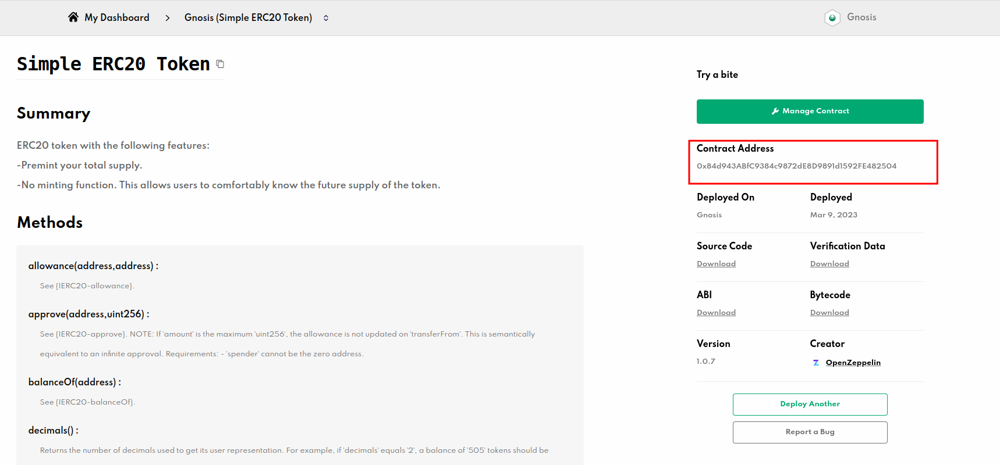

# Using Cookbook
Cookbook is an open source smart contract marketplace. You can search, upload, download, deploy, manage and integrate any Solidity smart contract into your app.

It supports Gnosis Chain and Chiado.

## Search on smart contract marketplace
Navigate to [Cookbook](https://www.cookbook.dev/search?q=), and search for the smart contract you would like to use or deploy: 

## Choose the deploy option
Once you've chosen your smart contract, you have different options to select:
1. Simply Deploy: Configure and Deploy the smart contract on the network you chose by few clicks.
2. Edit On Remix: Use [Remix IDE](https://remix.ethereum.org/) to edit the smart contract
3. Download smart contract: Download the smart contract and use it locally.

In this tutorial, we'll choose **Simply Deploy** option.

## Configure the smart contract

## Pick a chain
Select the network for which the smart contract to be deployed to.
Click **Deploy** and you'll be prompted to sign a smart contract creation transaction. Please check that whether you have enough xDAI balance on your wallet.

## Check your deployed smart contract on Dashboard
Once the smart contract is deployed, you may check the address on Dashboard. You may also download ABI, Bytecode, Source Code and Verification Data from here.

## Additional Resources
* [Cookbook](https://www.cookbook.dev/)