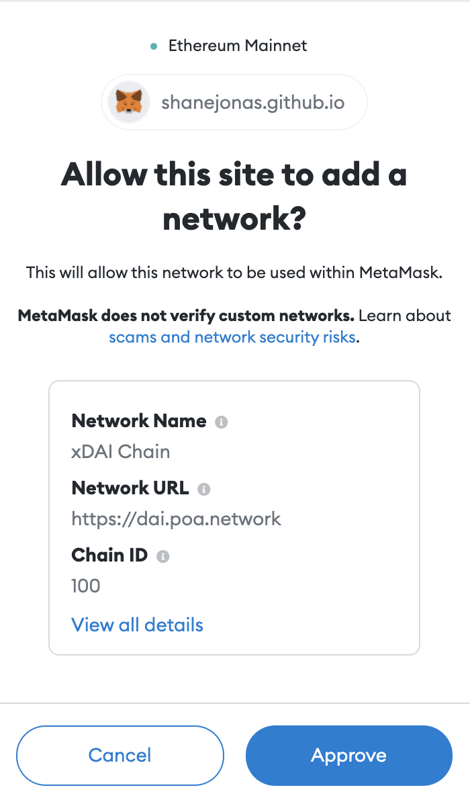
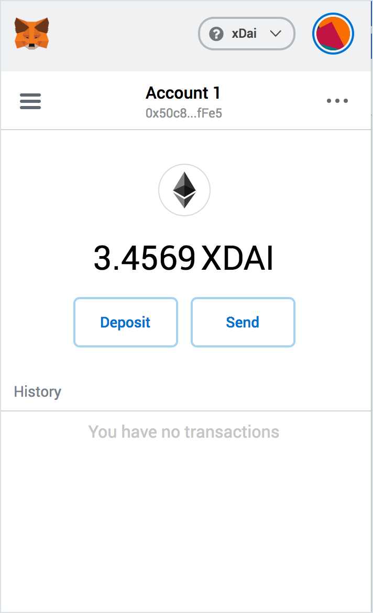

--- 
---

# Adding Gnosis to Metamask Programmatically

# Metamask

**Wallet Type**: Web3 wallet: Extensions available for [Chrome, Firefox, Opera and more](https://metamask.io/)

**Description**: MetaMask is the original web3 wallet. It allows you to run Ethereum dApps right in your browser without running a full Ethereum node. See our [Metamask Setup instructions](metamask-setup.md) to start using with xDai.


Nifty Wallet and MetaMask do not function properly when both are activated at the same time as chrome extensions. To use one or the other, **right click** on the extension icon, go to **Manage Extensions**, and **toggle off/on** the application you want to use. All data will be preserved in the wallet for future access.


## 1-Click MetaMask Configure

[Use MetaMask's deeplink to easily configure xDai for MetaMask](https://shanejonas.github.io/metamask-link/deep?method=wallet\_addEthereumChain\&params\[0]\[chainId]=0x64\&params\[0]\[chainName]=xDAI%20Chain\&params\[0]\[rpcUrls]\[0]=https://rpc.xdaichain.com\&params\[0]\[nativeCurrency]\[name]=xDAI\&params\[0]\[nativeCurrency]\[symbol]=xDAI\&params\[0]\[nativeCurrency]\[decimals]=18\&params\[0]\[blockExplorerUrls]\[0]=https://blockscout.com/xdai/mainnet)

When you click the link a dialog box will appear from MetaMask like the one below, confirm the details and you are finished!

 

## Manual xDai Configuration

