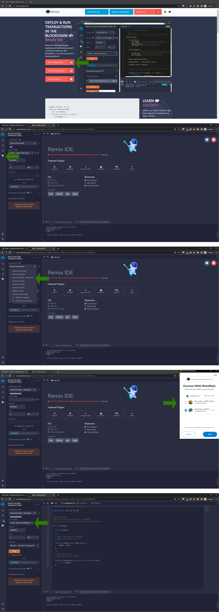
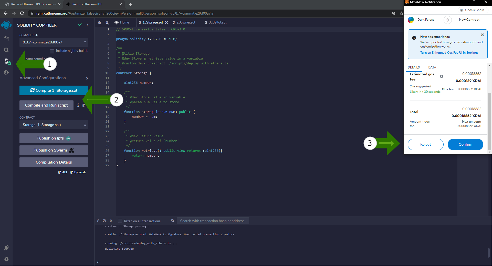
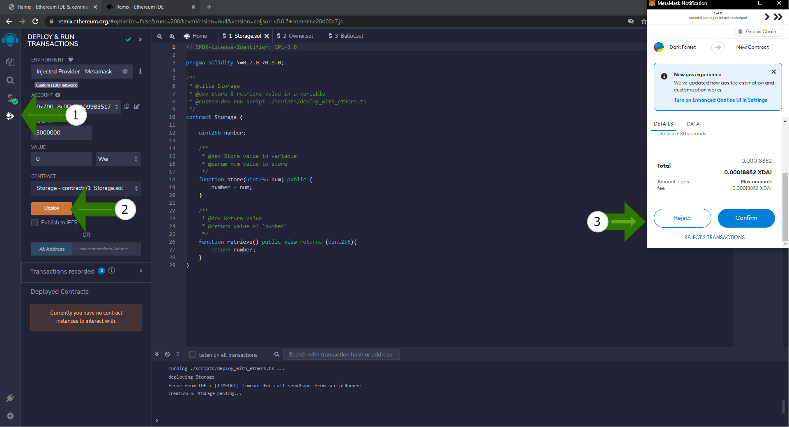

--- 
---

# Using Remix and Metamask

#### Remix is an integrated development enviornment used for smart contract compiling, deploying, testing and debugging.

View the official [Remix documentation](https://hardhat.org/hardhat-runner/docs/getting-started#installation) for general installation and overview.

Vist our [MetaMask page](../../tools/wallets/metamask/) for installation and general information.

## Connecting Remix to Gnosis via MetaMask

Remix can deploy contracts through Gnosis using the following environments:

- Javascript VM
- **Injected Web3**
- Web3 Provider

Using MetaMask falls under the **Injected Web3** option, which we will explore below.

1. First navigate to https://remix-project.org/ and click on "Start Coding online"
     - We will be using the online IDE for this tutorial.
2. Follow the steps in the diagram below:

In the last image, we can see that your wallet is connected.

## Compiling your contract in Remix

Follow the directions in the diagram below:

## Deploying your Contract

Follow the directions in the diagram below:

Visit our [Contract Verfication Page](../verifying-contracts/) for more documentation on verification tools.