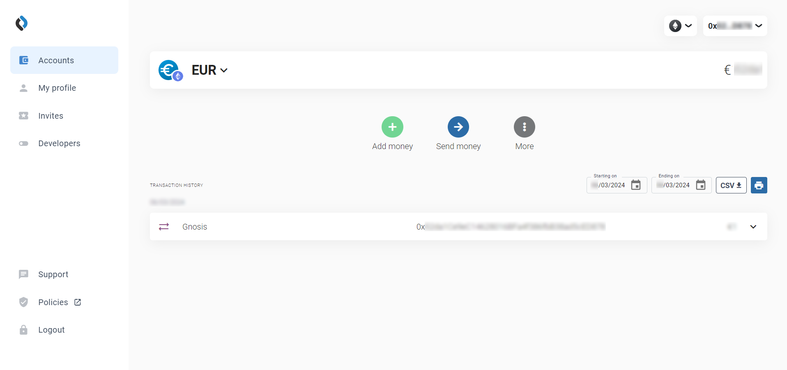
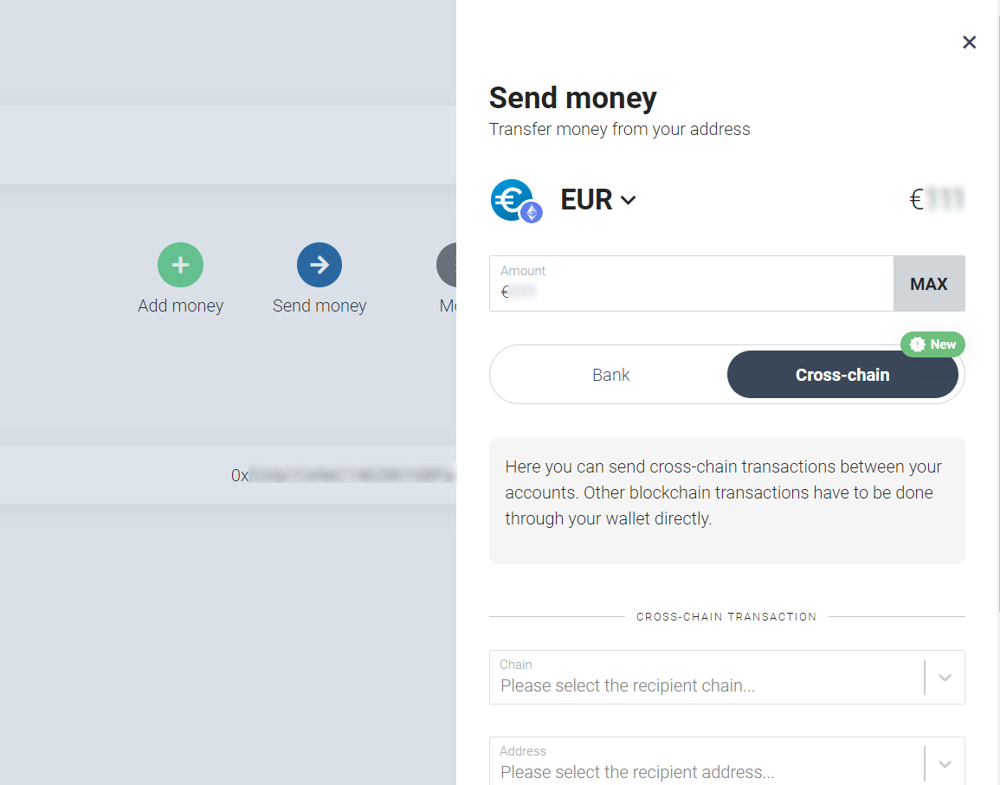
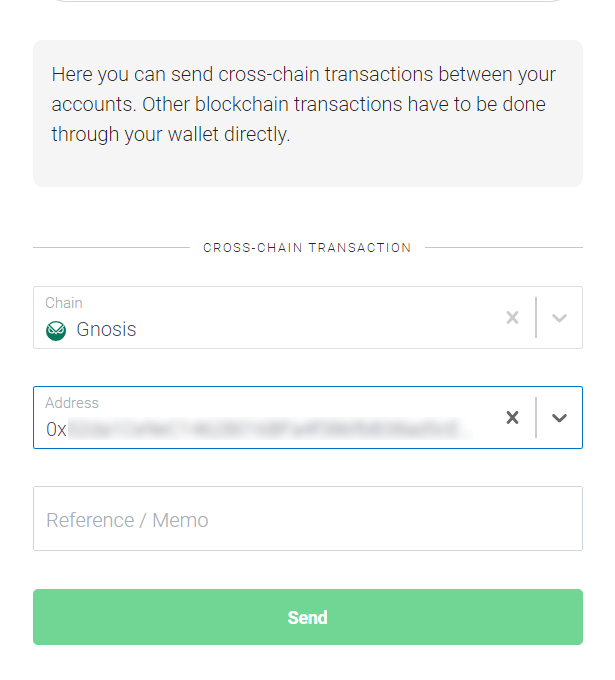
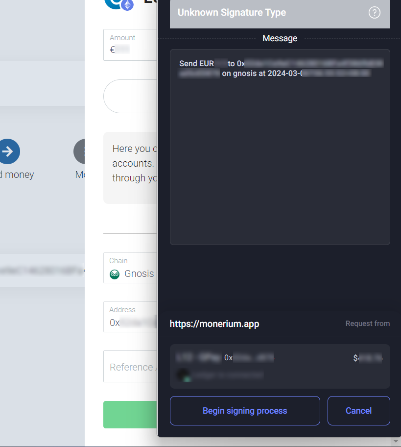

# Bridges FAQs

1. Can I bridge tokens between Gnosis Chain and BSC using Omni Bridge

   The BSC - Gnosis Chain bridge has been depreciated you can instead use a third party bridge like Jumper for example.

2. What is the best way to bridge it to another chain?

   For larger amounts, you can use the xDAI bridge (from Gnosis Chain to Ethereum) : https://bridge.gnosischain.com/ For smaller amounts or if you want to bridge them to another chain (to a L2 or another chain), with very small gas fees using Jumper : https://jumper.exchange/

3. On AMB/Omni Bridge once the daily limit has been reached, how can I get my tokens?

   Follow the manual execution tutorial https://docs.gnosischain.com/bridges/tutorials/using-amb once you have initiated the `executeSignature()` transaction, the token release transaction will be credited to your account automatically the next day.

4. I’m trying to bridge but Omni Bridge says that the maximum amount was already transferred?

   Some tokens have [bridge limits](https://docs.gnosischain.com/bridges/tokenbridge/omnibridge#single-transaction-limits), which can be a daily limit and or maximum or minimum per transaction, this is for example the case for GNO between Gnosis Chain and Ethereum, you can click the “Limits” button below the bridge box to check the current limits for a given token. These Daily Limits will be reset at 00:00 UTC.

5. How much time does it take to bridge using Omni Bridge ?

   With the new zk light client verification, bridging assets takes about 20 minutes. You can check your bridge transaction on the bridge explorer : https://bridge-explorer.gnosischain.com/

6. Why do the tokens I just got on Gnosis Chain after bridging from Ethereum have a different contract address?

   Often tokens have a different contract address because when they are bridged into Gnosis Chain, the contract address alters, becoming a proxy token of the bridged one. This process is fundamental to how the tokens are locked on the bridge.

7. I bridged some agEUR tokens using the Angle Bridge, now I have lz-agEUR in my wallet, what can I do?

   The Angle Bridge has daily and hourly limits (they are visible on the bridge page). If the limits are reached when processing a bridge transaction, you won’t receive agEUR in your wallet on the destination chain but instead, you will receive lz-agEUR tokens in your wallet that can be used to redeem agEUR later, when the limits reset, you would then need to make a manual claim following this tutorial : https://docs.angle.money/overview/guides/bridge#how-to-get-back-ageur-from-lz-ageur

8. I’m trying to bridge agEUR from Gnosis Chain to another chain using the Angle Bridge but I’m getting an error “internal JSON-RPC error”

   Be sure to have enough xDAI for gas and fees, to use the Angle Bridge you should have at least 1,5 xDAI in your wallet. More information in Angle Protocol docs : https://docs.angle.money/overview/guides/bridge

9. I’m having issues using Omni bridge to bridge assets held in a SAFE between Ethereum and Gnosis Chain, I get a “failure to connect” ERROR.

   Rabby wallet ( https://rabby.io/ ) wallet is good workaround allowing to load SAFE into it and inject them in similarly to Metamask.

10. I bridge my WETH from Gnosis Chain to Ethereum, but I don't see my WETH balance increases on Ethereum.

      When bridging [WETH](https://gnosisscan.io/token/0x6a023ccd1ff6f2045c3309768ead9e68f978f6e1) from Gnosis Chain, Omnibridge will automatically unwrap your WETH on Ethereum to ETH, so you will only accept ETH on Ethereum. The transaction calls [WETHOmnibridgeHelper](https://etherscan.io/address/0xa6439Ca0FCbA1d0F80df0bE6A17220feD9c9038a) to withdraw ETH from [WETH](https://etherscan.io/address/0xC02aaA39b223FE8D0A0e5C4F27eAD9083C756Cc2) token contract, create a new contract to receive the ETH and eventually self destruct that contract and send the ETH to the user. Check out [this transaction](https://etherscan.io/tx/0xfed3bfb9a86b4c65039de6e64f4582e7fad8b1cac0b67f69c185c0332b3fab7e) for more details.

11. How do I know if xDAI get minted to my account when I'm using xDAI bridge for bridging DAI from Ethereum?

      Because xDAI is gas token(or native token) on Gnosis Chain, newly minted xDAI by xDAI bridge will not create a transaction. You may check your balance increment visually by looking for **coin balance history** section in blockscout: https://gnosis.blockscout.com/address/$YOUR_ADDRESS?tab=coin_balance_history or querying the balance programmatically using eth_getBalance api.

12. I want to bridge my AgEUR or EURe, what bridge should I use?

      To bridge AgEUR : https://app.angle.money/bridges-agEUR    
      To bridge EURe: You will need have an account in [Monerium app](https://monerium.app/), click **Send Money**, select **Cross-Chain** and enter the amount you want to send, then click **Send**.. Double check the message is correct and sign the message. 
          
        
        
        