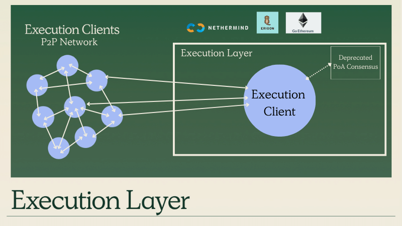
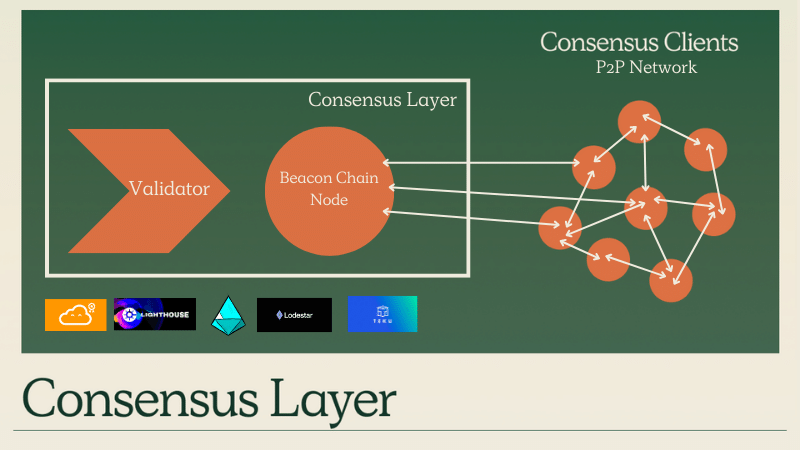

Image: Diagram representing the composite client architecture of a Gnosis node

## Architecture

Gnosis is a open peer-to-peer network of nodes operated by anyone in the world who runs the Gnosis client software. 

Gnosis utilizes the same architecture as Ethereum, and has committed to building together with Ethereum and contributing to the research, engineering and tooling for Ethereum's stack. 

Gnosis started out as a [proof-of-authority ](../specs/consensus/aura.md) sidechain to Ethereum with its own consensus algorithm in 2017. Gnosis [Merged](/updates/2022/12/10/merge) successful at block 6,306,357 deprecating legacy differences and aligning with Ethereum's new architecture, beginning with the Merge, with a goal of achieving 1:1 parity with Ethereum. 

## Composite Network Architecture

Gnosis (post-merge) utilizes the same [composite layer architecture](https://hackmd.io/@n0ble/the-merge-terminology) as Ethereum. Gnosis' network is created through the interaction of two layers: an Execution Layer (EL) network and a Consensus Layer (CL) network. 

To run a Gnosis node, you need to run an Execution Layer and Consensus Layer clients, and allow them to communicate with each other. The combined EL-CL network works together to function as a Gnosis node. 

### Execution Layer

Gnosis' Execution Layer is the legacy xDai "Eth1" network. The Execution Layer is where smart contracts and the EVM and network rules reside. Prior to the Merge, the Execution Layer utilized a [Proof-of-Authority consensus](../specs/consensus/aura.md), which was deprecated by the merge in favor of the Consensus Layer instead. 

| Period               | Ethereum        | Gnosis                                              |
| -------------------- | --------------- | --------------------------------------------------- |
| Pre-Merge Consensus  | Proof-of-Work   | [Proof-of-Authority](../specs/consensus/aura.md) |
| Post-Merge Consensus | Consensus Layer | Consensus Layer                                     |

Node Operators will need to run an Execution Layer client, which will interact with the Execution Layer network. 

- [Nethermind](./guide/execution/nethermind.md)
- [Geth](./guide/execution/geth.md) (in progress)
- [Erigon](./guide/execution/erigon.md) (in progress)

Gnosis used to be supported by the [Parity OpenEthereum client](./guide/execution/openethereum.md), but it has since been deprecated. 

### Consensus Layer

Gnosis' Consensus Layer utilizes the same architecture and tooling as Ethereum's Consensus Layer, and is a key sister chain to Ethereum in the emerging Ethereum Beaconverse. It is responsible for proof-of-stake incentives, and maintaining consensus chain, proposals and attestations, and fork choices. 

The Consensus Layer consists of the Beacon Node and Validator Client software. 

| Component   | Description                                                                                                                        | Communicates with                                 |
| ----------- | ---------------------------------------------------------------------------------------------------------------------------------- | ------------------------------------------------- |
| Beacon Node | Coordinates proof-of-stake consensus with other Beacon Nodes in p2p network                                                        | Other Beacon Nodes in Consensus Layer p2p Network |
| Validator   | Optional component that allows node operator to stake 32 mGNO and become an active participant in block proposals and attestations | Only the local Beacon Node                        |

Node operators will need to run a Consensus Layer client. In most cases, these are the same Ethereum Consensus Layer client, just run with a `--network` flag!

- [Lodestar](./guide/beacon/lodestar.md)
- [Nimbus](./guide/beacon/nimbus.md)
- [Teku](./guide/beacon/teku.md)
- [Lighthouse](./guide/beacon/lighthouse.md)

Gnosis is also supported by a fork of the [Prysm](./guide/beacon/prysm.md) client, albeit not the actual client itself. 

### Inter-Layer Communication

:::info

[This post](https://hackmd.io/@n0ble/ethereum_consensus_upgrade_mainnet_perspective) offers a good explanation of how the Execution and Consensus Layer work with each other. 

:::

## Types of Nodes

Gnosis is similar to Ethereum in the types of nodes available: 

- [Light Nodes](https://ethereum.org/en/developers/docs/nodes-and-clients/#light-node)
- [Full Nodes](https://ethereum.org/en/developers/docs/nodes-and-clients/#full-node)
- Full Nodes (w/o Validator)
- [Archival Nodes](https://ethereum.org/en/developers/docs/nodes-and-clients/#archive-node)