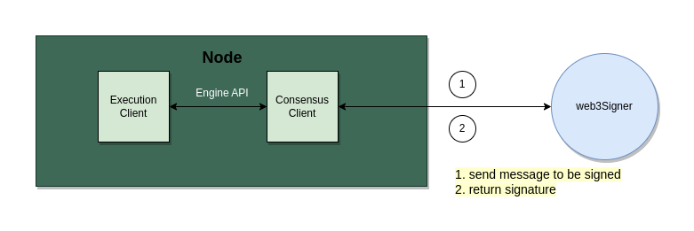

import Tabs from '@theme/Tabs';
import TabItem from '@theme/TabItem';

## What is Web3Signer?

:::info Before you start
This is only for advanced users. Please make sure you understand the risks before using web3signer.
:::

Web3Signer is a remote signing tool developed by Consensys. Remote signing is when a
Validator Client (VC) out-sources the signing of messages to remote server (e.g., via HTTPS). VC doesn’t need to store private key on the same server, it only needs to request for signature from the server which host Web3Signer.

It adds a layer of security, but also introduces a new set of security and slashing risks. It is only for advanced users.



Official Doc: [https://docs.web3signer.consensys.net/](https://docs.web3signer.consensys.net/)

## Build from source

```jsx
git clone --recursive https://github.com/Consensys/web3signer.git
cd web3signer
./gradlew build
cd build/distributions/
tar -xzf web3signer-<version>.tar.gz
```

Ensure that web3signer is installed correctly

```shell
cd web3signer-<version>/
bin/web3signer --help
```

Other ways includes [Installing binary distribution, and Run Web3Signer from Docker](https://docs.web3signer.consensys.net/category/get-started-with-web3signer).

## Start Web3Signer

### Step 1: Create validator.yaml file

Create a validator.yaml file with following key:

```shell
nano validator.yaml
```

* **type: “file-keystore” :** Use [keystore file](https://docs.web3signer.consensys.net/Reference/Key-Configuration-Files#keystore-file) that is generated from validator-generation process.

* **keystoreFile:** Path to validator keystore-m*.json 

* **keystorePasswordFile:** Path to validator password.txt 


Copy and modified the following content into the file.


```yaml
  type: "file-keystore"
// highlight-start
  keystoreFile: "/path/to/keystore-m_*.json"
  keystorePasswordFile: "/path/to/keystore-m_*txt"
// highlight-end
```


### Step 2: Start web3signer


The CLI format of web3signer is: web3signer [[options](https://docs.web3signer.consensys.net/Reference/CLI/CLI-Syntax)] eth2 [[Eth2 options](https://docs.web3signer.consensys.net/Reference/CLI/CLI-Subcommands)]


By default, slashing protection is enabled. You will need to configure —slashing-protection-db to make it work. To disable slashing protection, use `—slashing-protection-enabled=false` . 

```shell
web3signer --http-listen-port=9010 --key-store-path=/path_to_directory_of_validator.yaml eth2 --network=gnosis --slashing-protection-db-url="jdbc:postgresql://localhost/web3signer" --slashing-protection-db-username=postgres --slashing-protection-db-password=password
```

To disable slashing protection 

```shell
web3signer --http-listen-port=9010 --key-store-path=/path_to_directory_of_validator.yaml eth2 --network=gnosis --slashing-protection-enabled=false
```
:::info
The http listen port is default to 9000, which is the same as Lighthouse port. Please make sure to configure accordingly to avoid port clashing. HTTP port will be the port that listen to signing request from consensus client.
:::

The logging output will show how many keys have been loaded from keystore file and listening on which port. In this example, 1 validator key is loaded.

```shell
2023-03-23 16:35:57.490+08:00 | ForkJoinPool-1-worker-3 | INFO  | SignerLoader | Total configuration metadata files processed: 1
2023-03-23 16:35:57.490+08:00 | ForkJoinPool-1-worker-3 | INFO  | SignerLoader | Total signers loaded from configuration files: 1 in 00:00:01.432
2023-03-23 16:35:57.499+08:00 | pool-2-thread-1 | INFO  | DefaultArtifactSignerProvider | Total signers (keys) currently loaded in memory: 1
2023-03-23 16:35:58.159+08:00 | main | INFO  | Runner | Web3Signer has started with TLS disabled, and ready to handle signing requests on 127.0.0.1:9010
```

Check that the web3signer is up by running `curl -X GET http://localhost:port/upcheck`. 

```shell
Result: 200 OK
```

# Action needed from Consensus Client

Once the web3signer server is running, we need to configure consensus client so that the client knows remote signing is enabled and which port is used for remote signing. 

<Tabs>
<TabItem value="lighthouse" label="Lighthouse">

## Lighthouse

To use web3signer in Lighthouse, you may configure in `vadalitor_definitions.yml` OR via the `POST /lighthouse/validators/web3signer`API endpoint.

### Option 1: Configure `validator_definitions.yml`

The [validator_definitions.yml](https://lighthouse-book.sigmaprime.io/validator-management.html) file is located in `validator-dir` or `datadir`, which defaults to  `~/.lighthouse/{network}/validators`  . Add the following configuration in the file.

* `voting_public_key`: validator’s public key.

* `type`: web3signer

* `url`: web3signer’s HTTP url, defaults to `"https://localhost:9000"`

Example:

```yaml
---
- enabled: true
  voting_public_key: "0xa5566f9ec3c6e1fdf362634ebec9ef7aceb0e460e5079714808388e5d48f4ae1e12897fed1bea951c17fa389d511e477"
  type: web3signer
  url: "https://localhost:9000"
```

Restart the Lighthouse validator after saving `validator_definitions.yml`.

### Option 2: POST `/lighthouse/validators/web3signer`

1. Skip the import validator key step and [run validator](https://docs.gnosischain.com/node/guide/#step-4b-run-a-validator) directly.
2. Run [POST /lighthouse/validators/web3signer](https://lighthouse-book.sigmaprime.io/api-vc-endpoints.html#post-lighthousevalidatorsweb3signer) with tools such as [POSTMAN](https://www.postman.com/) or [curl](https://linuxize.com/post/curl-post-request/) command.

### [POST /lighthouse/validators/web3signer](https://lighthouse-book.sigmaprime.io/api-vc-endpoints.html#post-lighthousevalidatorsweb3signer)

**Usage:**

Create any number of new validators, all of which will refer to a [Web3Signer](https://docs.web3signer.consensys.net/en/latest/) server for signing.

**Prerequisite:** 

To obtain [Authorization data](https://lighthouse-book.sigmaprime.io/api-vc-auth-header.html?highlight=author#validator-client-api-authorization-header), run curl [http://localhost:5062/lighthouse/auth](http://localhost:5062/lighthouse/auth) to get the path to api-token.txt. Output format of api-token.txt would be `api-token-0x023106f2f58ea57ae82354a9273fd8878b1fec8fj80341525cc15vd0f5d07f14bd`. 

| Property | Specification |
| --- | --- |
| Path | /lighthouse/validators/web3signer |
| Method | POST |
| Required Headers | https://lighthouse-book.sigmaprime.io/api-vc-auth-header.html |
| Typical Responses | 200, 400 |

Request body

```json
{
        "enable": true,
        "description": "validator_one",
        "graffiti": "Mr F was here",
        "suggested_fee_recipient": "0xa2e334e71511686bcfe38bb3ee1ad8f6babcc03d",
        "voting_public_key": "0xa062f95fee747144d5e511940624bc6546509eeaeae9383257a9c43e7ddc58c17c2bab4ae62053122184c381b90db380",
        "url": "http://path-to-web3signer.com",
        "root_certificate_path": "/path/on/vc/filesystem/to/certificate.pem",
        "request_timeout_ms": 12000
    }
```

The following fields may be omitted or nullified to obtain default values:

- `graffiti`
- `suggested_fee_recipient`
- `root_certificate_path`
- `request_timeout_ms`

### [Example Response Body](https://lighthouse-book.sigmaprime.io/api-vc-endpoints.html#example-response-body-12)

*No data is included in the response body.*

Reference: [https://lighthouse-book.sigmaprime.io/validator-web3signer.html](https://lighthouse-book.sigmaprime.io/validator-web3signer.html)

</TabItem>

<TabItem value="teku" label="Teku">

## Teku

For Teku, you can run beacon node and validator in single command. Thus, to enable web3signer, you have to add two options: `--validators-external-signer-public-keys` and `--validators-external-signer-url`, and skip `—validator-keys` option.

| Option                                   | Type                       | Description                                                                                                                                                       |
|------------------------------------------|----------------------------|-------------------------------------------------------------------------------------------------------------------------------------------------------------------|
| --validators-external-signer-url         | string                     | URL of the external signer                                                                    |
| --validators-external-signer-public-keys | string, separated by comma | List of public keys of validators that you wish to voluntarily exit when using an external signer |

```shell
./bin/teku --network=gnosis \
--ee-endpoint=http://localhost:8551 \
--validators-external-signer-public-keys=0xa99a...e44c,0xb89b...4a0b \
--validators-external-signer-url=http://localhost:9000
```

Reference: [https://docs.web3signer.consensys.net/Tutorials/Launchpad-Keystores](https://docs.web3signer.consensys.net/Tutorials/Launchpad-Keystores)

</TabItem>
<TabItem value="lodestar" label="Lodestar">

## Lodestar

./lodestar validator

| Option                                   | Type                       | Description                                                                                                                                                       |
|------------------------------------------|----------------------------|-------------------------------------------------------------------------------------------------------------------------------------------------------------------|
| --externalSigner.url | string | URL to connect to an external signing server |
| --externalSigner.pubkeys | array | List of validator public keys used by an external signer. May also provide a single string a comma separated public keys |

Skip  `--importKeystores` and `--importKeystoresPassword`

Reference: [https://chainsafe.github.io/lodestar/reference/cli/](https://chainsafe.github.io/lodestar/reference/cli/)

</TabItem>
<TabItem value="nimbus" label="Nimbus">

## Nimbus

Support [keymanager API](https://ethereum.github.io/keymanager-APIs/)

Reference: [https://nimbus.guide/keymanager-api.html](https://nimbus.guide/keymanager-api.html)

</TabItem>
<TabItem value="prysm" label="Prysm">

## Prysm

Same options as Teku    

Reference: [https://docs.prylabs.network/docs/wallet/web3signer](https://docs.prylabs.network/docs/wallet/web3signer)
</TabItem>
</Tabs>