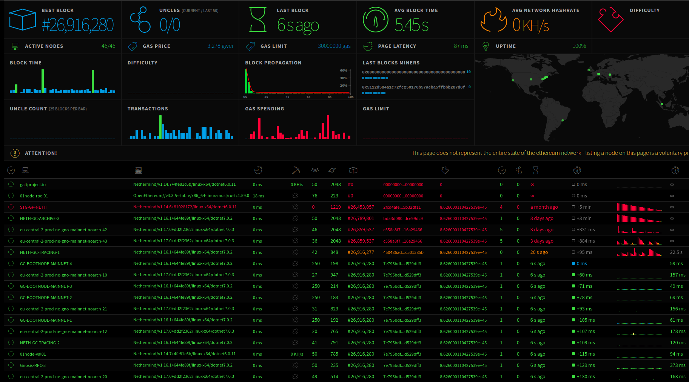
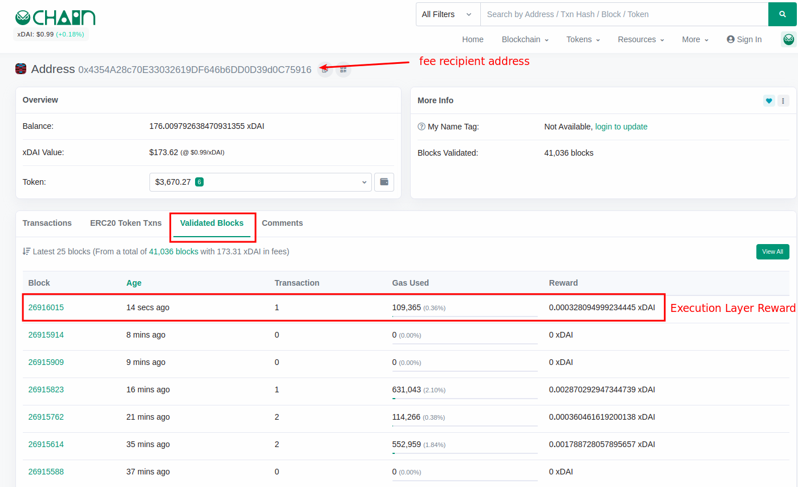
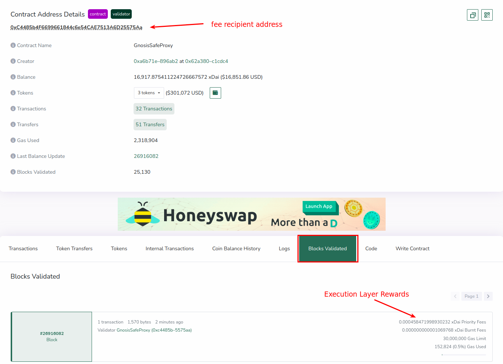
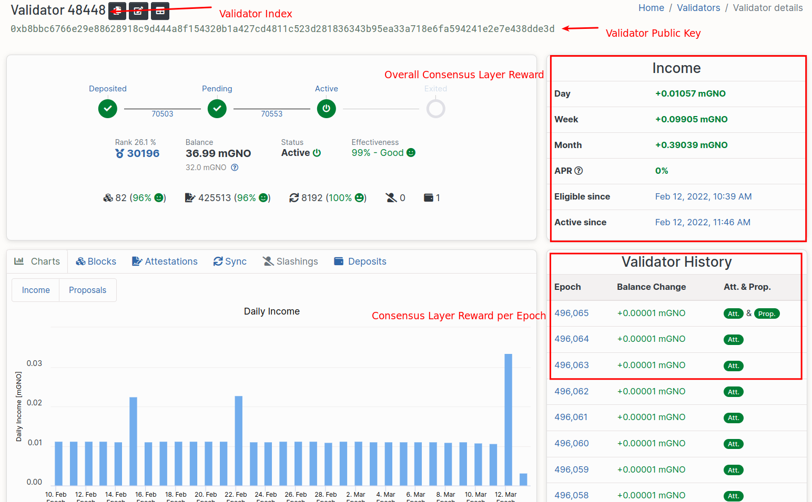

To monitor a node in the network, you can either observe your own node's status or the entire network.
Monitoring your own node can give you insight into its status, and setting up a monitoring dashboard using Prometheus and Grafana is commonly used.
To monitor the network, options include ethstats, forkmon, beacon.gnosischain, and blockscout, each providing different types of information about the network and validator-related metrics.

## Monitoring your own node with Prometheus + Grafana

**Prometheus** is a systems monitoring tool that pulls data from certain endpoint and stores the data into a database.
**Grafana** is a data visualisation tool that allows user to create their own dashboard from different data sources, including Prometheus.
**Node exporter** is a monitoring tool that exposes your hardware and OS metrics. It can provide your system metrics to Prometheus.

To set up these tools, please refer to the excellent guide from ethstaker on [how to do monitoring for an Ethereum validator](https://github.com/eth-educators/ethstaker-guides/blob/main/monitoring.md).

You may also refer to the [Ethereum Setup Instructions ](https://launchpad.ethereum.org/en/)and [CoinCashew's guide](https://www.coincashew.com/coins/overview-eth/guide-or-how-to-setup-a-validator-on-eth2-mainnet/part-i-installation/monitoring-your-validator-with-grafana-and-prometheus) for best monitoring practices.

In order to expose your node's clients data to Prometheus, please ensure the execution or consensus client has enabled the appropriate metrics flag.

## Default metrics port

| Client                      | Port |
| --------------------------- | ---- |
| Nethermind                  | 6060 |
| Lighthouse Beacon           | 5054 |
| Lighthouse Validator        | 5064 |
| Lodestar Beacon             | 8008 |
| Lodestar Validator          | 5064 |
| Teku (Beacon & Validator)   | 8008 |
| Nimbus (Beacon & Validator) | 8008 |
| Prysm Beacon                | 8080 |
| Prysm Validator             | 8081 |

### Execution client

<Tabs>
<TabItem value="Nethermind" label="Nethermind">

    --Metrics.Enabled true
    --Metrics.ExposePort <PORT>
    --Metrics.PushGatewayUrl

Refer to https://docs.nethermind.io/nethermind/ethereum-client/metrics/setting-up-local-metrics-infrastracture

</TabItem>

<TabItem value="Erigon" label="Erigon">
WIP
</TabItem>
</Tabs>

### Consensus client

<Tabs>
<TabItem value="lighthouse" label="Lighthouse">

    --metrics
    --metrics-port=<PORT>

https://lighthouse-book.sigmaprime.io/advanced_metrics.html
https://github.com/sigp/lighthouse-metrics
</TabItem>
<TabItem value="Lodestar" label="Lodestar">

    --metrics=true
    --metrics.port=<PORT>

https://chainsafe.github.io/lodestar/logging-and-metrics/prometheus-grafana/
https://chainsafe.github.io/lodestar/beacon-management/beacon-cli/#-metrics
</TabItem>
<TabItem value="Teku" label="Teku">

    --metrics-enabled=true

https://docs.teku.consensys.net/en/latest/HowTo/Monitor/Metrics/

</TabItem>
<TabItem value="Nimbus" label="Nimbus">

    --metrics
    --metrics-port=<PORT>

https://nimbus.guide/metrics-pretty-pictures.html#simple-metrics
</TabItem>
<TabItem value="Prysm" label="Prysm">

https://docs.prylabs.network/docs/prysm-usage/monitoring/grafana-dashboard/
</TabItem>

</Tabs>

## Monitoring the network

### Ethstats

Ethstats provides real-time insight about the entire state of Gnosis network such as Block Time, Transactions per block, Gas per block; as well as individual node's metrics such as node's OS, Execution client version, peers number, etc.

:::tip
By default, your node data will not be listed on the ethstats page.
Listing a node on ethstats is a voluntary process.
:::

To enable [ethstats module](https://docs.nethermind.io/nethermind/ethereum-client/configuration/ethstats) in Nethermind, set `--EthStats.Enabled true`.

- Gnosis chain: https://ethstats.gnosischain.com/
- Chiado: https://ethstats.chiadochain.net/

### Forkmon

Forkmon (Fork monitor) is another tool to monitor Node's status.

- Gnosis Chain: https://forkmon.gnosischain.com/
- Chiado: https://forkmon.chiadochain.net/

### d14n.info

:::note
The site is deprecated
:::
[d14n.info](https://d14n.info/) is a real-time dashboard that measures decentralization of Gnosis Chain and Ethereum networks.

### GnosisPools.info

[GnosisPools.info](https://gnosispools.info/d/Pz05j7dVk/gnosispools-public?orgId=1&refresh=5m&from=now-24h&to=now) allows you to monitor the performance of Gnosis consensus staking pool. Some of the metrics you can track include:

- % of inactive validators
- Delta in rewards/penalties between consecutive epochs
- Proposed and missed blocks for each epoch

### Block explorer

#### Execution Layer

- **Gnosisscan**
  [Gnosisscan](https://gnosisscan.io/) provides data about blocks, transactions, validator's reward on Execution Layer, etc.

  To check your Execution Layer Reward (in xDAI):

  1. Search your `fee-recipient-address` that is set when [running validator](../manual/README.md#step-4-run-a-validator)
  2. Click **Validated Blocks**
     

- **Blockscout**
  [Blockscout](https://blockscout.com/xdai/mainnet) is another block explorer similar to Gnosisscan.

  

#### Consensus Layer

- **beacon.gnosischain**
  [beacon.gnosischain](https://gnosischa.in//) provides insight on consensus layer such as most recent epochs, most recent blocks, and validator's reward on Consensus layer. You can view your validator's info by using its public key or index.

  To check your Consensus Layer Reward (in mGNO):

  1. Search your validator by Index or Public Key.
  2. **Income** section indicates the overall consensus layer reward the validator has gained, **Validator History** shows the reward per epoch.
     
