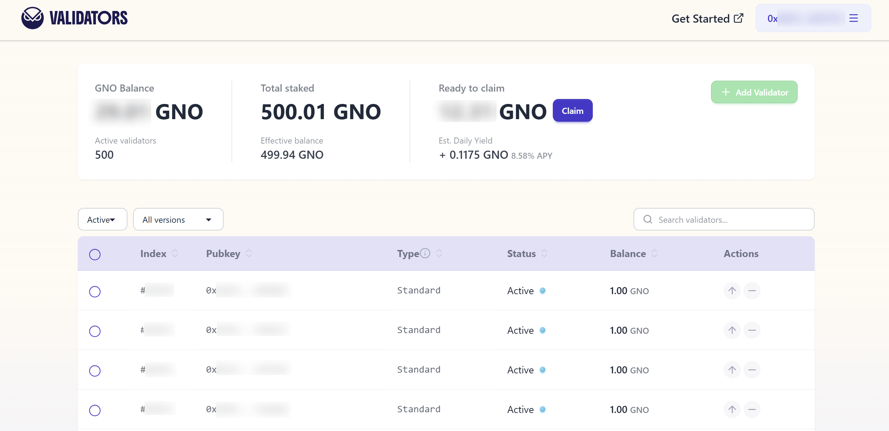
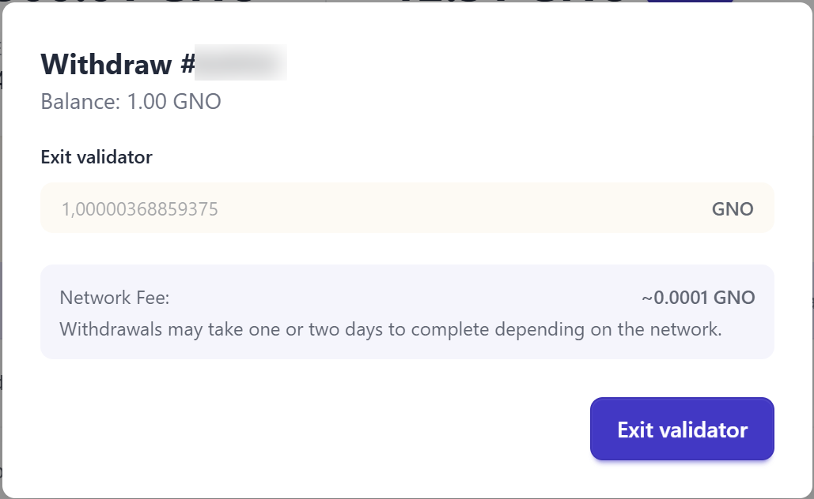

If you decide to stop validating and disable your node, you can initiate a voluntary exit. This will freeze your balance at its current value (rewards and/or penalties will no longer accrue).

If you initiate a voluntary exit, your validator's full balance becomes withdrawable once exit processing is complete. On Gnosis Chain it is then swept to the deposit contract, where you [claim](withdrawals.md#how-to-receive-my-withdrawal-full-or-partial) it to your configured withdrawal address — see [how long that takes](withdrawals.md#how-long-does-it-take) and [withdrawal credential details](withdrawals.md).

The easiest way to exit — and the recommended first choice below — only works if your validator already has an **execution withdrawal address** set (credential prefix `0x01` or `0x02`). If you're not sure whether you have one, or still need to set one, check the [validator withdrawals](withdrawals.md#check-withdrawal-credential) page first.

:::caution
Exits are non-reversible; once you have exited you cannot restart your validator.

It is recommended to set execution withdrawal credentials before exiting your validator. Updating credentials later, after your node is stopped, can be more difficult. See [validator withdrawals](withdrawals.md). 
:::

### Validators app (recommended)

The simplest way to exit, if your validator has an execution withdrawal address (`0x01` or `0x02`) — no node access, keystore, or client-specific command needed.

1. Go to the [validators app](https://validators.gnosischain.com/) and connect the wallet holding your validator's **withdrawal address** (not your validator keystore — this method works by sending a request from that address, so it only applies to `0x01`/`0x02` validators; check [here](withdrawals.md#check-withdrawal-credential) if you're unsure which you have). Give it a few seconds to load your validators — if the list doesn't show up, try refreshing the page.

   

2. Find your validator in the table and click the **withdraw** icon in the **Actions** column, on the right. This opens a withdraw panel for that validator, showing its balance and an amount field:
   - To make a **partial withdrawal** (only possible if the validator holds more than 1 GNO), enter the amount you want withdrawn and confirm — the button reads **Withdraw**.
   - To **exit the validator entirely**, click **MAX** next to the amount field (or just confirm as-is if the balance is already 1 GNO or less) — the button changes to **Exit validator**.

   

3. Confirm the transaction in your wallet. You'll need a little xDAI in that wallet to cover the gas (see [Faucets](../../tools/Faucets.md) if you need some).

:::tip Using a Safe as your withdrawal address?
You can open the validators app from inside your Safe: in [app.safe.global](https://app.safe.global/), go to **Apps → My custom apps**, add `https://validators.gnosischain.com/` as a custom app, then open it from there. Your Safe will need a small amount of xDAI to confirm validator actions like this one.
:::

:::tip Running many validators?
Exiting one by one on the validators app works fine for a handful of validators, but if you're running many, requesting the exit directly from Dappnode or your consensus client (below) — which typically let you select and exit several validators at once — will be faster.
:::

Otherwise — for `0x00` validators, or if you'd rather exit directly from your node — voluntary exit procedures vary depending on your client:

### Dappnode

Navigate to the Stakers > Gnosis Chain menu, click on the "Upload Keystores" button on the Web3Signer card. Once you are in the Web3Signer UI, select the validators you want to exit and click on the "Exit Validator" button on the top right part of the UI. Follow the instructions and type `I want to exit`, followed then click the "Exit" button. 

- For more info, see the [Dappnode Docs](https://docs.dappnode.io/docs/user/staking/gnosis-chain/solo#1-exit-the-validator-from-the-dappnode-ui).

### Lighthouse

In order to initiate an exit, users can use the lighthouse account validator exit command.

```bash
lighthouse --network gnosis account validator exit --keystore /path/to/keystore --beacon-node http://consensus:5052
```

- For more info, see the [Lighthouse Voluntary Exit docs](https://lighthouse-book.sigmaprime.io/voluntary-exit.html).

### Lodestar

Follow the syntax of the Lodestar CLI commands and their options.

```bash
validator voluntary-exit --network gnosis --pubkeys 0xF00
```

- For more info, see the [Lodestar Command Line Reference doc](https://chainsafe.github.io/lodestar/run/validator-management/validator-cli/#validator-voluntary-exit).

### Nimbus

To perform a voluntary exit, make sure your beacon node is running with the `--rest` option enabled, then run:

```bash
build/nimbus_beacon_node deposits exit --data-dir=build/data/shared_gnosis_0 --validator=<VALIDATOR_PUBLIC_KEY>
```

- For more info, see the Nimbus [Perform a voluntary exit](https://nimbus.guide/voluntary-exit.html) docs.

### Teku

Use the voluntary-exit subcommand to initiate a voluntary exit for specified validators.

```bash
teku voluntary-exit --beacon-node-api-endpoint=http://consensus:5051 \
--validator-keys=validator/keys/validator_ABC.json:validator/passwords/validator_ABC.txt
```

- For more info, see the Teku [Voluntarily exit a validator](https://docs.teku.consensys.io/how-to/voluntarily-exit) docs.
