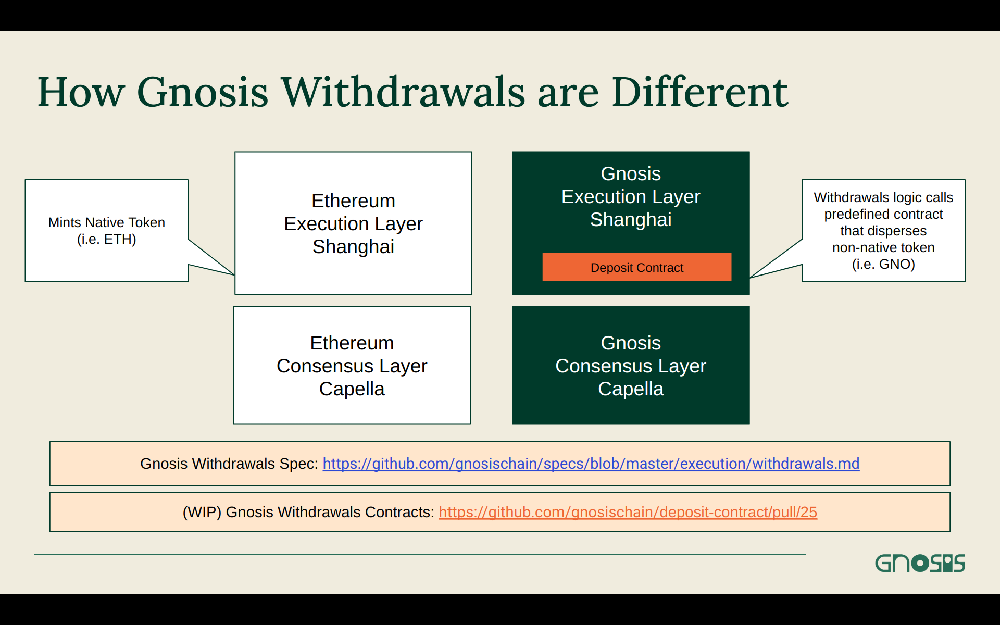
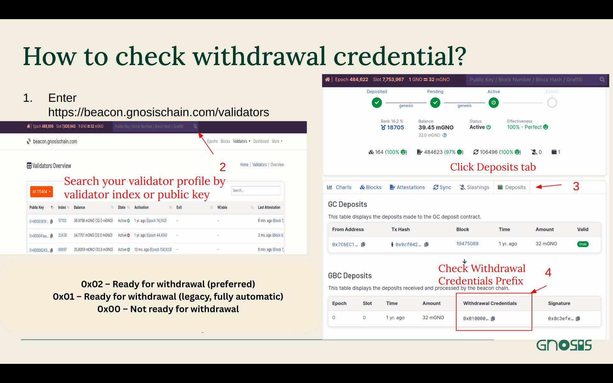
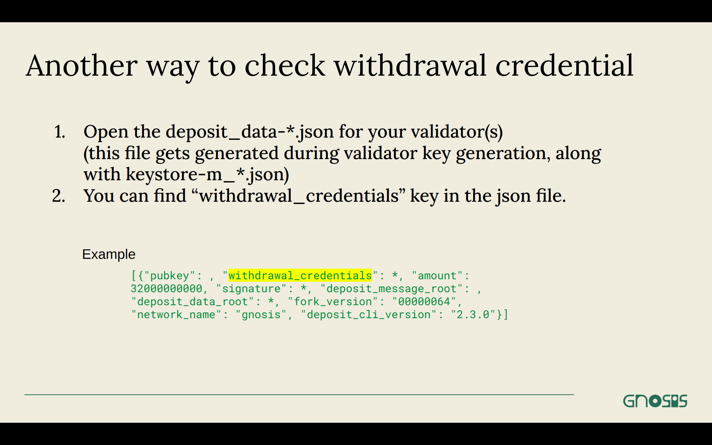
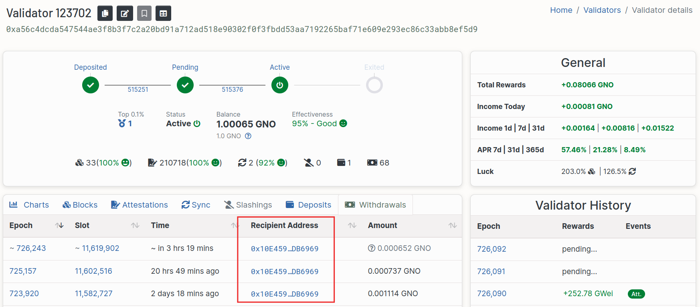

:::info Validator withdrawal has now been enabled!
Gnosis Chain underwent Shanghai/Capella Hardfork successfully on **August 1 2023, 11:34:20 UTC (slot 10 379 264, epoch 648 704)**.
:::

# What is Validator Withdrawal?

Validator withdrawal moves a validator’s balance from the Beacon Chain to the Execution Layer, paid out **in GNO** to the validator’s *withdrawal address* — the execution address recorded in the validator’s withdrawal credentials.

There are three kinds of withdrawals:

| Type                          | Trigger                                                                                                                                                       | What happens?                                                                                                                                     |
| ----------------------------- | --------------------------------------------------------------------------------------------------------------------------------------------------------------- | ----------------------------------------------------------------------------------------------------------------------------------------------- |
| **Partial — automatic sweep** | Automatic                                                                                                                                                     | Any balance above the validator’s maximum effective balance (**1 GNO** with `0x01`, **64 GNO** with `0x02`) is swept to the withdrawal address. |
| **Partial — on request**      | The withdrawal address submits an [EIP‑7002](https://eips.ethereum.org/EIPS/eip-7002) withdrawal request. **Requires `0x02` credentials.**                     | The requested amount is queued and paid out, down to the 1 GNO activation minimum.                                                                |
| **Full**                      | Validator signs and broadcasts a [`voluntary_exit`](./voluntary-exit.md), or the withdrawal address submits an EIP‑7002 full‑exit request (both irreversible) | The entire balance is withdrawn to the withdrawal address.                                                                                        |

---

## What is the difference between validator withdrawal on Gnosis Chain and Ethereum?



* **For users:** the experience is identical – funds simply arrive at the withdrawal address.
* **Under the hood:** Gnosis Chain uses a smart‑contract (the same address as the deposit contract) to pay out GNO. If the contract temporarily lacks GNO, queued withdrawals are retried once topped up and drained at a fixed rate (4‑16 per slot, TBD).

**References**

1. [Gnosis Chain Withdrawals spec](https://github.com/gnosischain/concepts/specs/blob/master/execution/withdrawals.md)
2. [Withdrawal Contract](https://github.com/gnosischain/deposit-contract/blob/master/contracts/SBCDepositContract.sol)

---

## What action should a validator take?

### 1 · Check your withdrawal credential prefix {#check-withdrawal-credential}

The first byte of a validator’s `withdrawal_credentials` is its *withdrawal prefix*. Three prefixes exist on Gnosis Chain:

| Prefix | Behaviour on Gnosis Chain                                                                                                                                                                                                                                                                                                              | Max effective balance |
| ------ | ------------------------------------------------------------------------------------------------------------------------------------------------------------------------------------------------------------------------------------------------------------------------------------------------------------------------------------ | --------------------- |
| `0x02` | **Compounding — recommended.** Rewards stay in the validator and compound instead of being swept away. Supports validator‑initiated partial withdrawals ([EIP‑7002](https://eips.ethereum.org/EIPS/eip-7002)) and can be the target of a consolidation. Can be set at deposit time or switched to later. Available since the [Pectra upgrade](../../about/specs/hard-forks/pectra.md) (30 April 2025). | **64 GNO**            |
| `0x01` | **Execution address, auto‑sweep.** Any balance above 1 GNO is swept to the withdrawal address automatically on a rolling sweep. Rewards do **not** compound, and validator‑initiated partial withdrawals are **not** available.                                                                                                         | 1 GNO                 |
| `0x00` | **BLS‑only** — no execution address is set, so **no withdrawals are possible** until you upgrade to `0x01`.                                                                                                                                                                                                                             | 1 GNO                 |

**Why `0x02` exists:** the `0x01` sweep is automatic, but it is also unavoidable — it forces everything above 1 GNO out of the validator, so those rewards stop earning. [EIP‑7251](https://eips.ethereum.org/EIPS/eip-7251) raises the ceiling to 64 GNO so rewards compound in place, lets a single validator hold what previously needed 64 of them, and replaces the forced sweep with withdrawals you request when you actually want them.

:::warning `--eth1_withdrawal_address` does not tell you your prefix on its own
In the [ETHstaker Deposit CLI](https://deposit-cli.ethstaker.cc/) — the tool used in the [key generation guide](../manual/validator/generate-keys/cli/README.md) — `--eth1_withdrawal_address` is only an alias for `--withdrawal_address`. Which prefix you ended up with depends on the tool and the version:

| How the keys were generated                                                                          | Prefix |
| ---------------------------------------------------------------------------------------------------- | ------ |
| ETHstaker Deposit CLI **v1.2.0 or later** (April 2025) with a withdrawal address — compounding is the default | `0x02` |
| ETHstaker Deposit CLI v1.1.0, or any version run with `--regular_withdrawal`                         | `0x01` |
| Ethereum `staking-deposit-cli`, Wagyu Key Gen, or the legacy `validator-data-generator`              | `0x01` |
| No withdrawal address supplied at all                                                                | `0x00` |

Don’t assume — read the credential itself, as described below.
:::

:::tip New validators can be created as `0x02` directly
You do **not** have to deposit as `0x01` and convert afterwards. The ETHstaker Deposit CLI generates compounding deposit data for Gnosis directly, and the deposit contract has accepted the variable deposit amounts that `0x02` allows since its [`batchDeposit` upgrade](../../bridges/management/decisions.md) (2 May 2025):

```shell
./deposit new-mnemonic --chain gnosis \
          --withdrawal_address 0xYourExecAddress \
          --compounding \
          --amount 64
```

On Gnosis, `--amount` is denominated in **GNO**: it defaults to the 1 GNO activation minimum and can go up to 64 GNO. Use [`partial-deposit`](https://deposit-cli.ethstaker.cc/partial_deposit.html) to top a validator up later.
:::

**How to check**

1. Look up your validator on the [Beacon chain explorer](https://beaconchain.gnosischain.com/) → *Withdrawal* tab, **or**
2. Open the [validators app](https://validators.gnosischain.com/) and read the *Type* column (`Type 1` = `0x01`, `Type 2` = `0x02`), **or**
3. Open the `deposit‑m*.json` file you saved when staking and examine `withdrawal_credentials` — the first byte is the prefix.




---

### 2 · `0x00` → `0x01`: BLS‑to‑Execution change {#how-to-change-the-withdrawal-credential}

If your validator is still on `0x00`, a one‑time **BLS‑to‑Execution change** attaches an execution withdrawal address to it.

:::note This step can only produce `0x01`
A `BLSToExecutionChange` requires the current prefix to be `0x00` and always writes the `0x01` prefix — see [`process_bls_to_execution_change`](https://github.com/ethereum/consensus-specs/blob/master/specs/capella/beacon-chain.md#new-process_bls_to_execution_change) in the consensus specs. It cannot produce `0x02`, and it cannot be applied to a validator that is already on `0x01`. To end up on `0x02`, complete this step first and then [switch to compounding](#switch-to-compounding).
:::

1. **Generate** `offline-preparation.json` on your online machine with [`ethdo`](https://github.com/wealdtech/ethdo/releases):

```bash
ethdo validator credentials set \
      --connection=http://localhost:<BEACON_PORT> \
      --prepare-offline
```

2. **Sign** it on an offline machine — copy `offline-preparation.json` across first; `ethdo` writes `change-operations.json` next to it:

```bash
ethdo validator credentials set \
      --offline \
      --mnemonic="abandon abandon … art" \
      --withdrawal-address=0xYourExecAddress
```

3. **Broadcast** the resulting `change-operations.json` either via the [broadcast tool](https://beaconchain.gnosischain.com/tools/broadcast) or with `curl`:

```bash
curl -d @change-operations.json \
     -H "Content-Type: application/json" \
     -X POST http://127.0.0.1:<BEACON_PORT>/eth/v1/beacon/pool/bls_to_execution_changes
```

<details>
<summary>Full step‑by‑step (online/offline) guide</summary>
<div>

<!-- the long original tutorial content retained below -->

**Online and Offline process**

The process contains three steps.

1. Generate data on the **online** computer.
2. Create `change-operations.json` on an **offline** computer.
3. Broadcast the change to the Gnosis network.

**Prerequisites**

1. Download [`ethdo`](https://github.com/wealdtech/ethdo/releases) on the online computer:

```bash
wget https://github.com/wealdtech/ethdo/releases/download/<version>/ethdo-<version>-linux-amd64.tar.gz
```

2. Extract and verify installation:

```bash
tar -xvf ethdo-<version>-linux-amd64.tar.gz
./ethdo --help
```

… *(rest of original tutorial unchanged for brevity)* …

</div>
</details>

**Further references**

1. [Changing withdrawal credential by ethdo](https://github.com/wealdtech/ethdo/blob/master/docs/changingwithdrawalcredentials.md)
2. [BLS-to‑Execution with ethdo](https://notes.ethereum.org/@launchpad/withdrawals-guide#BLS-to-execution-with-ethdo)
3. [Teku `postBlsToExecutionChange` API](https://consensys.github.io/teku/#tag/Beacon/operation/postBlsToExecutionChange)

---

### 3 · `0x01` → `0x02`: switch to compounding {#switch-to-compounding}

This section covers validators that are **already running** on `0x01`. If you have not deposited yet, create the validator as `0x02` directly instead — see [§1](#check-withdrawal-credential).

Moving an existing validator from `0x01` to `0x02` is **not** a BLS‑to‑Execution change. It is an [EIP‑7251](https://eips.ethereum.org/EIPS/eip-7251) *consolidation request* whose source and target are the same validator — a **self‑consolidation** — submitted on the execution layer through the consolidation system contract. Gnosis Chain has supported it since [Pectra](../../about/specs/hard-forks/pectra.md) (30 April 2025, epoch 1 337 856).

**Requirements** (see [`is_valid_switch_to_compounding_request`](https://github.com/ethereum/consensus-specs/blob/master/specs/electra/beacon-chain.md#new-is_valid_switch_to_compounding_request)):

* the validator is currently on `0x01` — if you are on `0x00`, do the [BLS‑to‑Execution change](#how-to-change-the-withdrawal-credential) first;
* the request is sent **from the validator’s withdrawal address**, i.e. the execution address in its credentials;
* the validator is active and has not initiated an exit.

Unlike a consolidation of two *different* validators, the switch costs no churn and has no activation‑age requirement.

#### Option A — the validators app (recommended)

1. Open the [validators app](https://validators.gnosischain.com/) and connect the wallet that controls your **withdrawal address**.
2. Select the validators listed as `Type 1`.
3. Choose **Consolidate** and confirm. Every `Type 1` validator is switched to compounding with a self‑consolidation request before any further consolidation happens.

#### Option B — call the system contract directly

Send a transaction from your withdrawal address to the consolidation contract:

| Field   | Value                                                                                          |
| ------- | ---------------------------------------------------------------------------------------------- |
| `to`    | `0x0000BBdDc7CE488642fb579F8B00f3a590007251`                                                   |
| `data`  | Your validator’s 48‑byte public key **repeated twice** — 96 bytes of `source_pubkey ‖ target_pubkey` |
| `value` | The current request fee, in wei                                                                |

The fee is dynamic — it starts at 1 wei and grows with queue pressure, and a request that sends less than the current fee reverts. Read it by calling the contract with empty calldata:

```bash
# Current consolidation request fee, returned in wei (hex)
curl -s -X POST https://rpc.gnosischain.com \
     -H 'Content-Type: application/json' \
     --data '{"jsonrpc":"2.0","id":1,"method":"eth_call",
              "params":[{"to":"0x0000BBdDc7CE488642fb579F8B00f3a590007251","data":"0x"},"latest"]}'
```

Then submit the request. `<PUBKEY>` is your validator’s public key **without** the leading `0x`, written twice so that the calldata is exactly 96 bytes:

```bash
cast send 0x0000BBdDc7CE488642fb579F8B00f3a590007251 \
     --data 0x<PUBKEY><PUBKEY> \
     --value <FEE_IN_WEI> \
     --rpc-url https://rpc.gnosischain.com \
     --ledger    # or --account <keystore>, --private-key <key>
```

The signing key **must** be the validator’s withdrawal address; a request sent from any other address is silently ignored by the consensus layer.

:::info The balance above 1 GNO is not paid out
When the switch is processed, the beacon chain moves everything above 1 GNO out of the validator and immediately re‑deposits it into that same validator ([`queue_excess_active_balance`](https://github.com/ethereum/consensus-specs/blob/master/specs/electra/beacon-chain.md#new-queue_excess_active_balance)). The explorer shows this as a `SYSTEM` withdrawal followed by a new deposit — it is bookkeeping, not a payout, and there is nothing to claim.
:::

Once processed, the validator’s prefix becomes `0x02`, its maximum effective balance rises from 1 GNO to 64 GNO, and rewards compound instead of being swept.

---

## 4 · Claiming your GNO (partial **and** full withdrawals) {#how-to-receive-my-withdrawal-full-or-partial}

Because Gnosis Chain pays out **GNO** rather than the gas token (xDai), withdrawals are **not sent automatically** to your address. After the Beacon‑chain message has executed you must *claim* the GNO from the withdrawal contract: [`0x0B98057eA310F4d31F2a452B414647007d1645d9`](https://gnosisscan.io/address/0x0B98057eA310F4d31F2a452B414647007d1645d9#writeProxyContract).

1. Connect **any** wallet on Gnosis Chain (it does *not* have to be the validator address).
2. Use:

   * `claimWithdrawal(address validatorRecipient)` – single validator, or
   * `claimWithdrawals(address[] validatorRecipients)` – batch.
3. Enter the **withdrawal (recipient) address** exactly as displayed on the *Beacon chain explorer*.
4. Sign & send – on confirmation the GNO appears at the recipient address.

> The `withdrawal address` and the `recipient address` are identical. Do *not* paste the long internal address you may see elsewhere.



---

## Reference material

* [Gnosis Validator Meetup #5 – Shanghai/Capella Upgrade](https://www.youtube.com/watch?v=6G7CmTHTor0)
