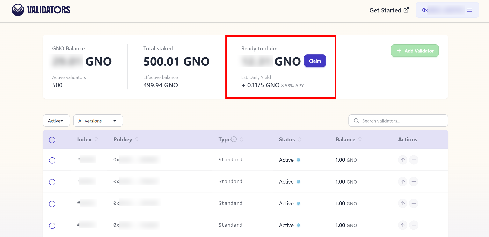

Because Gnosis Chain pays out **GNO** rather than the gas token (xDai), withdrawals are **not sent automatically** to your address. After the Beacon‑chain message has executed, the GNO sits in the deposit contract until *claimed* — [`0x0B98057eA310F4d31F2a452B414647007d1645d9`](https://gnosis.blockscout.com/address/0x0B98057eA310F4d31F2a452B414647007d1645d9?tab=write_proxy).

## Option A — claim from the validators app (recommended) {#claim-option-a}

The easiest option for most validators:

1. Open the [validators app](https://validators.gnosischain.com/) and connect the wallet that **is** your withdrawal/recipient address — the one the GNO is owed to.
2. Once connected, any claimable balance shows up automatically as "Ready to claim," with a **Claim** button right there.
3. Click **Claim** and confirm the transaction in your wallet.

This claims straight to your connected withdrawal address — there's no separate recipient address to type or mix up. It only works for the connected wallet's own balance, though: if you want to claim on behalf of a *different* recipient address, or claim for several recipients at once, use Option B instead.

## Option B — claim from the deposit contract directly {#claim-option-b}

1. Connect **any** wallet on Gnosis Chain (it does *not* have to be the validator or recipient address — claiming is permissionless, anyone can trigger it for anyone).
2. On the contract's [write page](https://gnosis.blockscout.com/address/0x0B98057eA310F4d31F2a452B414647007d1645d9?tab=write_proxy), use:

   * `claimWithdrawal(address validatorRecipient)` – single recipient, or
   * `claimWithdrawals(address[] validatorRecipients)` – batch, for several recipients in one transaction.
3. Enter the **withdrawal (recipient) address** exactly as displayed on the *Beacon chain explorer*.
4. Sign & send – on confirmation the GNO appears at the recipient address.

> The `withdrawal address` and the `recipient address` are identical. Do *not* paste the long internal address you may see elsewhere.

## How long does it take? {#how-long-does-it-take}

There's no single fixed number, because the timeline has a few distinct stages — only the first one is really variable:

1. **Exit queue** (full exits only). Your validator doesn't leave the moment you broadcast a `voluntary_exit` (or trigger an EIP‑7002 full‑exit request) — it enters an exit queue shared with every other validator exiting at the same time, gated by a protocol‑level churn limit. When few validators are exiting this clears within minutes; during periods of mass exits it can take substantially longer. The [Beacon chain explorer](https://beaconchain.gnosischain.com/) homepage shows the current number of validators "Leaving" — an empty queue means yours will process quickly.
2. **Withdrawability delay.** Once your exit is processed, there's a fixed `256`‑epoch wait before the balance is eligible to be swept — this is a hard protocol constant, not something that varies with network conditions. On Gnosis Chain's 5‑second slots (16 slots per epoch, so an 80‑second epoch), that works out to a fixed **~5.7 hours**.
3. **The sweep.** The protocol then needs to reach your validator in its rolling sweep of all active validators (it visits up to 8,192 validators per epoch). Unless the active validator set has grown well beyond that, this step completes within a handful of epochs — minutes, not hours.
4. **Claim.** Unlike Ethereum, this sweep does **not** deposit GNO straight into your withdrawal address — it moves the GNO into the deposit contract, where it sits until you (or anyone) claim it as described above. This last step is manual and has no deadline: nobody claims it automatically for you, and there's no time limit on when you can.

Add it up, and a full exit is commonly claimable within **1–2 days** of broadcasting it — a rule of thumb, not a guarantee. The exit queue (step 1) is the only meaningfully variable part; everything after it is fast and predictable.
