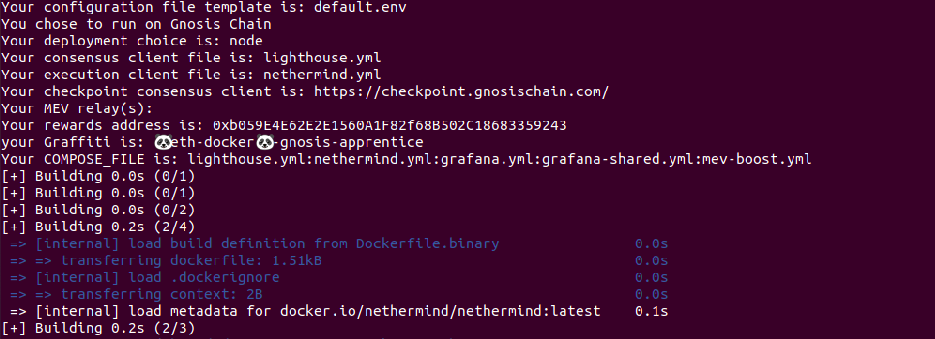

import Tabs from '@theme/Tabs';
import TabItem from '@theme/TabItem';

# eth-docker

[eth-docker](https://eth-docker.net/) is a docker automation project for Ethereum consensus and execution clients. It aims to make running a Ethereum staking full node simpler than setting everything up manually, while allowing the user choice when it comes to the exact client mix they wish to run. 

eth-docker allows user to set up Gnosis clients by answering simple dialog-based questions on terminal. 

## References
1. eth-docker Docs: https://eth-docker.net/
2. Github: https://github.com/eth-educators/eth-docker


## Prerequisite
1. Ensure compatible [hardware requirements](../README.md#requirements) for different clients.
2. [Configure the server](https://eth-docker.net/Usage/Prerequisites)(optional)


## Step 1: Install
:::tip
This demo has been tested on Ubuntu 20.04/22.04 and Debian11/12.
:::
Open a new terminal, copy and paste the command below.

Download eth-docker

```bash
cd ~ && git clone https://github.com/eth-educators/eth-docker.git && cd eth-docker
```

Install pre-requisites such as Docker

```bash
./ethd install
```


## Step 2: Configure and execute clients
Configure eth-docker - have an Gnosis address handy where you want Execution Layer rewards to go

```bash
./ethd config
```

1. Select Network: Gnosis Chain

2. Select deployment type: Ethereum node or Ethereum RPC node, choose Ethereum node if you want to run consensus, execution and validator client.
3. Select consensus client: Lighthouse, Teku, or Nimbus.
4. Select execution client: Nethermind, or Erigon.
5. Select checkpoint sync: Choose Yes if you want to use CL rapid sync with remote checkpoint.
6. Configure checkpoint consensus client: paste the checkpoint URL from https://checkpoint.gnosischain.com/.
7. Select MEV Boost
8. Select Grafana dashboard
9. Configure Graffiti: Enter the graffiti for your validator.

The Configuration will now be built.


Once the building part is done, start eth-docker by running


```bash
./ethd up
```

Check that execution/consensus client running correctly by running: 
<Tabs>
    <TabItem value = "Execution" label= "Execution" default>
        ./ethd logs -f execution
    </TabItem>
    <TabItem value = "Consensus" label= "Consensus">
        ./ethd logs -f consensus
    </TabItem>
    <TabItem value = "Validator" label= "Validator">
        ./ethd logs -f validator
    </TabItem>
</Tabs>

##  Step 3: Run a validator
You can either create validator key(s) from eth-docker or import the validator key(s) that are generated from [validator-data-generator](https://github.com/gnosischain/validator-data-generator).

For the second option, please refer to [Interactive Guide: Generate validator keys](../guide/README.md#step-4a-generate-validator-keys).

Import the key(s) by specifying the path to keystore file (folder where you keep the `keystore-m.json` file).

```bash
./ethd keys import --path PATH_OF_KEYS
```

Check that the key is imported by running

```bash
./ethd keys list
```

## Step 4: Deposit for validator
Once the exeution and consensus clients are fully synced, you may proceed to [deposit for validator](../guide/README.md#step-4c-fund-your-validator).


