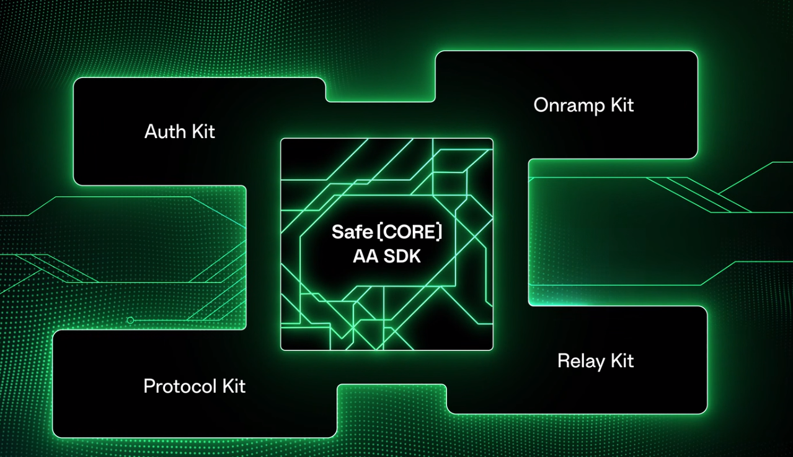

# Building Account Abstraction with Safe
[Safe](https://docs.safe.global/) provides a variety of Account Abstraction stacks for developers to integrate and build Account Abstraction on top of Safe. 

[Safe Core](https://docs.safe.global/learn/safe-core) suites:
1. [Safe Core Account Abstraction SDK](https://docs.safe.global/learn/safe-core/safe-core-account-abstraction-sdk)
2. [Safe Core  API](https://docs.safe.global/learn/safe-core/safe-core-api)
3. [Safe Core Protocol](https://docs.safe.global/learn/safe-core/safe-core-protocol)

## Safe Core Account Abstraction SDK
Safe Core Account Abstraction SDK allows developers to create AA functionalities into their apps.

### [Protocol Kit](https://docs.safe.global/learn/safe-core/safe-core-account-abstraction-sdk/protocol-kit)
Protocol Kit provides functionalities such as creating new Safe accounts, updating the configuration of existing Safes, and proposing and executing transactions.

For more details, see [Guide: Integrating the Safe Core SDK](https://github.com/safe-global/safe-core-sdk/blob/main/guides/integrating-the-safe-core-sdk.md) and [Safe Core SDK API Reference](https://github.com/safe-global/safe-core-sdk/tree/main/packages/protocol-kit#sdk-api)

Follow the [tutorial on Safe](https://docs.safe.global/learn/safe-core/safe-core-account-abstraction-sdk/protocol-kit#quickstart) to **create a 2 of 3 multi-sig Safe** and propose and **execute a transaction** to send some ETH out of this Safe.

### [Auth Kit](https://docs.safe.global/learn/safe-core/safe-core-account-abstraction-sdk/auth-kit)
Auth Kit enables users to sign in using an email address, social media account, or traditional crypto wallets like Metamask. It creates an Ethereum/Gnosis address and let users to authenticate the account using above-mentioned authentication methods.

Follow the [tutorial on Safe](https://docs.safe.global/learn/safe-core/safe-core-account-abstraction-sdk/auth-kit#quickstart) to create a Signing Account using your email or social media account. Once authenticated, you can sign transactions and interact with any Safe Smart Accounts you own.

### [Onramp Kit](https://docs.safe.global/learn/safe-core/safe-core-account-abstraction-sdk/onramp-kit)
Onramp Kit allows users to buy cryptocurrencies using a credit card or other payment methods.
This package is provided for testing purpose only. Please use it at your own risk.

Follow the [tutorial on Safe](https://docs.safe.global/learn/safe-core/safe-core-account-abstraction-sdk/onramp-kit#quickstart) to create a React component that allows you to enter an Ethereum address and fund it using a credit card. The full code example can be found in the [Safe Space repo](https://github.com/5afe/safe-space) in the [WalletFund.tsx](https://github.com/5afe/safe-space/blob/onramp-kit-integration/src/scenes/Wallet/WalletFund.tsx) file in [PR #8](https://github.com/5afe/safe-space/pull/8). We will also be using a [pre-deployed server](https://github.com/5afe/aa-stripe-service).

### [Relay Kit](https://docs.safe.global/learn/safe-core/safe-core-account-abstraction-sdk/relay-kit)
Relay Kit allows users to pay transaction fees (gas fees) using the native blockchain token or ERC-20 tokens. This allows you to pay gas fees using any ERC-20 token in your Safe, even if you don't have ETH.

Currently, the Relay Kit is only compatible with [Gelato relay](https://docs.gelato.network/developer-services/relay). There are two ways to use Gelato relay:
1. [Gelato 1Balance](https://docs.gelato.network/developer-services/relay/payment-and-fees/1balance-and-relay): Using prepaid deposit(via USDC on Polygon for mainnet, via gETH on Goerli for testnet) to funds the 1Balance account.With the deposit on 1Balance account, the Relay Kit can sponsors a transactions to other Safe within or on another chain. 
2. [Gelato SyncFee](https://docs.gelato.network/developer-services/relay/non-erc-2771/callwithsyncfee): Allows you to execute a transaction and pay the gas fees directly with funds in your Safe, even if you don't have ETH on Ethereum or xDAI on Gnosis Chain.

Follow the [tutorial on Safe](https://docs.safe.global/learn/safe-core/safe-core-account-abstraction-sdk/relay-kit#quickstart) to send some tokens to another address using the Relay Kit to pay for he gas fees. 

To learn more about how to use Gelato with Safe, checkout the demos linked below.

import DocCardList from '@theme/DocCardList';

<DocCardList />