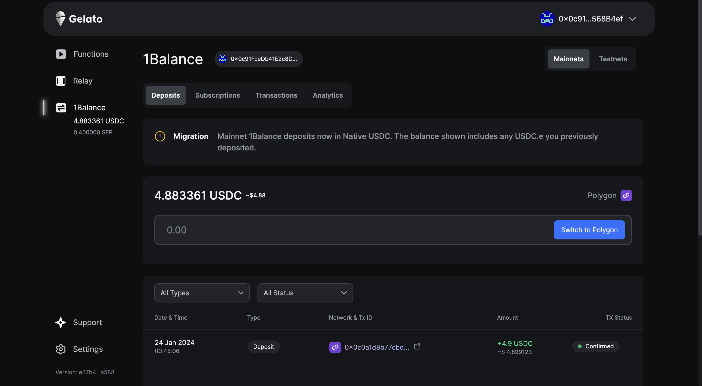
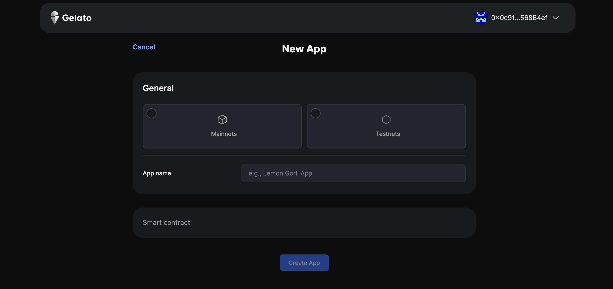
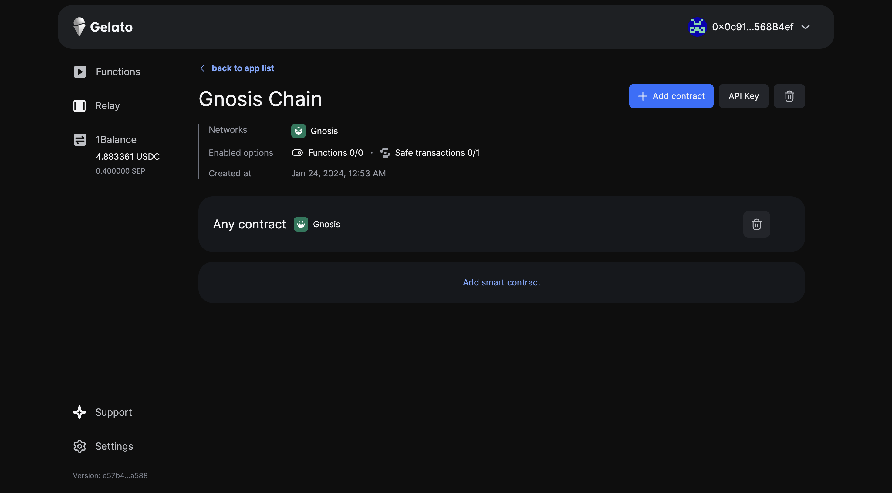
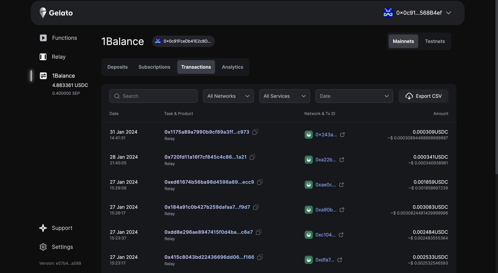

# Building on Safe AA with Gelato

As mentioned in previous section, Safe natively uses Gelato Relay to provide gasless transactions and more seamless experience. In this section, we will learn how you can connect with Safe and use Gelato Relay integration.

Currently, the Relay Kit is only compatible with the Gelato relay. The Gelato relay can be used in two ways:

- [Gelato 1Balance](https://docs.gelato.network/web3-services/relay/subscriptions-and-payments/1balance-and-relay)
- [Gelato SyncFee](https://docs.gelato.network/web3-services/relay/non-erc-2771/callwithsyncfee)


We would be using **Gelato 1Balance** on Gnosis Chain.

Gelato 1Balance is mechanism which would allow you to execute transactions for amount that is deposited. You can use it to sponsor transactions for users on Gnosis Chain and pay for their gas fees.

1Balance works by toping up with USDC on Polygon, regardless of the chain that is being used for deployed Safe address. 

You can learn more about usage of [Gelato 1Balance](https://docs.gelato.network/web3-services/relay/subscriptions-and-payments/1balance-and-relay) but now let's quickly implement this for our dApp.


### 1. Install the following dependencies.

```
npm install @safe-global/relay-kit
```

### 2. Import the dependencies in your `.jsx` file
```
import { GelatoRelayPack } from '@safe-global/relay-kit';
```
 
### 3. We would be requiring to get an `API KEY` for using Gelato 1Balance. We would be using `.env` to save our API Keys.

```
  const GELATO_1_BALANCE = import.meta.env.VITE_BALANCE_API_KEY;
```

### 4. How to get your API KEY from Gelato ?

- Go on [1Balance](https://app.gelato.network/1balance) page.
- Login with your Metamask or relevant wallet. This will be the owner for 1Balance account.
- Once logged in, you will get this dashboard



- Now, to generate an API key, we will go to [Relay](https://app.gelato.network/relay). You will see "Create App" option.
- Once you click, you will get a popup for a New App. 


- Based on your reference to which chain you are creating Safe on, Gnosis Chain or Chiado, you can choose the kind of network, give a app name and add the smart contract that you have deployed on the chain and enable 'Allow sponsored transactions from Safe'

- If you don't have any specific contract, you can still use the generated API KEY for any contract that exists on Gnosis Chain.

- This is what you will get after the setup


- Copy the API KEY to `.env` file and we can then use it in our JSX.

### 5. Depositing the balance amount USDC to use it on Gnosis Chain

- Now once you have setup the contract and got the App API_KEY, we need to setup our 1Balance which will be actually used to pay for the transactions.

- In order to achieve this, your connected metamask account should have USDC on Polygon (if you are deploying on mainnet which is Gnosis Chain).

- Once you fill up with your prepaid amount, you will have access to dashboard where you can check the usage of balance and all the relayed transactions and even get cumulative spend by the users for every single month.



### 6. Create transaction object and use Protocol Kit 


```jsx
const transactions  = [{
  to: destinationAddress,
  data: '0x',
  value: withdrawAmount
}]

const ethAdapter = new EthersAdapter({
        ethers,
        signerOrProvider: currentSigner,
      });

      const protocolKit = await Safe.create({
        ethAdapter,
        safeAddress: safeAuthSignInResponse?.safes[0],
      });
```

### 7. Setup transactions to be relayed on Gnosis Chain

```jsx
    const relayKit = new GelatoRelayPack({ apiKey: GELATO_1_BALANCE, protocolKit });

      const safeTransaction = await relayKit.createRelayedTransaction({
        transactions,
        options: { isSponsored: true, gasLimit: '100000' },
      });

      const signedSafeTransaction = await protocolKit.signTransaction(safeTransaction);

      const response = await relayKit.executeRelayTransaction(signedSafeTransaction, { isSponsored: true });
      console.log(`Relay Transaction Task ID: https://relay.gelato.digital/tasks/status/${response.taskId}`);
      
      const transactionHash = response.taskId;
      console.log(`Transaction Hash: ${transactionHash}`);
```

You will be able to check the relayed transaction status on console.

:::info
To checkout the entire frontend along with code you can checkout the [github code](https://github.com/vanshika-srivastava/safe-gnosis-chain/tree/2baf5926250adf6aabe963c7bd053afc844e46da/src)

Test out the application live here on [vercel](https://safe-gnosis-chain.vercel.app/)
:::
