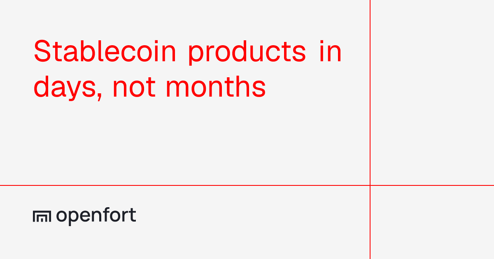

# Openfort

This guide will walk you through the steps to integrate Openfort embedded wallets and the Openfort React SDK into your Web3 DApp, with a specific configuration for the Gnosis chain (mainnet & Chiado testnet).



## Guide

The [Openfort React SDK](https://www.npmjs.com/package/@openfort/react) is the easiest way to integrate Openfort in your application.

In order to integrate the Openfort React SDK, your project must be on:

- a minimum React version of 17
- wagmi 3.x and viem 2.x

### 1. Install the Openfort React SDK

```shell
npm install @openfort/react wagmi viem @tanstack/react-query
```

### 2. Setup Log-in methods & Openfort keys

Navigate to your [Openfort dashboard](https://dashboard.openfort.io) and create a new project. From the **Auth providers** settings, enable all the login methods you want the end-user to have (email, social logins, external wallets).

You will need two keys to configure the SDK:

- the **Publishable key** (`pk_...`) from **Project Settings > API Keys**
- the **Shield publishable key** from **Shield > API Keys**, which secures the embedded signer

### 3. Setup Openfort Provider and Gnosis Config

We can now initialize **OpenfortProvider** together with wagmi. Replace the key fields with your own Openfort keys and import the chains you want to support in your dapp. In our case, we have imported **gnosisChiado** and **gnosis** from viem. You can also customize the login screen theme, logo, recovery methods and other [configs](https://www.openfort.io/docs).

```tsx
'use client';

import { OpenfortProvider, RecoveryMethod } from '@openfort/react';
import { getDefaultConfig, OpenfortWagmiBridge } from '@openfort/react/wagmi';
import { QueryClient, QueryClientProvider } from '@tanstack/react-query';
import { gnosis, gnosisChiado } from 'viem/chains';
import { createConfig, WagmiProvider } from 'wagmi';

const queryClient = new QueryClient();

const wagmiConfig = createConfig(
  getDefaultConfig({
    appName: 'Gnosis App Demo',
    chains: [gnosisChiado, gnosis],
  }),
);

export default function Providers({ children }: { children: React.ReactNode }) {
  return (
    <QueryClientProvider client={queryClient}>
      <WagmiProvider config={wagmiConfig}>
        <OpenfortWagmiBridge>
          <OpenfortProvider
            publishableKey="<Enter Publishable Key>"
            walletConfig={{
              shieldPublishableKey: '<Enter Shield Publishable Key>',
            }}
            uiConfig={{
              walletRecovery: {
                defaultMethod: RecoveryMethod.PASSKEY,
              },
            }}
          >
            {children}
          </OpenfortProvider>
        </OpenfortWagmiBridge>
      </WagmiProvider>
    </QueryClientProvider>
  );
}
```

You can now import the above component and wrap around your application in the **layout.tsx** file (in case of a NextJS app).

Here is an example:

```tsx
import type { Metadata } from "next";
import Providers from "./components/openfort";

export const metadata: Metadata = {
  title: "Gnosis App Demo",
  description: "Gnosis App Demo",
};

export default function RootLayout({
  children,
}: Readonly<{
  children: React.ReactNode;
}>) {
  return (
    <html lang="en" className="dark">
      <body>
          <Providers>
            {children}
          </Providers>
      </body>
    </html>
  );
}
```

### 4. Add the connect button

Openfort ships a prebuilt button that handles the full authentication flow. Once the user logs in, an embedded wallet is created for them on the Gnosis chain, and all the standard wagmi hooks (`useAccount`, `useSendTransaction`, `useSignMessage`, ...) work as usual.

```tsx
'use client';

import { OpenfortButton } from '@openfort/react';

export default function Home() {
  return <OpenfortButton label="Connect Wallet" />;
}
```

## Learn More

For wallet recovery options, gas sponsorship on Gnosis, and the full hooks reference, check the [Openfort documentation](https://www.openfort.io/docs) and the [Openfort React SDK repository](https://github.com/openfort-xyz/openfort-react).
