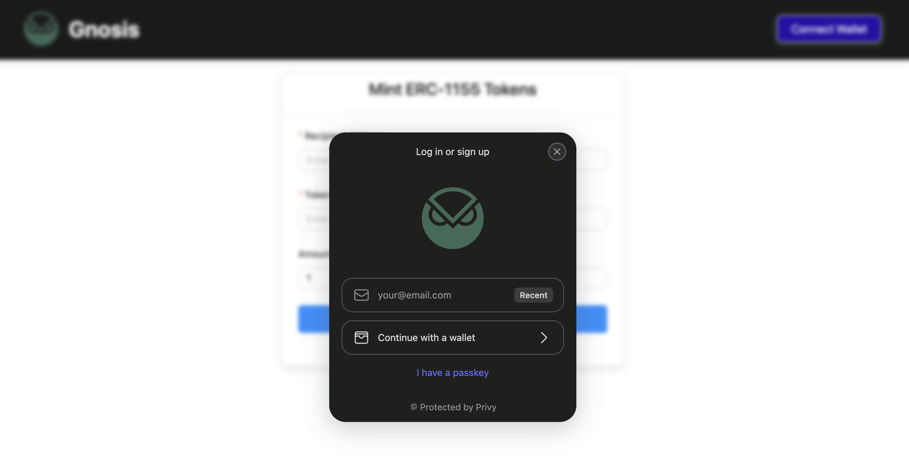

# Privy

This guide will walk you through the steps to integrate the Privy Wallet and SDK into your Web3 DApp, with a specific configuration for the Gnosis chain(mainnet & Chiado testnet).



## Guide

The [Privy React SDK](https://www.npmjs.com/package/@privy-io/react-auth) is the easiest way to integrate Privy in your
application.

In order to integrate the Privy React SDK, your project must be on:

- a minimum React version of 18
- a minimum TypeScript version of 5

### 1. Install the Privy React SDK

```shell
npm install @privy-io/react-auth@latest
```

### 2. Setup Log-in methods & Privy App ID

Navigate to your [Privy dashboard](https://dashboard.privy.io/apps) and from the **Login methods** methods tab, enable all the login methods you want the end-user to have.

Also, note the **App ID** from the settings, we will need to configure while initializing Privy.

### 3. Setup Privy Provider and Gnosis Config

We can now initialize **PrivyProvider**. Replace the App ID field with your own Privy App ID and import the chains you want to support in your dapp. In our case, we have imported **gnosisChiado** and **gnosis** from viem. We can also customize with theme, logo and , colours and other [configs](https://docs.privy.io/guide/react/configuration/appearance#app-name).

```shell
'use client';

import {PrivyProvider} from '@privy-io/react-auth';
import {gnosisChiado, gnosis} from 'viem/chains';

export default function Providers({children}: {children: React.ReactNode}) {
  return (
    <PrivyProvider
      appId="<Enter App ID>"
      config={{
        appearance: {
          theme: 'dark',
          accentColor: '#676FFF',
          logo: 'https://cdn.prod.website-files.com/662931fe35e0c191d1733ab9/662931fe35e0c191d1733b0f_owl-forest.png',
        },
        defaultChain: gnosisChiado,
        supportedChains: [gnosisChiado,gnosis], 

        embeddedWallets: {
          createOnLogin: 'users-without-wallets',
        },
      }}
    >
      {children}
    </PrivyProvider>
  );
}
```


You can now import the above component and wrap around your application in the **layout.tsx** file(In case of a NextJS app).

Here is an example:

```shell
import type { Metadata } from "next";
import PrivyProvider from "./components/privy"; 

export const metadata: Metadata = {
  title: "Gnosis App Demo",
  description: "Gnosis App Demo",
};

export default function RootLayout({
  children,
}: Readonly<{
  children: React.ReactNode;
}>) {
  return (
    <html lang="en" className="dark"> 
      <body>
          <PrivyProvider> 
            {children} 
          </PrivyProvider>
      </body>
    </html>
  );
}

```

## Demo Application

Here is a full-stack dapp which showcases Privy integration along with proper configurations to fetch wallet data and make on-chain transactions. The application integrates the Pirvy React SDK and uses it to mint ERC-1155 tokens on the Gnosis Chiado testnet.

[**Link to Demo Application**](https://github.com/gnosischain/developer-resources/tree/main/custom-signers/privy-gnosis)

