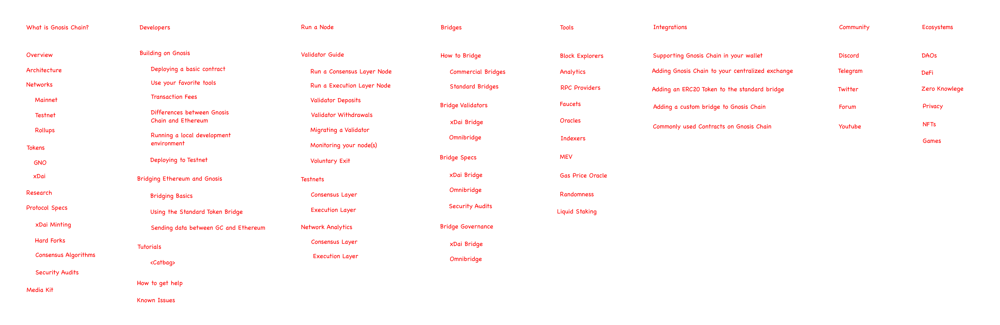
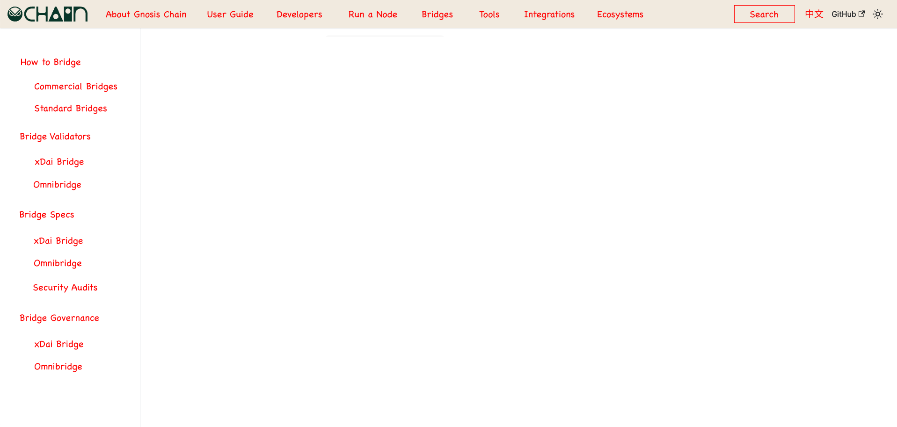
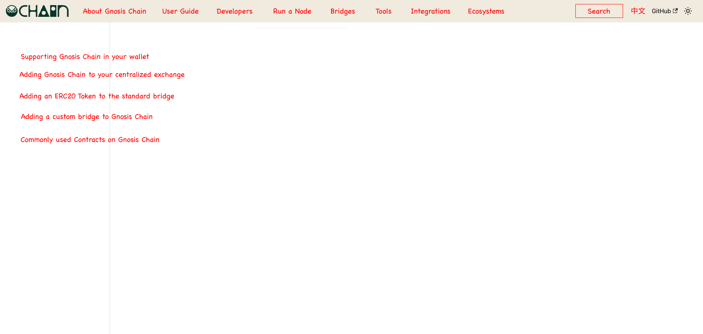

# Spec: Make Gnosis Docs Great Again 

>

## Objectives

### Improving Developers Experience

- The success of Gnosis Chain depends on developer adoption
  - Novel DApps are critical for user adoption
  - Current disorganized docs prevents developer adoption
- Need for information architecture built around user objectives
  - Currently divided by [EVM chain](https://developers.gnosischain.com) and [Beacon Chain](https://docs.gnosischain.com/))
  - Coherent IA allows for easy adding of information in future 
- Need to clean up old, deprecated features to avoid confusing readers
  - e.g. OpenEthereum
  - e.g. STAKE token
- Need to drive key objectives
  - How do I use Gnosis Chain as a User?
  - How do I deploy an Ethereum DApp to GC?
  - What key differences between GC and Ethereum should I be aware of as a Developer?
  - How do I participate in GC as a Validator?
  - What are the DevTools I have available for GC?
  - What are the existing DApps on GC and how can I build on them?

### Training our Team

- New Team members need to get up to speed on Gnosis Chain
  - Writing docs is a fantastic driving exercise
- Good exercise to expand "Core Dev" and "Ecosystem" expertise
  - e.g. Understanding AuRa consensus and previous hard forks
  - e.g. xDai-as-native-gas minting process and how it's tied to block rewards
  - e.g. Understanding how current bridges are set up, and security attack vectors
- Develop processes to triage Technial issues
  - i.e. Process for triaging inbound technical issues
  - i.e. Where can we ask for help? (e.g. ask Blockscout or Nethermind team)

### More than Developers

- Documentation should organize all the existing information on the site
  - "End-user" focused home page
  - News and Updates
  - Governance
  - Hard Forks, etc
- Organized information can then be refactored to other sites
  - End-user site (i.e. gnosischain.com)
  - Governance-focused site (i.e. Gnosis DAO?)

## How we Organize

- People
  - Ale (Lead)
  - Dan
  - CJ (2-month Fellowship till 12 Sept 2022)
  - Nithin (2-month Fellowship till 12 Sept 2022)
  - Can consider putting out an open call to Gnosis Chain community and give out short-term grants
- Tools
  - [Project Board](https://github.com/orgs/gnosischain/projects/3/views/1) 
  - #gc-devrel on Slack
- Staging
  - https://developers-portal.staging.gnosisdev.com/

## Specs

> 

### Features

**Docusaurus Functionality**
- [ ] Search Functionality (Algolia or equivalent)
- [ ] Broken Links checker (prevent merging if link is 404 - critical for migration)
- [ ] SEO support (ensure crawlability)
- [ ] Translation and i18n support (can KIV in first phase)

**Leadgen**
- [ ] Intercom
- [ ] Telegram Bot Integration?

**Analytics**
- [ ] Google Analytics (or open source, non-privacy infringing alternative?)

**SEO**
- [ ] SEO-optimized for crawlability
- [ ] Later on, set up 302 redirects from legacy xdaichain.com URLs to new pages on docs.gnosischain.com

### Info Architecture

>

**Site Map**
- What is Gnosis Chain
- User Guide
- Developers
- Run a Node
- Bridges
- Tools
- Integration (_may be refactored to Guides_)
- Community
- Ecosystem

### About Gnosis Chain

>

**User Stories**

- [ ] What is special about GC?
  - [ ] How is GC different from  Ethereum?
  - [ ] Why does GC need to exist? What value does it bring to Ethereum?
- [ ] Who are the people and community associated with GC?
  - [ ] What is the culture of the chain?
  - [ ] Who is the community around the chain?
- [ ] How does the "xDai-as-native-token" work in GC? 
  - [ ] Conceptually, how is it implemented? 
  - [ ] Where can I go to look for more information?
- [ ] Can I understand conceptually how GC works?
  - [ ] I heard GC is a Proof-of-Authority Network, is that still the case?
  - [ ] I heard GC is a Canary Network for Ethereum, is that still the case?
  - [ ] Conceptually, how do the Beacon Chain, EVM Chain, and Rollups work?
- [ ] Can I understand the Roadmap for Gnosis Chain?
  - [ ] What are the upcoming features I should expect for the chain?
- [ ] What are the different networks within the GC Ecosystem?
  - [ ] Why do I connect to Optimism on GC when playing Dark Forest?
- [ ] What is the use of the GNO and xDai Token?
  - [ ] Where can I get GNO?
  - [ ] Where can I get xDai?
- [ ] How is xDai minted?
  - [ ] Isn't xDai just bridged Dai?
  - [ ] What happens to my Dai on Ethereum once I bridge it to Gnosis Chain?
- [ ] What are the fees associated with using xDai?
  - [ ] How might these change in the future?
- [ ] What is the Tokenomics associated with the Gnosis Chain network?
  - [ ] How will this be sustainable over time?
  - [ ] As a holder of GNO, how can I expect to earn on GNO in the future?
  - [ ] What is the inflation and issuance of GNO?

### User Guide

>

**User Objectives**
- [ ] How do I start using GC, as someone new to blockchain?
- [ ] How do I start using GC, as someone familiar with Ethereum?
- [ ] How do I get xDai to start using GC?
- [ ] How do I bridge tokens over to GC? (ERC-20, NFTs)
  - [ ] What is the difference between the "Native Bridge" and 3rd-party bridges like Nomad?
- [ ] What wallets can I use to interact with Gnosis Chain?
  - [ ] On Desktop?
  - [ ] On Mobile?
- [ ] What can I do once I'm on Gnosis Chain?

### Developers

>

**User Objectives**
- [ ] As a Developer coming from Ethereum, what are key things I need to know about GC?
  - [ ] Can I just treat the xDai-stablecoin-like-gas?
  - [ ] What are the risks involved
- [ ] As a Developer new to Blockchain, what is the simplest "Hello World" I can deploy?
- [ ] As a Developer, what are the known issues I might encounter while building on Gnosis Chain?
  - [ ] PermissionDenied
  - [ ] FeeTooLowToCompete
- [ ] As a Developer, where can I go to ask for help and get a response from the DevRel team?

### Run a Node

>

- [ ] How do I run a Validator in the GC Network?
- [ ] How much can I expect to earn as a Validator on the Network?
- [ ] Is it necessary for me to run both Consensus/Beacon Chain node and Execution/EVM Chain node?
- [ ] What do you mean by saying that we can run different clients on Gnosis Chain?
  - [ ] Who do we even want multiple clients to support Gnosis Chain?
  - [ ] What are the Consensus Layer Clients that support Gnosis Chain?
  - [ ] What are the Execution Layer Clients that support Gnosis Chain?
- [ ] How do the Consensus and Execution layers work with each other?
- [ ] What are Known Issues in running Gnosis Chain?
- [ ] How do I upgrade my client from OpenEthereum to Nethermind?
  - [ ] Why did we move away from OpenEthereum/Parity?

### Bridges

>

**Nomenclature**

- [ ] Should we use the term "Protocol Bridges" or "Native Bridges"? 
  - [ ] Native Dai Bridge
  - [ ] Native ERC-20 Bridge
- [ ] Should we have the concept of a "Native Bridged Token Registry"? 

**User Stories**

- [ ] How can I bridge to Gnosis Chain? 
  - [ ] How do I bridge a ERC20 token?
  - [ ] How do I bridge Dai?
  - [ ] What is the difference between bridging Dai and ERC-20? Aren't they both ERC-20s?
  - [ ] How do I bridge NFTs?
  - [ ] How do I send arbitrary messages?
- [ ] What are the different types of bridges, and what should I use?
  - [ ] What is the difference between xDai Bridge and Omnibridge?
  - [ ] What is the difference between Native Bridges and 3rd party bridges? (e.g. Nomad)
  - [ ] How do we communicate that we encourage users to use the 3rd party bridges (vs the standard bridges?)
  - [ ] How is Tornado Cash used as a bridge? 
- [ ] Where can I find analytics on Gnosis Chain Bridges? 
- [ ] What is the Arbitrary Message Bridge?
  - [ ] How can I send arbitrary messages to Ethereum?
  - [ ] How does the Zodiac team use the AMB under the hood? 
- [ ] How do the bridges work under the hood?
  - [ ] How does xDai get minted?
  - [ ] I heard the Gnosis Chain earns money on the money I park in the bridge - what's up with that?
- [ ] What are the risks of parking funds in the bridge?
  - [ ] Are there security audits I can take a look at?
  - [ ] Who am I trusting when I put money on the bridge?
  - [ ] Who are the signers for the Bridge?
- [ ] How do I add an ERC-20 token to the Native Bridge? 
- [ ] What is bridge governance?
  - [ ] Why do bridges need to be governed? 
- [ ] What is the Roadmap for the Bridges?
  - [ ] Will we have trustless bridges?
- [ ] What can we expect for bridges in the future?
  - [ ] Tell me more about your plan to use ZK Light Clients in the future - how do they work conceptually (w/ the AMB)? 
  - [ ] Tell me more about your plan to use Deterministic Addresses for Bridged ERC-20 Tokens
- [ ] How can I build my own bridge?

**Additional Resources**

- [ ] There is a talk by Alex on the AMB at ETHCC in 2019

### Tools

>

- [ ] What are the Block Explorers I can use?
  - [ ] How do I learn more about Blockscout?
  - [ ] Why can't I see my Dark Forest transactions on Gnosis Chain Blockscout? (use Optimism)
  - [ ] What is the best tool for debugging Transaction traces on Gnosis Chain? (e.g. Tenderly)
- [ ] What are the different Analytics dashboards for Gnosis Chain?
  - [ ] Dune Analytics
  - [ ] Beacon Chain Analytics?
  - [ ] Network analytics?
- [ ] etc. 

### Integrations

> Should this be "Guides" instead, where we put all the guides that don't quite fit into other sections? Integrations can then just be one sub-section of Guides

>

**User Stories**

**Business**
- [ ] How can I launch a token on Gnosis Chain? (code-wise or DApp)
- [ ] How can I release a NFT on Gnosis Chain?
- [ ] How can I do a fundraise on Gnosis Chain?
- [ ] How can I list my token on Uniswap on Gnosis Chain?

**Developer**
- [ ] How do I deploy a contract with the exact same address as Ethereum mainnet? (i.e. CREATE2)

### Ecosystem

> This is a novel idea I had, which I haven't seen in other chains, but could supercharge the composability and growth in ours. 

>

**User Stories**

- [ ] For each ecosystem, what are the "foundational" apps, and what are their contract addresses?
  - [ ] Encourage composability and ecosystem growth
  - [ ] e.g. for DeFi - what is Uniswap's contract address on Gnosis Chain?
  - [ ] e.g. for DAOs - what is the Gnosis Safe Proxy address on Gnosis Chain?
- [ ] DAOs: [Youtube: DAO Tooling on Gnosis Chain](https://www.youtube.com/watch?v=uAw1paJKcqc)
- [ ] DeFi: [Youtube: DeFi Ecosystem on Gnosis Chain](https://www.youtube.com/watch?v=yPYYKz0u9K0)

### Other Notes

- There will be work required to convert from Gitbook-flavored Markdown to Docusaurus-flavored Markdown
  - e.g. Tabs
  - e.g. Formatting errors
- Each "section" owner is responsible for ensuring that links are up-to-date (there is a lot of self-referencing that is broken)